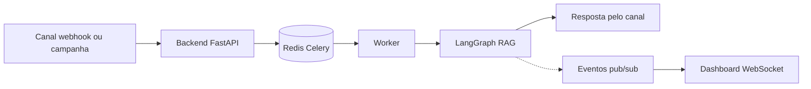

# Autonomous Agent

[](LICENSE)

**Backend & workers**

[](https://www.python.org/)
[](https://fastapi.tiangolo.com/)
[](https://www.sqlalchemy.org/)
[](https://docs.celeryq.dev/)
[](https://langchain-ai.github.io/langgraph/)
[](https://docs.pydantic.dev/)

**Frontend**

[](https://nextjs.org/)
[](https://react.dev/)
[](https://www.typescriptlang.org/)
[](https://tailwindcss.com/)

**Dados**

[](https://www.postgresql.org/)
[](https://github.com/pgvector/pgvector)
[](https://redis.io/)

**IA — padrão local (OSS)**

[](https://ollama.com/)
[](https://github.com/SYSTRAN/faster-whisper)
[](https://github.com/coqui-ai/TTS)
[](https://ollama.com/library/nomic-embed-text)

**Infra & canais**

[](https://docs.docker.com/compose/)
[](https://developers.cloudflare.com/cloudflare-one/connections/connect-networks/)
[](https://www.twilio.com/)
[](https://core.telegram.org/bots)

Sistema multi-agente de inteligência artificial para atendimento autônomo de clientes em múltiplos canais — **WhatsApp, Telegram e Voz**. O agente opera em modo **ativo** (campanhas outbound para leads) ou **receptivo** (resposta a mensagens recebidas), com orquestração por grafo (LangGraph).

A IA roda **100% local por padrão** (sem chaves de API, sem custo) e é **agnóstica de provedor**: qualquer camada (LLM, STT, TTS, embeddings) pode ser plugada a um provedor de nuvem por variável de ambiente, **sem mudar código**.

## O que é

Uma plataforma que substitui fluxos tradicionais de telemarketing por um agente autônomo capaz de identificar intenções, manter contexto conversacional (memória de curto e longo prazo), consultar uma base de conhecimento (RAG) e escalar para atendimento humano quando necessário — integrando múltiplos canais em uma arquitetura de microsserviços.

## Local por padrão, plugável para a nuvem

A stack open source (OSS) é o **modo padrão** em **todas as camadas** (código, Docker Compose e `.env.example`). A seleção de provedor é feita pela `agents/provider_factory.py` a partir de variáveis de ambiente — trocar de provedor é questão de configuração, sem alterar código.

| Camada | Padrão local (OSS) | Alternativa de nuvem (opcional) | Variável que troca |
|---|---|---|---|
| LLM | Ollama `llama3.1` | OpenAI (`gpt-4o`) | `LLM_PROVIDER=ollama \| openai` |
| STT (voz → texto) | faster-whisper (`large-v3`) | OpenAI Whisper API | `STT_PROVIDER=faster_whisper \| openai` |
| TTS (texto → voz) | Coqui XTTS-v2 | ElevenLabs | `TTS_PROVIDER=coqui \| elevenlabs` |
| Embeddings (RAG) | Ollama `nomic-embed-text` (768d) | OpenAI `text-embedding-3-small` (1536d) | acompanha `LLM_PROVIDER`; dimensão em `EMBEDDING_DIMENSIONS` |

No modo local **não é necessária nenhuma chave de API**. As chaves de nuvem (`OPENAI_API_KEY`, `ELEVENLABS_API_KEY`) só são exigidas se você optar pela respectiva alternativa de nuvem.

> Os embeddings seguem o provedor de LLM ativo: com Ollama, usam `nomic-embed-text` (768 dimensões); com OpenAI, usam `text-embedding-3-small` (1536). Ao trocar, ajuste `EMBEDDING_DIMENSIONS` de forma coerente (`768` local, `1536` OpenAI) e rode as migrations.

## Arquitetura

Conjunto de microsserviços orquestrados via Docker Compose:

| Serviço | Base | Papel |
|---|---|---|
| `backend` | FastAPI (Python 3.12) | API REST, webhooks, WebSocket de monitoramento, migrations e seed no startup |
| `frontend` | Next.js 15 (React 19) | Dashboard de gestão e monitoramento |
| `worker` | Celery | Processamento assíncrono de inbound e campanhas outbound |
| `celery-beat` | Celery Beat | Agendador (scheduler de acionamento, fila receptiva, sweeps, devolutivas) |
| `postgres` | `pgvector/pgvector:pg16` | Banco relacional + memória vetorial de longo prazo (pgvector) |
| `redis` | `redis:7-alpine` | Histórico de chat (TTL), broker/result Celery, pub/sub de eventos, modo humano, slots de capacidade |
| `ollama` | `ollama/ollama` | LLM (`llama3.1`) + embeddings (`nomic-embed-text`) |
| `faster-whisper` | REST :8001 | STT local |
| `coqui-tts` | REST :8002 | TTS local (XTTS-v2, português) |
| `cloudflared` | Cloudflare Tunnel | Exposição pública do backend para webhooks (Twilio/Telegram) |
| `telegram-polling` | profile `telegram-polling` | Polling do Telegram (opt-in) |

### Fluxo resumido



O grafo (`agents/orchestrator/graph.py`) identifica a intenção, decide se escala para humano e gera a resposta com RAG em dois níveis (memória do contato + base de conhecimento). Cada etapa publica eventos no Redis, consumidos em tempo real pelo dashboard via WebSocket.

## Principais funcionalidades

- **Três canais:** WhatsApp (Twilio), Telegram (polling ou webhook) e Voz (Twilio PSTN + STT/TTS local), com indicador de "digitando...".
- **Dois perfis de agente:** ativo (campanhas outbound) e receptivo (inbound com fila e controle de capacidade).
- **Identidade institucional configurável:** definida por workspace e com override por agente (nome, tom, contexto de negócio), injetada no prompt — separada da base de conhecimento.
- **Base de conhecimento (RAG):** upload de documentos (`.txt`, `.pdf`, `.docx`) com ingestão assíncrona, chunking e recuperação semântica (pgvector).
- **Memória de dois níveis:** curto prazo (Redis, TTL) e longo prazo (PostgreSQL + pgvector), com busca semântica isolada por contato.
- **Voz inbound:** atendimento de chamadas recebidas (gravação + transcrição + resposta sintetizada), com detecção de silêncio.
- **Handoff humano:** escalonamento por intenção, baixa confiança ou reclamação grave, com notificação ao operador e ciclo de assumir/finalizar/timeout.
- **Templates Meta do WhatsApp:** mensagens fora da janela de 24h via Content Templates (inicial/follow-up/retomada).
- **Rastreamento de entrega:** status de entrega das mensagens WhatsApp (Twilio status callback).
- **Dimensionamento de capacidade:** Erlang C + capacidade global ponderada por canal, e tabulação de atendimentos (padrão call center).
- **Monitoramento em tempo real:** WebSocket com feed de eventos e métricas no dashboard.
- **Configuração dinâmica (hot-reload):** providers de IA, prompts e parâmetros ajustáveis pela tela de Configurações, sem reiniciar.
- **Qualidade:** suíte de **683 testes** automatizados (pytest) + CI no GitHub Actions.

## Pré-requisitos

- **Docker** + **Docker Compose v2**
- **GPU NVIDIA** + **NVIDIA Container Toolkit** — recomendado para a IA local (Ollama, faster-whisper, Coqui). Sem GPU, é possível rodar em CPU ajustando `WHISPER_DEVICE`/`COQUI_DEVICE` (mais lento).
- Para desenvolvimento fora do Docker (opcional): **Python 3.12** e **Node 20+**.

## Instalação

```bash
# 1. Clonar
git clone https://github.com/ersjunior/autonomous-agent.git
cd autonomous-agent

# 2. Configurar ambiente (os defaults já vêm na stack local, sem chaves)
cp .env.example .env

# 3. Subir tudo: containers + modelos de IA + migrations
make setup
```

O alvo `make setup` agrega: `make up` (build e sobe a stack) → aguarda o Ollama → `make pull-models` (baixa `llama3.1` e `nomic-embed-text`) → aquece o modelo → `make migrate` (Alembic até o head).

```bash
# (Opcional) Telegram em modo polling — serviço opt-in
docker compose --env-file .env \
  -f infra/docker/docker-compose.yml \
  -f infra/docker/docker-compose.dev.yml \
  --profile telegram-polling up -d telegram-polling
```

Acesse o dashboard em <http://localhost:3000> e a API/Swagger em <http://localhost:8000/docs>.
Admin padrão (seed): `admin@admin.com` / `admin` — altere antes de produção.

### Comandos úteis (Makefile)

| Comando | Ação |
|---|---|
| `make setup` | 1ª inicialização (up + modelos + warm-up + migrate) |
| `make up` / `make down` | Sobe / para a stack (DEV) |
| `make logs` | Logs em tempo real |
| `make pull-models` | Baixa `llama3.1` + `nomic-embed-text` no Ollama |
| `make migrate` | `alembic upgrade head` |
| `make test` | Testes unitários no container |
| `make test-integration` | Testes de integração (Postgres de teste) |
| `make lint` | `ruff` em backend/agents/worker |
| `make prod-up` / `make prod-down` | Stack de produção |

## Variáveis de ambiente

Todas ficam em `.env` (criado a partir de `.env.example`). No Docker, infra e providers já têm defaults — para o **modo local não é preciso preencher nenhuma chave**.

**Infraestrutura** (com default no Docker Compose)

| Variável | Default | Uso |
|---|---|---|
| `SECRET_KEY` | `change-me-in-production` | Chave do JWT (troque em produção) |
| `DATABASE_URL` | `postgres:5432` (interno) | PostgreSQL |
| `REDIS_URL` / `CELERY_*` | `redis:6379` (interno) | Cache, broker e result backend |

**Seleção de provedor** (default local)

| Variável | Default | Valores |
|---|---|---|
| `LLM_PROVIDER` | `ollama` | `ollama` \| `openai` |
| `STT_PROVIDER` | `faster_whisper` | `faster_whisper` \| `openai` |
| `TTS_PROVIDER` | `coqui` | `coqui` \| `elevenlabs` |
| `EMBEDDING_DIMENSIONS` | `768` | `768` (Ollama) \| `1536` (OpenAI) |
| `OLLAMA_MODEL` | `llama3.1` | modelo no Ollama |
| `WHISPER_MODEL` | `large-v3-turbo` | modelo faster-whisper (recomendado) |

**Chaves de nuvem** (opcionais — só se trocar o provider)

| Variável | Necessária quando |
|---|---|
| `OPENAI_API_KEY`, `OPENAI_MODEL` | `LLM_PROVIDER=openai` ou `STT_PROVIDER=openai` |
| `ELEVENLABS_API_KEY`, `ELEVENLABS_VOICE_ID` | `TTS_PROVIDER=elevenlabs` |

**Canais** (opcionais — só os que for usar)

| Variável | Canal |
|---|---|
| `TWILIO_ACCOUNT_SID`, `TWILIO_AUTH_TOKEN`, `TWILIO_PHONE_NUMBER`, `TWILIO_VOICE_NUMBER` | WhatsApp e Voz |
| `TELEGRAM_BOT_TOKEN`, `TELEGRAM_MODE` | Telegram (`polling` \| `webhook`) |
| `WHATSAPP_TEMPLATE_*`, `WHATSAPP_USE_TEMPLATES` | Templates Meta do WhatsApp |
| `TUNNEL_MODE`, `CLOUDFLARE_TUNNEL_TOKEN`, `PUBLIC_BASE_URL` | Túnel público para webhooks |

**Frontend / API**

| Variável | Uso |
|---|---|
| `NEXT_PUBLIC_API_URL`, `FRONTEND_URL`, `FRONTEND_PORT`, `BACKEND_PORT` | URLs e portas |

> Detalhes completos em [`docs/configuracao.md`](docs/configuracao.md). O `.env` contém segredos e **não é versionado** — apenas o `.env.example`.

## Endpoints principais

API versionada sob `/api/v1` (Swagger em `/docs`). Principais grupos:

| Método | Rota | Descrição |
|---|---|---|
| `POST` | `/auth/register`, `/auth/login` | Autenticação (JWT) |
| `GET/POST/PUT/DELETE` | `/agents`, `/agents/{id}` | CRUD de agentes |
| `PATCH` | `/agents/{id}/identity` | Identidade institucional por agente (override) |
| `GET/PUT` | `/settings`, `/settings/identity` | Configurações dinâmicas e identidade do workspace |
| `GET/POST/PUT/DELETE` | `/channels`, `/channels/{id}` | CRUD de canais |
| `POST` | `/channels/webhooks/whatsapp` | Webhook inbound WhatsApp (Twilio) |
| `POST` | `/channels/webhooks/whatsapp/status` | Status de entrega WhatsApp |
| `POST` | `/channels/webhooks/telegram` | Webhook inbound Telegram |
| `GET/POST` | `/channels/webhooks/voice/*` | Webhooks de voz (inbound/outbound) |
| `GET/POST` | `/knowledge`, `/knowledge/upload`, `/knowledge/manual` | Base de conhecimento (RAG) |
| `GET/POST/PUT/DELETE` | `/leads`, `/lead-bases`, `/campaigns` | Leads, bases e campanhas |
| `POST` | `/campaigns/{id}/start`, `/campaigns/{id}/stop` | Controle de campanha ativa |
| `GET/POST` | `/handoff/*` | Handoff humano (assumir/finalizar/reativar) |
| `GET` | `/dashboard/*`, `/metrics/*`, `/capacity` | Métricas e capacidade |
| `WS` | `/monitoring/ws` | Feed de eventos em tempo real |
| `GET` | `/tunnel/status` | Status do túnel Cloudflare |

## Estrutura de pastas

```
autonomous-agent/
├── agents/                    ← IA (nunca em backend/)
│   ├── channels/              ← whatsapp/ · telegram/ · voice/
│   ├── orchestrator/          ← graph.py (LangGraph) · router.py · state.py
│   ├── providers/             ← llm/ · stt/ · tts/ (ollama, openai, coqui, elevenlabs…)
│   ├── provider_factory.py    ← seleção de provider por env (agnóstico)
│   ├── identity.py            ← identidade institucional (workspace + agente)
│   ├── memory/                ← short_term.py (Redis) · long_term.py (pgvector)
│   ├── services/              ← embedding_service.py
│   └── events.py              ← pub/sub Redis (monitoramento)
├── backend/                   ← FastAPI (API apenas)
│   └── app/
│       ├── api/v1/            ← rotas (auth, agents, channels, knowledge, settings…)
│       ├── core/              ← config.py · database.py · security.py · erlang.py
│       ├── models/            ← user, agent, channel, lead, campaign, knowledge…
│       ├── schemas/           ← Pydantic
│       └── services/          ← regras de negócio (identidade, KB, handoff, tabulação…)
├── worker/                    ← Celery (tasks/ + celery_app.py)
├── frontend/                  ← Next.js 15 (dashboard)
├── infra/docker/              ← docker-compose + serviços (ollama, whisper, coqui, cloudflared)
├── docs/                      ← documentação
└── tests/ · backend/tests/    ← suíte pytest
```

## Documentação

A documentação completa está em [`docs/`](docs/). Comece pelo documento consolidado ou navegue por parte:

| Documento | Conteúdo |
|---|---|
| [docs/documentacao.md](docs/documentacao.md) | **Documentação consolidada** (tudo em um, com sumário) |
| [docs/arquitetura.md](docs/arquitetura.md) | Visão geral, serviços, fluxos e pipeline de IA |
| [docs/stack.md](docs/stack.md) | Linguagens, bibliotecas e modelos de IA |
| [docs/backend.md](docs/backend.md) | API, routers, autenticação e settings dinâmicas |
| [docs/frontend.md](docs/frontend.md) | Dashboard e suas telas |
| [docs/canais.md](docs/canais.md) | WhatsApp, Telegram e Voz |
| [docs/agentes.md](docs/agentes.md) | Grafo, escalonamento, identidade, capacidade, memória e RAG |
| [docs/infra.md](docs/infra.md) | Docker, túnel Cloudflare, Makefile e CI |
| [docs/configuracao.md](docs/configuracao.md) | Variáveis de ambiente (`.env`) |
| [docs/scripts.md](docs/scripts.md) | Scripts de validação |
| [docs/testes.md](docs/testes.md) | Pirâmide de testes e CI |
| [docs/roadmap.md](docs/roadmap.md) | Pendências e trabalhos futuros |
| [docs/kb-templates/](docs/kb-templates/) | Modelos para estruturar a base de conhecimento |

## Licença

Distribuído sob a licença [MIT](LICENSE).

---

## Sobre o projeto (TCC)

Este projeto foi desenvolvido como Trabalho de Conclusão de Curso (TCC) intitulado **"Do operador ao Agente: Transformando um atendente de telemarketing em um Agente de IA Autônomo"**, apresentado ao Instituto de Ciências Matemáticas e de Computação (ICMC) da Universidade de São Paulo (USP).

O objetivo acadêmico é demonstrar a viabilidade de substituir fluxos tradicionais de telemarketing por um agente autônomo capaz de identificar intenções, manter contexto conversacional e escalar para atendimento humano quando necessário — integrando múltiplos canais em uma arquitetura moderna baseada em microsserviços e **modelos de linguagem executados localmente por padrão**, mantendo a flexibilidade de plugar provedores de nuvem sem alterar código.
