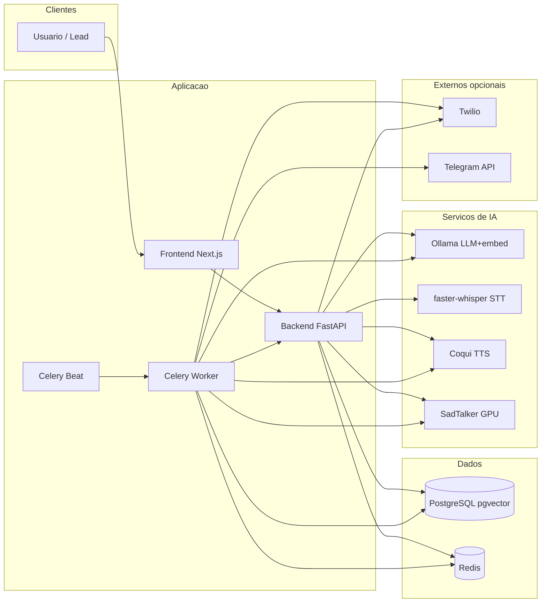
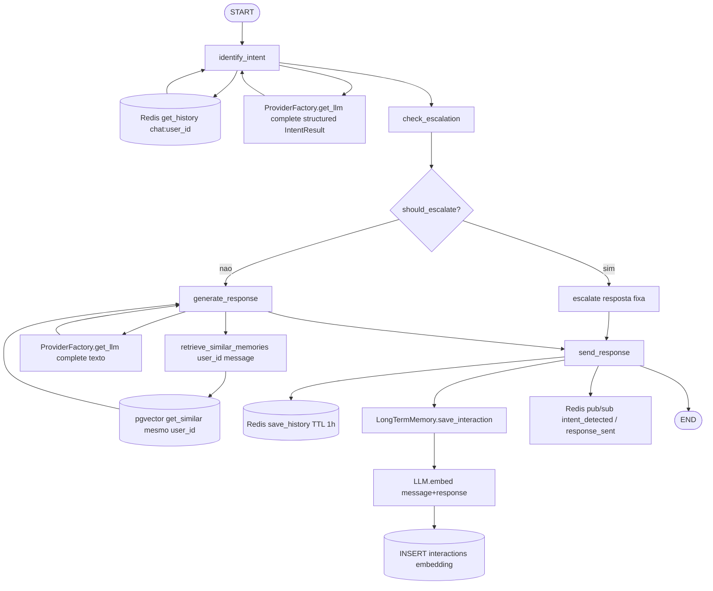
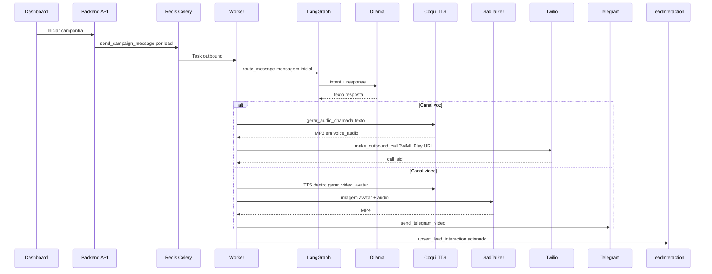
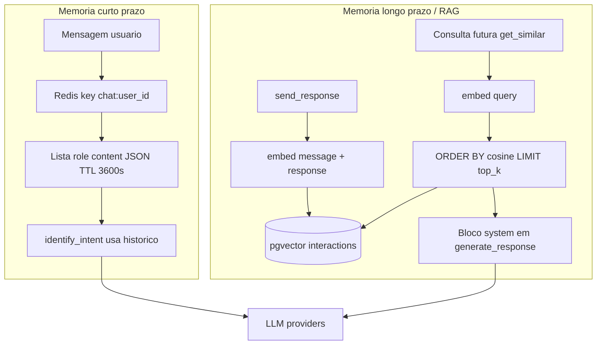

# Autonomous Agent

**Do operador ao agente: atendimento omnichannel com IA multi-agente, modelos locais e voz/avatar sintéticos.**

[](https://www.python.org/)
[](https://fastapi.tiangolo.com/)
[](https://nextjs.org/)
[](https://langchain-ai.github.io/langgraph/)
[](https://docs.docker.com/compose/)
[](LICENSE)

---

## Visão geral

O **Autonomous Agent** é um sistema de **IA aplicada** para atendimento autônomo em múltiplos canais. Dois agentes especializados — **classificação de intenção** e **geração de resposta** — são orquestrados por um **grafo LangGraph** com memória em camadas (Redis + PostgreSQL/pgvector). Por padrão, toda a pilha de modelos roda **localmente** (Ollama, faster-whisper, Coqui XTTS-v2, SadTalker), com opção de trocar para provedores comerciais (OpenAI, ElevenLabs, D-ID) apenas via configuração.

O dashboard Next.js cobre campanhas **ativas** (outbound multi-canal), importação de leads, métricas, devolutivas em Excel e uma tela de **Configurações com hot-reload** (provedores, temperaturas, prompt, voz e avatar) sem reiniciar containers.

---

## Documentação

| Documento | Descrição |
|-----------|-----------|
| [docs/ROTEIRO_APRESENTACAO.md](docs/ROTEIRO_APRESENTACAO.md) | Roteiro de demonstração para a banca (~15–20 min), com foco em IA aplicada |
| [docs/SMOKE_TEST.md](docs/SMOKE_TEST.md) | Checklist de verificação antes da apresentação (comandos e troubleshooting) |
| [infra/docker/sadtalker/README.md](infra/docker/sadtalker/README.md) | Notas do serviço SadTalker (GPU, build, API `/generate`) |
| [docs/demo-assets/README.md](docs/demo-assets/README.md) | Pasta para MP3/MP4/screenshots de fallback (Plano B da demo; arquivos não versionados) |

---

## Destaques de IA

### Sistema multi-agente (LangGraph)

| Agente | Módulo | Papel |
|--------|--------|--------|
| **Agente de intenção** | `agents/workers/intent_agent.py` | Classifica a mensagem em categorias (`greeting`, `question`, `complaint`, `purchase`, `cancel`, `escalate`, `other`), extrai entidades e retorna `confidence` via saída estruturada (Pydantic). |
| **Agente de resposta** | `agents/workers/response_agent.py` | Gera o texto final usando histórico, intenção, entidades e canal. |

O grafo em `agents/orchestrator/graph.py` define os nós e arestas:

1. **`identify_intent`** — carrega histórico do Redis → chama o agente de intenção (LLM) → publica evento `intent_detected`.
2. **`check_escalation`** — define `should_escalate` se intenção `escalate` ou `confidence < 0.5`.
3. **Ramo condicional** (`route_after_escalation_check`):
   - **`escalate`** — resposta fixa de encaminhamento humano.
   - **`generate_response`** — chama o agente de resposta (LLM).
4. **`send_response`** — persiste turno no Redis, grava interação + embedding no pgvector, publica `response_sent` ou `escalated`.

Entrada única: `route_message()` em `agents/orchestrator/router.py` (usada por webhooks, Celery e Telegram).

### Memória e RAG (dois níveis)

| Camada | Tecnologia | Uso no código hoje |
|--------|------------|-------------------|
| **Curto prazo** | Redis (`chat:{user_id}`, TTL 1h) | Histórico multi-turno lido em `identify_intent` e atualizado em `send_response`. |
| **Longo prazo** | PostgreSQL + **pgvector** (`interactions.embedding`) | Cada resposta gera embedding (`LLM.embed` → `nomic-embed-text` no Ollama) e grava em `save_interaction`. |
| **Busca semântica** | `LongTermMemory.get_similar()` / `retrieve_similar_memories` | Recupera interações do mesmo `user_id` por similaridade (`1 - distância cosseno`) e injeta no prompt em `generate_response` (nó do grafo → `response_agent`). |

Dimensão do vetor: **768** com stack OSS (`EMBEDDING_DIMENSIONS=768`); migration `alter_interactions_embedding_dimensions` alinha a coluna ao `.env` no primeiro `upgrade head`.

### Modelos locais (padrão OSS)

| Função | Serviço | Modelo / nota |
|--------|---------|----------------|
| LLM | Ollama | `llama3.1` (chat + classificação + resposta) |
| Embeddings | Ollama | `nomic-embed-text` (via `OllamaLLMProvider.embed`) |
| STT | faster-whisper | `large-v3` (REST; usado no handler de voz **inbound**, ainda não exposto em produção) |
| TTS + clonagem | Coqui XTTS-v2 | `reference.wav` no volume `/voices` |
| Avatar / lip-sync | SadTalker | Imagem em `/avatars` + áudio Coqui → MP4 (GPU NVIDIA) |

Ollama e SadTalker reservam GPU no Compose; Whisper e Coqui rodam em CPU por padrão (comentários no compose para GPU opcional).

### Providers agnósticos

`agents/provider_factory.py` seleciona implementações por `LLM_PROVIDER`, `STT_PROVIDER`, `TTS_PROVIDER`, `AVATAR_PROVIDER`. O grafo LangGraph e os serviços (`voice_audio`, `avatar_video`) **não mudam** ao trocar OSS ↔ comercial — apenas variáveis de ambiente / `app_settings` (UI).

---

## Canais de atendimento

| Canal | Entrega | IA envolvida | Modo no projeto |
|-------|---------|--------------|-----------------|
| **WhatsApp** | Twilio (`send_whatsapp_message` / webhook) | Texto via grafo (Ollama) | **Outbound** (campanha) + **Inbound** (webhook `POST /api/v1/channels/webhooks/whatsapp`) |
| **Telegram** | Bot API (`send_message` / `send_video`) | Texto ou vídeo avatar | **Outbound** (worker). **Inbound**: `TelegramHandler` com polling — requer processo separado (não sobe no Compose por padrão) |
| **Voz** | Twilio Voice (`<Play>` MP3 Coqui ou `<Say>` fallback) | Texto (grafo) → TTS Coqui → MP3 em `voice_audio` | **Outbound** ativo. **Inbound** por chamada: planejado (`VoiceHandler.handle_call`), não implementado |
| **Vídeo** | Telegram `send_video` (MP4) | Texto (grafo) → Coqui → SadTalker | **Outbound** ativo (MVP: destino = `telegram_id` do lead). Inbound com avatar: futuro |

---

## Arquitetura

A stack sobe com `make setup` (ver [Setup](#setup-passo-a-passo)). Componentes principais: dashboard, API, worker assíncrono, banco vetorial, filas e quatro microsserviços de IA.

### A. Arquitetura geral

Fluxo de dados entre camadas: o frontend consome a API; o worker executa campanhas e tarefas agendadas; ambos acessam Postgres, Redis e os serviços de modelo.



### B. Grafo do agente (LangGraph) — foco da banca

Este é o caminho de **uma mensagem** processada por `route_message` → `agent_graph.ainvoke`. Destaque para onde o LLM é chamado e onde a memória entra.



**Nota sobre RAG:** após `send_response`, o par pergunta/resposta fica indexado no pgvector. A função `get_similar(user_id, query)` existe para recuperar contexto por similaridade, mas o nó `generate_response` ainda **não** consulta essa busca — parâmetros `rag_top_k` e `rag_similarity_threshold` já estão na tela de Configurações para quando a injeção no prompt for ligada.

### C. Fluxo outbound — voz e vídeo (campanha ativa)

Sequence desde o disparo da campanha até o lead receber áudio ou vídeo. O texto da fala vem do mesmo grafo LangGraph.



### D. Memória e embeddings



---

## Stack tecnológica

| Camada | Tecnologia | Função |
|--------|------------|--------|
| Orquestração IA | **LangGraph** + LangChain (OpenAI path) | Grafo multi-agente, estado `AgentState` |
| API | **FastAPI** + SQLAlchemy 2 async | REST, webhooks Twilio/WhatsApp, JWT |
| Frontend | **Next.js 15** + TypeScript + Tailwind | Dashboard, settings, métricas, leads |
| Filas | **Celery** + **Redis** | Outbound, inbound async, beat (devolutiva, sweep) |
| Banco | **PostgreSQL 16** + **pgvector** | CRM, `interactions` vetoriais, `app_settings` |
| Cache / pub-sub | **Redis** | Histórico de chat, broker Celery, eventos do agente |
| LLM / embeddings | **Ollama** (padrão) ou OpenAI | Chat, classificação estruturada, embeddings |
| STT | **faster-whisper** ou OpenAI Whisper | Transcrição (handler voz) |
| TTS | **Coqui XTTS-v2** ou ElevenLabs | Voz clonada + áudio para avatar |
| Avatar | **SadTalker** (GPU) ou D-ID | Vídeo talking-head |
| Telefonia / mensagens | **Twilio**, **python-telegram-bot** | WhatsApp, PSTN, Telegram |
| Infra | **Docker Compose** | Stack completa reproduzível |

---

## Modelo de dados

Entidades principais (`backend/app/models/`):

```text
User
 └── Agent (mode: ACTIVE | RECEPTIVE)
 └── Campaign ── CampaignChannel (channel_type: whatsapp | telegram | voice | video)
      └── LeadBase ── LeadBaseChannel (canais habilitados na base)
           └── Lead (nome, telefones, aux_values JSONB: telegram_id, aux1..aux45, ...)
                └── LeadInteraction (status, devolutiva, datas por campanha/canal)

Interaction (pgvector) — memória semântica do grafo (user_id string, embedding, intent)

AppSetting — chave/valor global (providers, temperaturas, prompts) com hot-reload

Channel — credenciais por usuário (legado UI canais)
```

**LeadInteraction** rastreia o ciclo de atendimento (`pendente`, `acionado`, `nao_atendido`, `convertido`, `recusou`, `erro`). Inbound atualiza via `lead_tracking`; outbound via `outbound_campaign`.

---

## Funcionalidades de negócio (suporte à IA)

- **Campanhas multi-canal** — uma base de leads pode acionar WhatsApp, Telegram, voz e vídeo conforme `LeadBaseChannel`.
- **Importação CSV** — mapeamento dinâmico de colunas para `aux1`…`aux45` (`csv_import.py`).
- **Modos de agente** — `ACTIVE` (campanhas) e `RECEPTIVE` (mensagens recebidas); o grafo é o mesmo, muda o gatilho (Celery vs webhook).
- **Devolutiva diária** — Excel por base (`devolutiva.py` + task Celery à meia-noite).
- **Métricas** — agregação por campanha/base (`metrics.py`, dashboard).
- **Configurações** — CRUD em `app_settings`, versão Redis, reload em backend/worker sem restart.

---

## Pré-requisitos

| Requisito | Obrigatório para | Notas |
|-----------|------------------|-------|
| Docker + Compose v2 | Tudo | Caminho oficial do TCC |
| **NVIDIA GPU + Container Toolkit** | SadTalker (vídeo) e aceleração Ollama | Sem GPU: LLM/TTS/STT/WhatsApp/Telegram texto seguem; **vídeo avatar não sobe healthy** |
| ~15–30 GB disco | Modelos Ollama + build SadTalker | Primeiro `make up --build` pode demorar |
| Conta Twilio | WhatsApp + voz outbound | Trial pode exigir tecla no destino |
| Bot Telegram | Canal Telegram / vídeo | Token BotFather; `telegram_id` no lead para outbound |
| GNU Make | Atalhos `make setup` | No Windows: Chocolatey ou WSL |

---

## Setup passo a passo

```bash
# 1. Clonar
git clone <url-do-repositorio>
cd autonomous-agent

# 2. Variáveis de ambiente
cp .env.example .env
# Edite .env se necessário (Twilio, Telegram, PUBLIC_BASE_URL para voz)

# 3. Voz Coqui (obrigatório para TTS/voz/avatar)
# Opção A: coloque reference.wav em infra/docker/coqui-tts/voices/
# Opção B: após subir, envie pela UI em Configurações → Áudio

# 4. Subir stack + modelos + migrations
make setup
# Equivale a: make up → wait-ollama → pull-models → warm-ollama → migrate
# O backend também roda alembic no startup (lifespan)

# 5. Acessar
# Dashboard: http://localhost:3000
# API docs:  http://localhost:8000/docs
# Login padrão (seed): admin@admin.com / admin
```

**Primeira build do SadTalker:** pode levar 15–30+ minutos (checkpoints + GPU). Aguarde `autonomous-agent-sadtalker` healthy antes de testar vídeo.

**Telegram inbound (opcional):** o polling não está no Compose. Com a stack no ar:

```bash
docker exec -it autonomous-agent-worker python -c "
from app.core.config import settings
from agents.channels.telegram import TelegramHandler
TelegramHandler(settings.telegram_bot_token).start()
"
```

---

## Configuração

### Arquivo `.env`

Copie de `.env.example`. Defaults OSS:

```env
LLM_PROVIDER=ollama
STT_PROVIDER=faster_whisper
TTS_PROVIDER=coqui
AVATAR_PROVIDER=sadtalker
EMBEDDING_DIMENSIONS=768
```

Troca para comercial: `openai` / `elevenlabs` / `did` e `EMBEDDING_DIMENSIONS=1536` **antes** do primeiro migrate em banco limpo.

### Tela Configurações (`/dashboard/settings`)

Persistência em `app_settings` + **hot-reload** (`settings_sync.py`: versão Redis, TTL 30s).

| Aba | O que ajusta |
|-----|----------------|
| **Texto (LLM)** | `llm_provider`, URLs/chaves OpenAI e Ollama |
| **Comportamento** | `intent_temperature`, `response_temperature`, `agent_system_prompt`, `rag_top_k`, `rag_similarity_threshold`, `response_max_tokens` |
| **Áudio** | STT/TTS providers, upload `reference.wav`, teste de voz (Coqui → MP3) |
| **Avatar / Vídeo** | `avatar_provider`, SadTalker/D-ID, upload foto de rosto, teste de vídeo (~25s) |

Alterações aplicam no próximo `route_message` / task Celery sem rebuild de containers.

---

## Uso (fluxo típico)

1. **Login** no dashboard.
2. **Criar agente** (modo ATIVO para campanhas).
3. **Criar campanha** e selecionar canais (`whatsapp`, `telegram`, `voice`, `video`).
4. **Importar base CSV** — mapear colunas; incluir `telegram_id` se usar Telegram/vídeo; telefones para WhatsApp/voz.
5. **Configurar IA** — voz (`reference.wav`) e avatar (imagem) nas abas correspondentes.
6. **Iniciar campanha** — worker enfileira `send_campaign_message` por lead.
7. **Monitorar** — métricas no dashboard; WebSocket em `/api/v1/monitoring` (eventos do grafo).
8. **Devolutiva** — download Excel histórico por base; geração diária automática (Celery Beat).

---

## Estrutura de pastas

```text
autonomous-agent/
├── agents/                    # Todo codigo de IA (grafo, providers, canais)
│   ├── orchestrator/          # graph.py, router.py, AgentState
│   ├── workers/               # intent_agent, response_agent
│   ├── memory/                # short_term (Redis), long_term (pgvector)
│   ├── providers/             # llm, stt, tts, avatar (openai, ollama, coqui, …)
│   └── channels/              # whatsapp, telegram, voice, video
├── backend/app/
│   ├── api/v1/                # REST: auth, campaigns, lead_bases, settings, channels
│   ├── models/                # SQLAlchemy: Lead, Campaign, Interaction, AppSetting, …
│   └── services/              # avatar_video, voice_audio, devolutiva, metrics, settings_*
├── worker/tasks/              # outbound_campaign, inbound_handler, devolutiva, status_sweep
├── frontend/src/app/dashboard/# UI: campanhas, leads, settings, metrics, monitoring
├── infra/docker/              # compose, ollama, coqui-tts, faster-whisper, sadtalker
├── backend/alembic/versions/  # Migrations lineares (pgvector 768/1536)
├── docs/fine-tuning/          # Guias LLM, STT, TTS
└── Makefile                   # up, setup, migrate, pull-models, …
```

---

## Comandos úteis (Makefile)

| Comando | Descrição |
|---------|-----------|
| `make setup` | Stack + wait Ollama + pull models + warm + migrate |
| `make up` / `make down` | Sobe / para containers |
| `make migrate` | `alembic upgrade head` no backend |
| `make pull-models` | `llama3.1` + `nomic-embed-text` no Ollama |
| `make logs` | Logs em tempo real |
| `make test` | pytest (backend + agents + worker) |

---

## Roadmap e limitações conhecidas

| Item | Situação |
|------|----------|
| **RAG** | Ativo em `generate_response` (mesmo `user_id`, threshold configurável) |
| **Voz inbound (STT ao vivo)** | `VoiceHandler.handle_call` esqueleto; sem Media Streams Twilio |
| **Vídeo inbound Telegram** | Outbound MVP; `reply_video` no handler é futuro |
| **Telegram receptivo no Compose** | Handler existe; processo de polling manual |
| **Voz outbound Twilio trial** | Pode exigir pressionar tecla no destino |
| **SadTalker sem GPU** | Healthcheck exige `gpu: true` — serviço não fica healthy |
| **Canal `video` em WhatsApp** | Apenas Telegram no MVP |
| **D-ID / OpenAI** | Suportados por provider; não são o default do `.env.example` |

Documentação de fine-tuning: [`docs/fine-tuning/`](docs/fine-tuning/).

---

## Referência rápida — variáveis de ambiente

Ver `.env.example` comentado. Principais grupos: `DATABASE_URL`, Redis/Celery, providers (`LLM_*`, `STT_*`, `TTS_*`, `AVATAR_*`), URLs dos microsserviços (`OLLAMA_*`, `WHISPER_*`, `COQUI_*`, `SADTALKER_*`), Twilio/Telegram, `PUBLIC_BASE_URL`, `EMBEDDING_DIMENSIONS`, portas do host.

---

## Licença

MIT — ver [LICENSE](LICENSE).
