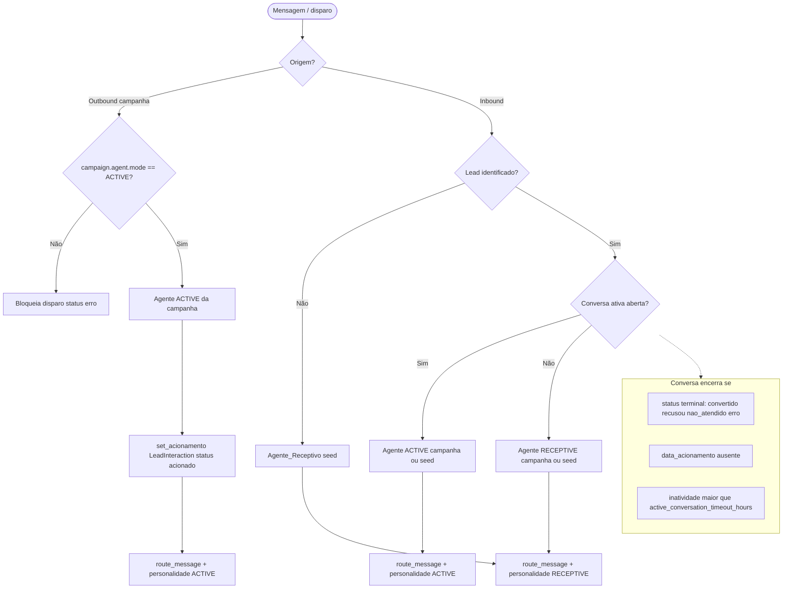
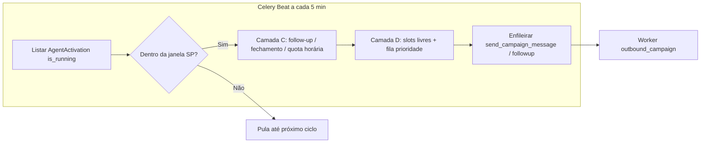
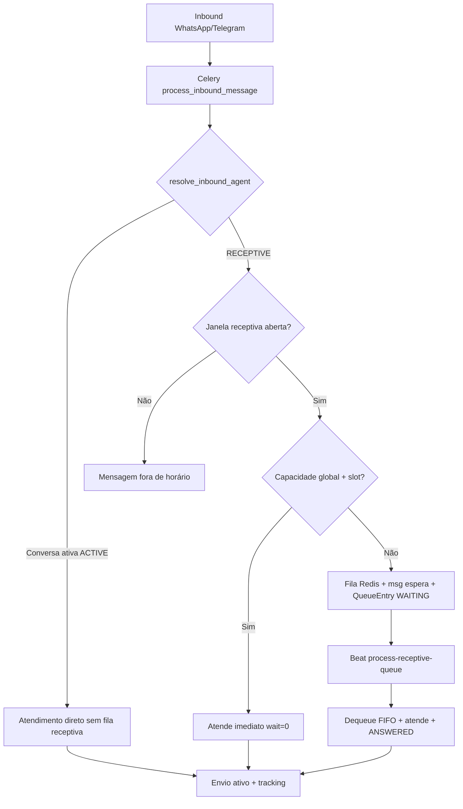
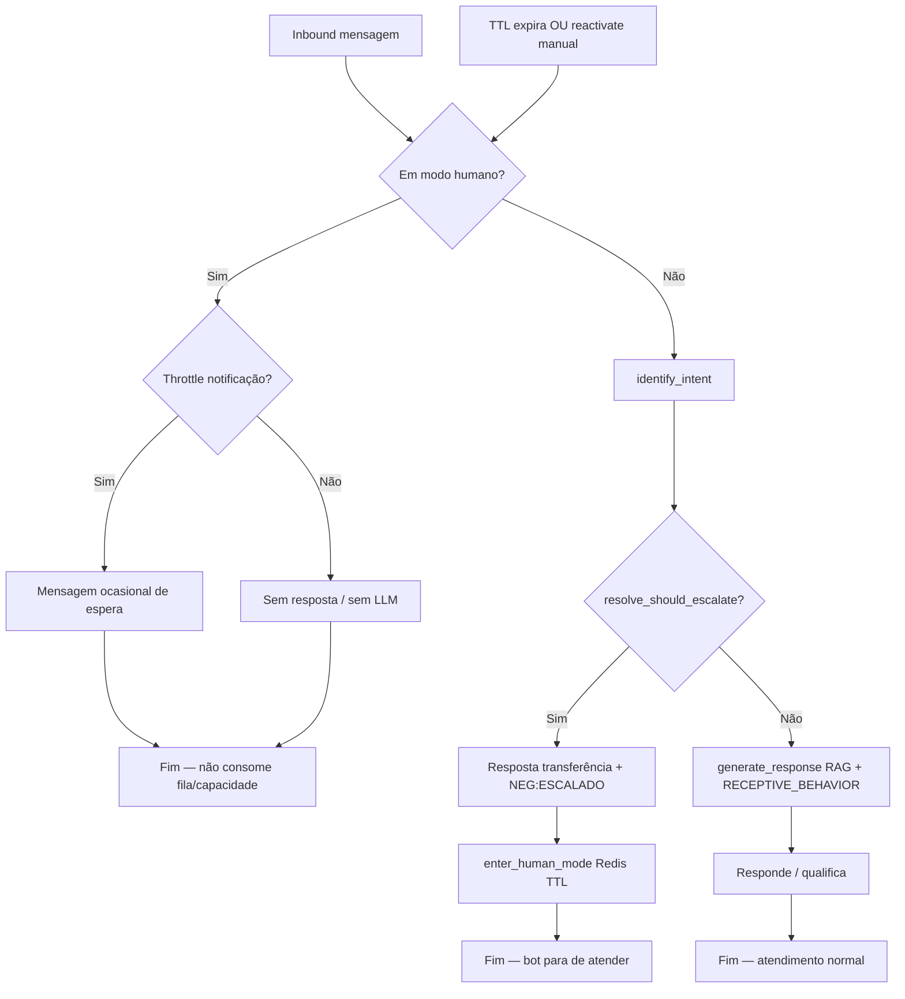
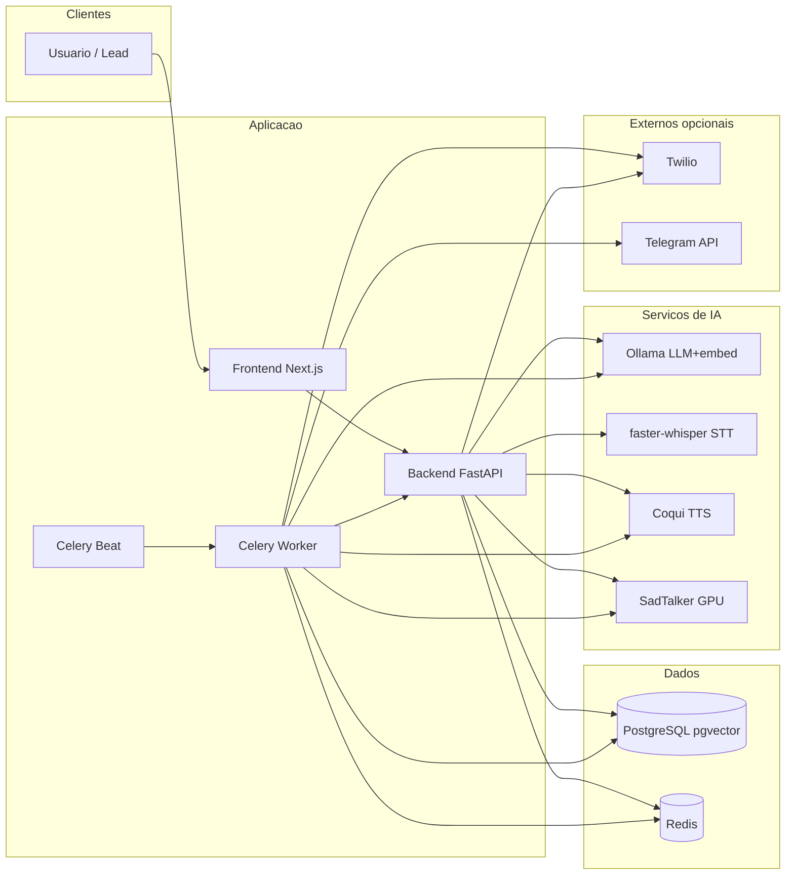
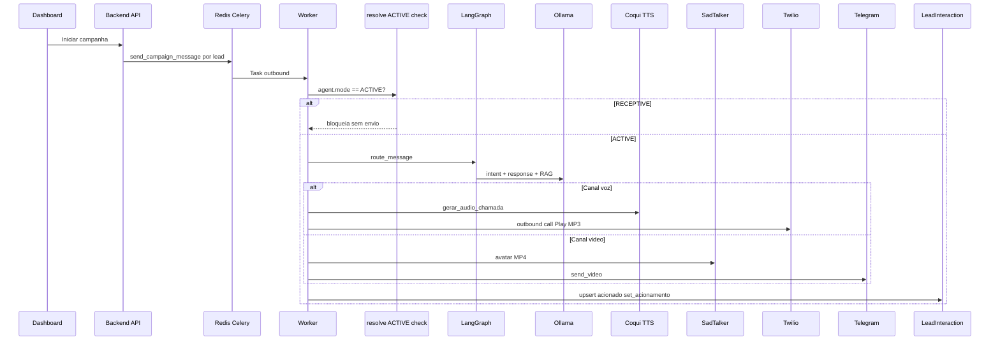
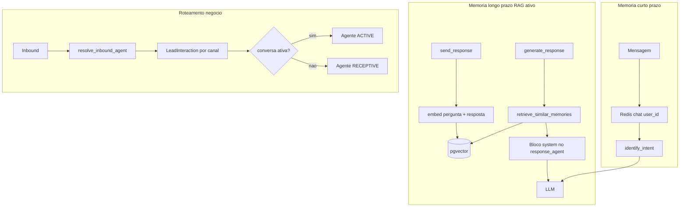

# Autonomous Agent

**Do operador ao agente: atendimento omnichannel com IA multi-agente, modelos locais e voz/avatar sintéticos.**

[](https://github.com/ersjunior/autonomous-agent/actions/workflows/ci.yml)
[](https://www.python.org/)
[](https://fastapi.tiangolo.com/)
[](https://nextjs.org/)
[](https://langchain-ai.github.io/langgraph/)
[](https://docs.docker.com/compose/)
[](LICENSE)

---

## Visão geral

O **Autonomous Agent** é um sistema de **IA aplicada** para atendimento autônomo em múltiplos canais. Dois agentes especializados de **processamento de linguagem** — classificação de intenção e geração de resposta — são orquestrados por um **grafo LangGraph** com memória em camadas (Redis + PostgreSQL/pgvector).

Além disso, o domínio de negócio define **dois perfis de agente de campanha** (`ACTIVE` e `RECEPTIVE`) e um **modelo de propriedade** que separa registros **do sistema** (globais, somente leitura) dos registros **do usuário** (privados, CRUD completo). O **roteamento por dono da conversa** decide qual perfil atende cada contato inbound/outbound.

Por padrão, toda a pilha de modelos roda **localmente** (Ollama, faster-whisper, Coqui XTTS-v2, SadTalker), com opção de trocar para provedores comerciais (OpenAI, ElevenLabs, D-ID) apenas via configuração.

O dashboard Next.js cobre campanhas **ativas** (outbound multi-canal), importação de leads, métricas, devolutivas em Excel, proteção visual de registros (`is_system`, bases IMPORT/MANUAL) e uma tela de **Configurações com hot-reload** sem reiniciar containers.

---

## Documentação

| Documento | Descrição |
|-----------|-----------|
| [Motor de acionamento](#motor-de-acionamento) (neste README) | Camadas A–D, defaults, scheduler, scripts `validate_layer_*` |
| [Atendimento receptivo](#atendimento-receptivo-r-a0--r-c) (neste README) | Inbound unificado, fila, métricas de call center, Erlang C |
| [Comportamento do Agente Receptivo](#comportamento-do-agente-receptivo-b-1--b-2) (neste README) | Conduta híbrida, escalonamento inteligente, handoff humano (modo humano) |
| [Tabulação / Status de Atendimento](#tabulação--status-de-atendimento) (neste README) | Catálogo call center, atribuição híbrida (regras + IA + SIP futuro), devolutiva Excel |
| [docs/ROTEIRO_APRESENTACAO.md](docs/ROTEIRO_APRESENTACAO.md) | Roteiro de demonstração para a banca (~15–20 min), com foco em IA aplicada |
| [docs/SMOKE_TEST.md](docs/SMOKE_TEST.md) | Checklist de verificação antes da apresentação (comandos e troubleshooting) |
| [docs/TESTING.md](docs/TESTING.md) | Suíte de testes: pirâmide em 3 camadas, infraestrutura, CI e comandos |
| [infra/docker/sadtalker/README.md](infra/docker/sadtalker/README.md) | Notas do serviço SadTalker (GPU, build, API `/generate`) |
| [docs/demo-assets/README.md](docs/demo-assets/README.md) | Pasta para MP3/MP4/screenshots de fallback (Plano B da demo; arquivos não versionados) |

---

## Destaques de IA

### Sistema multi-agente (LangGraph)

| Agente (worker) | Módulo | Papel |
|-----------------|--------|--------|
| **Agente de intenção** | `agents/workers/intent_agent.py` | Classifica a mensagem (`greeting`, `question`, `complaint`, `purchase`, `cancel`, `escalate`, `other`), extrai entidades e retorna `confidence` via saída estruturada (Pydantic). |
| **Agente de resposta** | `agents/workers/response_agent.py` | Gera o texto final usando histórico Redis, intenção, entidades, canal, **memórias RAG** e **personalidade do agente de negócio** selecionado (`agent_personality` no `AgentState`). |

O grafo em `agents/orchestrator/graph.py` define os nós e arestas:

1. **`identify_intent`** — carrega histórico do Redis → LLM estruturado → evento `intent_detected`.
2. **`check_escalation`** — `should_escalate` se intenção `escalate` ou `confidence < 0.5`.
3. **Ramo condicional** (`route_after_escalation_check`):
   - **`escalate`** — resposta fixa de encaminhamento humano.
   - **`generate_response`** — recupera RAG + chama LLM de resposta.
4. **`send_response`** — persiste turno no Redis, grava interação + embedding no pgvector, publica `response_sent` ou `escalated`.

Entrada única: `route_message()` em `agents/orchestrator/router.py` (webhooks, Celery, Telegram). O worker inbound injeta `agent_context` (nome, modo, descrição) antes de invocar o grafo.

### Agentes de negócio: ATIVO e RECEPTIVO

Entidade `Agent` (`backend/app/models/agent.py`) com `mode: ACTIVE | RECEPTIVE` e `description` (texto rico usado no prompt).

| Modo | Papel de negócio | Gatilho típico |
|------|------------------|----------------|
| **ACTIVE** | Proativo: conduz **disparos outbound** de campanha; abre e mantém a “conversa ativa” após acionamento. | `worker/tasks/outbound_campaign.py` — exige `campaign.agent.mode == ACTIVE` para enviar. |
| **RECEPTIVE** | Passivo: atende **primeiro contato** ou retorno após conversa encerrada; não dispara outbound. | `worker/tasks/inbound_handler.py` + `resolve_inbound_agent()`. |

Seeds no startup (`seed_default_agents`): **Agente_Ativo** (ACTIVE) e **Agente_Receptivo** (RECEPTIVE), ambos `is_system=true`, com descrições orientando o comportamento no prompt.

### Roteamento por dono da conversa

Implementado em `worker/tasks/conversation_routing.py` e aplicado no inbound (`inbound_handler.py`). O outbound valida o agente da campanha antes de disparar.

**Regra resumida:**

| Situação | Agente que atende |
|----------|-------------------|
| **Outbound** (campanha dispara) | Agente **ACTIVE** da campanha (`Campaign.agent_id`). Se não for ACTIVE → disparo **bloqueado** (tracking com `status=erro`). |
| **Inbound** + conversa ativa **aberta** | Agente **ACTIVE** (preferência: agente da campanha da `LeadInteraction`; fallback: `Agente_Ativo` seed). |
| **Inbound** + primeiro contato ou conversa **encerrada** | Agente **RECEPTIVE** (preferência: agente RECEPTIVE da campanha; fallback: `Agente_Receptivo` seed). |
| **Contato desconhecido** (lead não identificado) | `Agente_Receptivo` (primeiro contato). |

**Conversa ativa aberta** (`is_active_conversation_open`) — todas as condições:

- Existe `LeadInteraction` para o par `(lead_id, channel_type)` mais recente.
- `data_acionamento` preenchido (houve acionamento outbound).
- `status` **não** está em status terminal: `convertido`, `recusou`, `nao_atendido`, `erro`.
- `(agora - data_ultimo_contato) ≤ active_conversation_timeout_hours` (default **24h**).

**Conversa encerrada** quando qualquer condição acima falha (inclui inatividade além do timeout).

> **Dois timeouts distintos:** `active_conversation_timeout_hours` (24h) encerra a conversa ativa para **roteamento** inbound. `status_timeout_hours` (48h, Celery Beat) marca `acionado` sem resposta como `nao_atendido` — sweep em `worker/tasks/status_sweep.py`.

### Memória e RAG (dois níveis) — **ativo no grafo**

| Camada | Tecnologia | Uso |
|--------|------------|-----|
| **Curto prazo** | Redis (`chat:{user_id}`, TTL 1h) | Histórico multi-turno em `identify_intent` / `send_response`. |
| **Longo prazo** | PostgreSQL + **pgvector** (`interactions.embedding`) | `save_interaction` após cada resposta; embedding via `ProviderFactory.get_llm().embed`. |
| **RAG na geração** | `LongTermMemory.retrieve_similar_memories()` | Chamado em `generate_response` (grafo); filtra por **mesmo `user_id`**, `rag_top_k` e `rag_similarity_threshold`; injeta bloco system em `response_agent.format_rag_context_block`. |

Dimensão do vetor: **768** com stack OSS (`EMBEDDING_DIMENSIONS=768`); migration `alter_interactions_embedding_dimensions` alinha a coluna ao `.env`.

**Isolamento:** cada contato no canal usa um `user_id` estável (telefone normalizado ou `telegram_id`); memórias semânticas não cruzam usuários.

### Modelos locais (padrão OSS)

| Função | Serviço | Modelo / nota |
|--------|---------|----------------|
| LLM | Ollama | `llama3.1` (chat + classificação + resposta) |
| Embeddings | Ollama | `nomic-embed-text` |
| STT | faster-whisper | `large-v3` (handler voz inbound — integração de chamada ainda limitada) |
| TTS + clonagem | Coqui XTTS-v2 | `reference.wav` no volume `/voices` |
| Avatar / lip-sync | SadTalker | Imagem em `/avatars` + áudio Coqui → MP4 (GPU NVIDIA) |

Ollama e SadTalker reservam GPU no Compose; Whisper e Coqui rodam em CPU por padrão.

### Providers agnósticos

`agents/provider_factory.py` seleciona implementações por `LLM_PROVIDER`, `STT_PROVIDER`, `TTS_PROVIDER`, `AVATAR_PROVIDER`. O grafo e os serviços (`voice_audio`, `avatar_video`) **não mudam** ao trocar OSS ↔ comercial — apenas `.env` / `app_settings` (UI com hot-reload).

---

## Regras de negócio

### Modelo de propriedade e proteção

Camada central: `backend/app/core/authorization.py` (`can_view`, `can_edit`, `can_delete`, `raise_if_cannot_*`).

| Tipo de registro | Visibilidade | Mutação (API + UI) |
|------------------|--------------|---------------------|
| **`is_system=true`** (padrão do sistema) | **Global** — todos os usuários autenticados veem | **Somente leitura** — PUT/DELETE retornam **403** com mensagem clara; UI: selo **“Padrão do sistema”** + botão Visualizar |
| **Do usuário** (`user_id` = dono) | Apenas o dono | CRUD completo (criar, editar, excluir) |

Aplica-se a **Agent**, **Channel**, **Campaign** e **Lead**. **LeadBase** deriva o dono via `Campaign.user_id`; listagens incluem bases de campanhas visíveis (`Campaign.is_system` ou dono).

Campanhas `is_system` não podem ser **iniciadas** por usuários comuns (`raise_if_cannot_edit` em `POST /campaigns/{id}/start`).

### Padrões do sistema (seed no startup)

Idempotente por nome (`backend/app/core/seed.py` + `ensure_seed_flags()` no lifespan):

| Recurso | Nomes | Detalhes |
|---------|-------|----------|
| **Admin** | `admin@admin.com` / `admin` | Criado se não existir |
| **4 canais** | `WhatsApp_Agent`, `Telegram_Agent`, `Voice_Agent`, `Video_Agent` | Credenciais do `.env`; `is_system=true` |
| **2 agentes** | `Agente_Ativo`, `Agente_Receptivo` | ACTIVE / RECEPTIVE; descrições longas; `config` `{tipo: outbound\|inbound}`; `is_system=true` |
| **16 tabulações** | Códigos `SIP:*` + `NEG:*` | Catálogo call center; `is_system=true`; read-only na API/UI |

O usuário **não começa do zero**: ao subir a stack, já pode usar canais e agentes padrão em campanhas (`agent_id` de agente sistema permitido via `can_view`).

### Regras de leads e bases

| Origem (`LeadBase.source`) | Leads individuais | Base inteira |
|----------------------------|-------------------|--------------|
| **IMPORT** (CSV via `/lead-bases/import`) | **Somente leitura** — PUT/DELETE do lead → 403 | Pode **excluir a base** (`DELETE /lead-bases/{id}`) — CASCADE nos leads |
| **MANUAL** (`POST /lead-bases/`) | CRUD completo | Exclusão permitida (se não `is_system`) |

Read-only de lead importado: checagem via `lead.lead_base.source` (`is_lead_from_import` em `authorization.py`), sem campo duplicado no lead.

### Decisão: qual agente atende o contato?



### Rastreamento, devolutiva e métricas

- **`LeadInteraction`** — por `(lead, campaign, channel_type)`: `status`, `devolutiva`, `data_acionamento`, `data_ultimo_contato`, vínculo com última `Interaction` do grafo quando aplicável.
- **Inbound** — `track_inbound_lead_interaction()` atualiza status conforme intenção (`convertido` / `recusou` / `em_andamento`).
- **Devolutiva** — Excel diário por base (`devolutiva.py` + Celery Beat); colunas **Status operacional**, **Tabulação** e **Categoria Tabulação** (ver [Tabulação](#tabulação--status-de-atendimento)); download sob demanda no dashboard.
- **Métricas** — agregação por campanha/base no dashboard; **fila receptiva** em `GET /api/v1/metrics/queue` (`queue_metrics.py`).

---

## Campanhas — iniciar, parar e retomar

Além de **iniciar** (`POST /api/v1/campaigns/{id}/start` → `status=active`, enfileira leads), campanhas **ativas** podem ser **paradas**:

| Ação | Endpoint | Efeito |
|------|----------|--------|
| **Iniciar** | `POST /campaigns/{id}/start` | `status=active`; dispara outbound conforme motor |
| **Parar** | `POST /campaigns/{id}/stop` (campanha `status=active`) | `status=paused`; desliga **todas** as `AgentActivation` (`is_running=false`) da campanha |
| **Retomar** | `POST /campaigns/{id}/start` novamente | Volta a `active` e religa acionamentos por canal |

A UI em `/dashboard/campaigns` expõe **Parar** em campanhas ativas (ícone quadrado, mesmo padrão de ações de registro). Tasks já enfileiradas no Celery **não** são canceladas ao parar — o scheduler deixa de enfileirar novos disparos.

Script de regressão: `validate_campaign_stop.py`.

---

## Motor de acionamento

Motor outbound para campanhas com agente **ACTIVE**: parâmetros por agente+canal, janela de horário, cadência de tentativas e concorrência com slots no Redis. API em `/api/v1/activation` e `/api/v1/agents/{id}/channel-settings`; UI em `/dashboard/activation`.

### Dashboard — 3 abas (`/dashboard/activation`)

| Aba | Função |
|-----|--------|
| **Motor de campanha** | Liga/desliga por canal, edita parâmetros (janela, cadência, slots) — comportamento existente das camadas A–D |
| **Teste de acionamento** | Disparo **ad-hoc síncrono**: escolhe agente **ACTIVE**, lead e canal; **não** exige campanha em execução. Usa a campanha da base do lead só para `LeadInteraction`. Bypassa janela/cadência/scheduler; **respeita** capacidade global. A resposta do LLM/canal aparece na tela na hora — ideal para **demonstração** (ex.: Telegram ao vivo na banca). API: `POST /api/v1/activation/test-dispatch` |
| **Histórico de acionamentos** | Lista **paginada** de acionamentos **outbound** (`LeadInteraction` com `data_acionamento` preenchida). Filtros: campanha, canal, status, só abertos. Ação **Finalizar** em atendimentos não terminais: tabulação escolhida, origem `MANUAL_FINALIZE`, libera slot/capacidade. API: `GET /api/v1/activation/history`, `POST /api/v1/activation/interactions/{id}/finalize` |

Scripts: `validate_test_dispatch.py`, `validate_activation_history.py`.

| Camada | Responsabilidade | Implementação principal |
|--------|------------------|-------------------------|
| **A** | Parâmetros por `(agente, canal)`: concorrência, cadência, horário; liga/desliga por campanha+canal | `activation_defaults.py`, `AgentChannelSettings`, `AgentActivation` |
| **B** | Janela `horario_inicio`–`horario_fim` no fuso **America/Sao_Paulo** (`ACTIVATION_TIMEZONE`); scheduler só enfileira dentro da janela | `activation_window.py`, Celery Beat `process_active_activations` (a cada 5 min, UTC) |
| **C** | Cadência: rate limit voz/vídeo por hora; 2ª mensagem WhatsApp/Telegram após N min; encerramento após N tentativas sem resposta | `activation_cadence.py`, `activation_scheduler.py` |
| **D** | Concorrência: slots atômicos no Redis (Lua), fila de prioridade (ZSET) para leads pulados por falta de slot | `activation_slots.py`, integração no scheduler + `outbound_campaign.py` |

### Defaults do sistema (por canal)

Valores padrão em `backend/app/core/activation_defaults.py` (editáveis por agente não-sistema na UI/API):

| Parâmetro | Voz / Vídeo | WhatsApp / Telegram |
|-----------|-------------|---------------------|
| Concorrência simultânea | `chamadas_simultaneas` = **1** | `chats_simultaneos` = **5** |
| Campanhas simultâneas (mesmo agente+canal) | `campanhas_simultaneas` = **1** | `campanhas_simultaneas` = **1** |
| Cadência | `tentativas_por_hora` = **6** | `tentativas_sem_resposta` = **2**, `minutos_segunda_mensagem` = **20** |
| Janela de horário | `horario_inicio` / `horario_fim` = **09:00** – **20:00** | idem |

**Camada D (comportamento):** voz/vídeo ocupam slot por chamada (~`CALL_SLOT_TTL_SECONDS`, default 300s) sem callback Twilio; messaging libera slot ao status terminal ou inatividade (`ACTIVE_CONVERSATION_TIMEOUT_HOURS`), com TTL de segurança `CHAT_SLOT_TTL_SECONDS`. Leads pulados entram na fila de prioridade e são atendidos antes de pendentes novos.

### Dois “históricos” — não confundir

| Tela | Escopo | Foco |
|------|--------|------|
| **Acionamento → Histórico de acionamentos** | Só outbound de campanha (`data_acionamento IS NOT NULL`) | Operação: tentativas, tabulação, **finalizar manual** |
| **Monitoramento → Histórico de atendimentos** | Conversas com mensagens (inbound receptivo + outbound); inclui contatos **órfãos** sem lead | Supervisão/QA: **thread de mensagens**, somente leitura |

Duração: em **chat** (WhatsApp/Telegram) é **estimada** (primeira → última mensagem em `interactions`). Em **voz/vídeo** a duração da **chamada** é **indisponível** (sem callback Twilio) — a UI mostra isso explicitamente; só há transcrição parcial das falas passadas pelo grafo.

### Ciclo do scheduler (Beat)



Ordem de candidatos por ciclo: **(1)** fila de prioridade Redis → **(2)** follow-ups elegíveis → **(3)** leads pendentes (1ª mensagem), respeitando `campanhas_simultaneas` e limites de slot.

Variáveis de ambiente (seção `# Motor de acionamento` em `.env.example`): `ACTIVATION_TIMEZONE`, `CALL_SLOT_TTL_SECONDS`, `CHAT_SLOT_TTL_SECONDS`, `ACTIVE_CONVERSATION_TIMEOUT_HOURS`, `STATUS_TIMEOUT_HOURS`.

---

## Atendimento receptivo (R-A.0 → R-C)

Camadas que complementam o motor de acionamento **ACTIVE**: inbound omnichannel unificado, **fila de atendimento** com teoria de filas, **métricas de call center** e **dimensionamento** (capacidade estimada + Erlang C). O agente **RECEPTIVE** (`Agente_Receptivo`) atende primeiro contato e retornos após conversa encerrada; o roteamento continua em `conversation_routing.py` e `worker/tasks/inbound_handler.py`.

### R-A.0 — Inbound unificado

| Etapa | Comportamento |
|-------|----------------|
| **Webhook / polling** | WhatsApp (`POST /api/v1/channels/webhooks/whatsapp`) e Telegram (`TelegramHandler`) **não** chamam o grafo de forma síncrona no processo HTTP/polling. |
| **Fila Celery** | Enfileiram `process_inbound_message.delay(channel, user_id, message)` (WhatsApp pode enviar `message_sid` para dedup Redis). |
| **Worker** | `resolve_inbound_agent` → se **ACTIVE** (conversa aberta): atendimento direto; se **RECEPTIVE**: fluxo com capacidade/fila (`inbound_attendance.py`). |
| **Resposta** | Envio **ativo** pelo canal (Twilio/Telegram API no worker), não TwiML com texto do LLM no webhook. |
| **Tracking** | `track_inbound_lead_interaction()` atualiza `LeadInteraction` conforme intenção. |

Dedup WhatsApp: `inbound_dedup:whatsapp:{MessageSid}` (NX, 24h). Após cada task Celery, `engine.dispose()` + `reset_worker_async_clients()` evitam `InterfaceError` por event loop fechado.

### R-A — Fila de atendimento e capacidade global

**Teto global ponderado** (`capacity_service.py`): ativo (outbound) e receptivo **compartilham** o mesmo `MAX_WEIGHTED_CAPACITY` (pesos por canal em `CHANNEL_WEIGHT_*`). Redis: `global_capacity_usage`, fila `receptive_queue:{channel}` (ZSET FIFO por timestamp), payload `queue_payload:{ch}:{user}`.

Fluxo receptivo (mensageria WhatsApp/Telegram):

1. Fora da **janela receptiva** (`receptivo_horario_inicio` / `receptivo_horario_fim` em settings do canal; default **00:00–23:59** = 24/7) → mensagem automática, sem fila.
2. **Capacidade livre** → atendimento imediato (`record_receptive_immediate_answer`, `wait_seconds=0`).
3. **Capacidade cheia** → `enqueue_receptive` + mensagem de espera + `QueueEntry` **WAITING**.
4. **Celery Beat** `process-receptive-queue` (intervalo `RECEPTIVE_QUEUE_BEAT_SECONDS`, default 30s) → dequeue FIFO quando houver capacidade → `record_receptive_answered`.

Outbound **ACTIVE** também debita o teto global antes do slot local (R-C): scheduler usa `try_acquire_outbound_capacity`; se cheio, lead volta à **fila de prioridade** da Camada D.



### R-B — Métricas de fila (call center)

Histórico em PostgreSQL (`queue_entries`); estado quente da fila permanece no Redis.

| Métrica | Definição |
|---------|-----------|
| **Tempo médio de espera** | Média de `wait_seconds` dos atendidos com espera > 0. |
| **Nível de serviço** | % de atendidos com `wait_seconds ≤ SERVICE_LEVEL_TARGET_SECONDS` (default **20s** — alvo clássico **80/20** com `ERLANG_TARGET_SERVICE_LEVEL=0.80` no dimensionamento). |
| **Taxa de abandono** | `ABANDONED / enfileirados` — **abandono só VOZ** (`mark_abandoned`, sweep `sweep-queue-abandonment` a cada 2 min). **Mensageria não abandona**; sem inbound de voz, a taxa tende a **zero** (estrutura pronta). |
| **Tamanho da fila** | Soma `queue_size` Redis por canal messaging. |

API: `GET /api/v1/metrics/queue?days=1`. UI: dashboard **Métricas** → seção **Fila de atendimento**.

Migration Alembic: `h9i0j1k2l3m4` (`queue_entries`, enum `queue_entry_status`).

### R-C — Capacidade estimada e Erlang C

| Componente | Papel |
|------------|------|
| `capacity_estimate.py` | `psutil` (CPU/RAM **do container** — cgroup, não host físico) + coeficientes `CHANNEL_COST_*`; sinal GPU opcional via `GET` SadTalker `/health`. |
| `erlang.py` | Motor **analítico**: Erlang C, nível de serviço previsto, `required_agents` — **não controla** fila nem runtime. |
| `capacity_analysis.py` | Agrega recursos, uso global (ativo vs receptivo), λ, AHT, SLA previsto. |
| Dashboard | **Capacidade** → `/dashboard/capacity`. |

**Honestidade operacional:**

- **Capacidade de canais** = **estimativa** (perfil de carga abstrato), não medição exata de hardware. `MAX_WEIGHTED_CAPACITY_OVERRIDE=0` deriva o teto de CPU/RAM; valor > 0 força override manual.
- **Abandono** = conceito de **voz** (desligou na fila); dados reais quando existir inbound de voz.
- **Erlang C** = **planejamento** e banca; o controle em produção é Redis + scheduler.
- **AHT** observado: proxy em `LeadInteraction` encerradas (`data_acionamento` → última atividade); com pouco histórico usa `DEFAULT_AHT_SECONDS` (default 180s). `wait_seconds` na fila mede **espera**, não duração total do atendimento.

API: `GET /api/v1/capacity`.

### Variáveis de ambiente (atendimento receptivo)

Seções `# R-A`, `# R-B` e `# R-C` em `.env.example`:

| Variável | Default | Uso |
|----------|---------|-----|
| `MAX_WEIGHTED_CAPACITY` | `50` | Teto legado se override=0 e estimativa falhar |
| `MAX_WEIGHTED_CAPACITY_OVERRIDE` | `0` | >0 força teto manual; `0` = derivado do hardware |
| `CHANNEL_WEIGHT_WHATSAPP` / `TELEGRAM` / `VOICE` / `VIDEO` | `1` / `1` / `3` / `4` | Peso no teto global (runtime) |
| `RECEPTIVE_QUEUE_BEAT_SECONDS` | `30` | Beat da fila receptiva |
| `RECEPTIVE_QUEUE_PAYLOAD_TTL_SECONDS` | `86400` | TTL payload Redis na fila |
| `SERVICE_LEVEL_TARGET_SECONDS` | `20` | Alvo T (segundos) para SLA na UI/API |
| `QUEUE_ABANDON_TIMEOUT_SECONDS` | `60` | Sweep abandono **voz** (futuro inbound) |
| `CHANNEL_COST_WHATSAPP` / `TELEGRAM` / `VOICE` / `VIDEO` | `1` / `1` / `3` / `5` | Custo abstrato por canal (estimativa) |
| `CAPACITY_CPU_UNITS_PER_CORE` | `10` | Unidades de recurso por core |
| `CAPACITY_MB_PER_UNIT` | `512` | MB por unidade de recurso |
| `GPU_CAPACITY_BOOST` | `1.15` | Multiplicador se SadTalker reportar GPU |
| `DEFAULT_AHT_SECONDS` | `180` | AHT fallback sem histórico |
| `CAPACITY_HISTORY_DAYS` | `7` | Janela para λ e AHT observados |
| `ERLANG_TARGET_SERVICE_LEVEL` | `0.80` | Alvo 80% no dimensionamento Erlang |

Parâmetros de janela receptiva por canal: `receptivo_horario_inicio` / `receptivo_horario_fim` (API/UI de acionamento, defaults 24/7).

### Scripts de validação (receptivo)

| Script | O que prova |
|--------|-------------|
| `validate_layer_ra_receptive.py` | Fila FIFO, capacidade global, janela 24/7, processador Beat |
| `validate_layer_rb_queue.py` | `QueueEntry`, SLA, `GET /metrics/queue`, abandono voz (manual) |
| `validate_layer_rc_capacity.py` | Erlang C (referência A=10, N=14), outbound no global, `GET /capacity` |

```bash
docker exec -e MAX_WEIGHTED_CAPACITY_OVERRIDE=2 autonomous-agent-worker \
  python /workspace/backend/scripts/validate_layer_ra_receptive.py
docker exec -e MAX_WEIGHTED_CAPACITY_OVERRIDE=2 autonomous-agent-worker \
  python /workspace/backend/scripts/validate_layer_rb_queue.py
docker exec autonomous-agent-worker \
  python /workspace/backend/scripts/validate_layer_rc_capacity.py
```

### Celery Beat (tarefas novas)

Além de `process_active_activations` e sweeps existentes (`worker/celery_app.py`):

| Beat | Task | Intervalo |
|------|------|-----------|
| `process-receptive-queue` | `receptive_queue.process_receptive_queue` | `RECEPTIVE_QUEUE_BEAT_SECONDS` |
| `sweep-queue-abandonment` | `queue_abandon_sweep.sweep_queue_abandonment` | 120s (só entradas **VOZ** WAITING além do timeout) |

---

## Comportamento do Agente Receptivo (B-1 + B-2)

Camada de **conduta conversacional** e **handoff para humano**, complementar à infraestrutura de fila/capacidade descrita acima. Implementação: `agents/workers/response_agent.py`, `agents/orchestrator/graph.py`, `agents/workers/intent_agent.py`, `backend/app/services/inbound_attendance.py`, `backend/app/services/human_handoff.py`.

O perfil **RECEPTIVE** no banco (`Agente_Receptivo`, `description`) define **quem é** o agente; um bloco operacional separado — `RECEPTIVE_BEHAVIOR_PROMPT` — define **como age** quando `agent_mode == "RECEPTIVE"` no grafo. Os dois são injetados como system messages distintas em `build_response_messages()`.

### Conduta híbrida (B-1)

O receptivo **responde** e **qualifica** na mesma conversa:

| Aspecto | Comportamento |
|---------|----------------|
| **Responder** | Esclarece dúvidas com clareza, usando histórico imediato (Redis) e memória de longo prazo (**RAG** / pgvector). Não inventa fatos fora do contexto. |
| **Qualificar** | Quando o lead demonstra interesse sem detalhar, faz **perguntas naturais**, uma de cada vez, para entender necessidade, prazo ou canal preferido — sem interrogatório ou script rígido. |
| **Tom** | Acolhedor e profissional; conversa fluida. |
| **ACTIVE** | O bloco `RECEPTIVE_BEHAVIOR_PROMPT` **não** é injetado; apenas `agent_personality` + prompt global. |

### Escalonamento inteligente (B-1)

Após `identify_intent`, o nó `check_escalation` usa `resolve_should_escalate()`:

| Gatilho | Condição | Efeito |
|---------|----------|--------|
| **Pedido explícito de humano** | `intent == "escalate"` (classificador instruído a marcar quando o lead pede atendente, supervisor ou pessoa real) | Escala |
| **Baixa confiança** | `confidence < 0.5` (`ESCALATION_CONFIDENCE_THRESHOLD`) | Escala |
| **Reclamação grave** | `intent == "complaint"` **e** `complaint_severity == "high"` | Escala |
| **Reclamação leve** | `intent == "complaint"` **e** `complaint_severity == "low"` | **Não** escala — o bot tenta resolver em `generate_response` |

A gravidade é avaliada pela IA no structured output do `intent_agent` (`IntentResult.complaint_severity`: `low` \| `high`; default `low` para retrocompatibilidade). Reclamações leves (demora, confusão menor) permanecem com o bot; graves (ameaça legal, indignação extrema, promessa de processar) escalam.

Quando escala: resposta fixa de transferência (`escalate` no grafo) + evento Redis `escalated` + tabulação **`NEG:ESCALADO`** (origem **`ESCALATION`**) na `LeadInteraction`.

### Handoff humano — modo humano (B-2)

Ao escalar, a transferência deixa de ser só telemetria: o bot **para de responder** aquele contato até saída explícita do modo humano.

| Componente | Detalhe |
|------------|---------|
| **Estado** | Redis `human_mode:{channel}:{user_id}` com timestamp do escalonamento |
| **TTL** | `HUMAN_MODE_TTL_SECONDS` (default **14400** = 4h) — timeout de segurança se ninguém assumir |
| **Entrada** | `enter_human_mode()` após `should_escalate=true` em `attend_inbound_message` (libera capacidade/slot adquiridos) |
| **Curto-circuito** | **Antes** de `route_message`, fila ou capacidade: se `is_in_human_mode`, o grafo/LLM **não** roda |
| **Mensagem ocasional** | *"Seu atendimento está na fila de atendimento humano, em breve um atendente prosseguirá."* — throttle via `human_mode_notified:{channel}:{user_id}` e `HUMAN_MODE_NOTIFY_INTERVAL_SECONDS` (default **300** = 5 min); não spamma a cada mensagem |
| **Escopo** | Por contato (`channel` + `user_id`), independente de ACTIVE/RECEPTIVE; gatilho vem do fluxo inbound receptivo |

Enquanto em modo humano: **não** consome slot/capacidade global, **não** entra na fila receptiva.

**Saída do modo humano:**

1. **Reativação manual** — operador no painel (`/dashboard/monitoring` → seção **Modo humano** → **Devolver ao bot**) ou `POST /api/v1/handoff/reactivate` com `{ channel, user_id }`.
2. **Timeout (TTL)** — chave expira no Redis; próxima mensagem volta a ser atendida pelo bot normalmente.

API complementar: `GET /api/v1/handoff/active` — lista contatos aguardando humano (leitura das chaves `human_mode:*`).



### Variáveis de ambiente (comportamento receptivo)

Seção `# B-2` em `.env.example`:

| Variável | Default | Uso |
|----------|---------|-----|
| `HUMAN_MODE_TTL_SECONDS` | `14400` | Tempo máximo em modo humano antes de devolver ao bot |
| `HUMAN_MODE_NOTIFY_INTERVAL_SECONDS` | `300` | Intervalo mínimo entre mensagens ocasionais de espera |

## Monitoramento — tempo real e histórico de atendimentos

UI: `/dashboard/monitoring`. API WebSocket: `ws://…/api/v1/monitoring/ws` (canal Redis `agent_events`).

### Dashboard — 2 abas

| Aba | Função |
|-----|--------|
| **Tempo real** | Badge de conexão WebSocket; feed de eventos (`message_received`, `intent_detected`, `response_sent`, `escalated`); painel **Modo humano** (handoff H-2: Assumir / Finalizar / Devolver ao bot) — comportamento existente |
| **Histórico de atendimentos** | Lista **paginada** híbrida: `LeadInteraction` com atividade conversacional **ou** contatos receptivos **órfãos** (sem LI). Filtros: campanha, canal, status, só abertos. **Abrir conversa** reconstrói a thread a partir de `interactions` (bolhas user/assistant). **Somente leitura** — finalização manual fica no histórico de **Acionamento** (item 3). API: `GET /api/v1/monitoring/attendance-history`, `GET /api/v1/monitoring/attendance/{lead_interaction_id}/messages`, `GET /api/v1/monitoring/contact-messages?channel=&contact_user_id=` (órfãos) |

**Normalização WhatsApp:** inbound grava `whatsapp:+5511…` e outbound `+5511…` em `interactions.user_id`. O helper `canonical_contact_ids()` (`contact_normalization.py`) busca **ambas** as formas para a thread não ficar partida.

**Órfãos receptivos:** `interactions` não tem `campaign_id`; política de visibilidade — só o **dono do Agente_Receptivo** seed (tipicamente admin) vê contatos sem `LeadInteraction`, evitando vazamento entre tenants.

**Honestidade:** duração de chat = estimada; voz = `duration_available=false` + nota de transcrição parcial.

Script: `validate_attendance_history.py`.

### Scripts de validação (comportamento)

| Script | O que prova |
|--------|-------------|
| `validate_receptive_b1.py` | Bloco RECEPTIVE no prompt, `resolve_should_escalate`, severity de reclamação, `NEG:ESCALADO`, RAG intacto, ACTIVE sem bloco receptivo |
| `validate_human_mode_b2.py` | Modo humano no Redis, curto-circuito sem LLM, throttle de mensagem, reativação manual, TTL, fila/capacidade não consumidas |

```bash
docker exec autonomous-agent-worker python /workspace/backend/scripts/validate_receptive_b1.py
docker exec autonomous-agent-worker python /workspace/backend/scripts/validate_human_mode_b2.py
```

---

## Tabulação / Status de Atendimento

Classificação do **resultado** de cada atendimento no vocabulário de **call center** (telefonia SIP + status de negócio), em eixo **separado** do **status operacional interno** da `LeadInteraction` (`pendente`, `acionado`, `em_andamento`, `convertido`, `recusou`, `nao_atendido`, `erro`), que continua a governar roteamento, cadência e slots.

| Eixo | Papel | Exemplos |
|------|--------|----------|
| **Status operacional** | Máquina de estados do funil / motor | `acionado`, `convertido`, `nao_atendido` |
| **Tabulação** | Rótulo de resultado para gestão e devolutiva | `NEG:VENDA`, `SIP:486`, código customizado |

Implementação: `backend/app/models/tabulacao.py`, `tabulacao_mapping.py`, `tabulacao_assignment.py`, `agents/workers/tabulacao_agent.py`, API `/api/v1/tabulacoes`, UI `/dashboard/tabulacoes`.

### Catálogo padrão do sistema (`is_system`, read-only)

Seed idempotente no startup (`seed_default_tabulacoes` em `seed.py`) — **16 tabulações** visíveis a todos os usuários; PUT/DELETE → **403** (mesma proteção de agentes/canais seed).

**Telefonia (categoria `TELEFONIA`, códigos `SIP:*`):**

| Código | Nome | Significado típico |
|--------|------|---------------------|
| `SIP:200` | Atendida | Chamada completada com sucesso |
| `SIP:486` | Ocupado | Destino ocupado |
| `SIP:480` | Indisponível | Temporariamente indisponível |
| `SIP:487` | Cancelada | Chamada cancelada antes do atendimento |
| `SIP:404` | Número inexistente | Destino inválido / não encontrado |
| `SIP:603` | Recusada | Destino recusou a chamada |
| `SIP:408` | Sem resposta/Timeout | Timeout / sem resposta |
| `SIP:484` | Número incompleto | Formato incompleto |

**Negócio (categoria `NEGOCIO`, códigos `NEG:*`):**

| Código | Nome |
|--------|------|
| `NEG:ABANDONO` | Abandono |
| `NEG:NUM_ERRADO` | Número Errado |
| `NEG:AUSENTE` | Cliente Ausente |
| `NEG:DESLIGOU` | Desligou |
| `NEG:SUCESSO` | Sucesso |
| `NEG:VENDA` | Venda |
| `NEG:RECUSADO` | Recusado |
| `NEG:ESCALADO` | Escalado para humano (bot encerrou; lead segue com operador) |

### Tabulações customizadas (usuário)

CRUD completo via API e dashboard — **sem limite** de quantidade. Categoria gravada como `CUSTOMIZADO` (ou valor explícito em `TabulacaoCreate`). Códigos únicos globalmente (`uq_tabulacoes_codigo`).

### Atributos de cada tabulação

| Campo | Descrição |
|-------|-----------|
| `nome` | Rótulo legível na UI e na devolutiva |
| `codigo` | Identificador estável (`SIP:486`, `NEG:VENDA`, `CUSTOM:MEU_COD`) |
| `categoria` | `TELEFONIA` \| `NEGOCIO` \| `CUSTOMIZADO` |
| `is_terminal` | Indica encerramento do resultado (catálogo seed marca terminais de telefonia/negócio) |
| `is_system` | Catálogo padrão imutável |
| `descricao` | Texto opcional (ex.: regra de negócio) |

### Atribuição híbrida em camadas

Política em `tabulacao_mapping.py` + `apply_tabulacao()` — **não roda a cada mensagem**; só em **transições significativas** (`is_classification_moment`):

- Status terminal (`convertido`, `recusou`, `nao_atendido`, `erro`)
- Intents claros (`purchase`, `cancel`)
- **Escalonamento** (`escalated=True` → `NEG:ESCALADO`, origem `ESCALATION`) — ver [Comportamento do Agente Receptivo](#comportamento-do-agente-receptivo-b-1--b-2)
- SIP futuro (webhook de discador)

Ordem de resolução:

1. **SIP** (preparado) — `sip_code` → código `SIP:*` no catálogo (`resolve_tabulacao_by_sip`). Gancho documentado para Twilio StatusCallback / Asterisk; **não wired em produção nesta entrega**.
2. **Regras** — mapeamento determinístico intent/status → código (`resolve_tabulacao_by_rules`), ex.: `purchase` → `NEG:VENDA`, `cancel` → `NEG:RECUSADO`, `escalate` / escalonamento → `NEG:ESCALADO`, `nao_atendido` → `NEG:AUSENTE`; `erro` de acionamento **sem** tabulação automática por regra.
3. **IA** — se regras não resolverem e houver texto (`devolutiva` / mensagem), `classify_tabulacao()` escolhe **um** código **dentro do catálogo** do dono (sistema + customizados); saída estruturada restrita à lista.

Pontos de integração atuais: `track_inbound_lead_interaction()` (inbound), `close_lead_no_answer()` / cadência (`activation_cadence.py`), `status_sweep.py`.

Campos gravados em `LeadInteraction`: `tabulacao_id`, `tabulacao_origem` (`INTENT` \| `IA` \| `SIP` \| `ESCALATION`), `tabulacao_aplicada_em`. **`twilio_call_sid`** já existe como gancho para correlacionar chamadas outbound/inbound de voz com tabulação SIP futura.

### Devolutiva Excel

`devolutiva.py` exporta, além do status operacional, as colunas **Tabulação** (nome) e **Categoria Tabulação** (`TELEFONIA` / `NEGOCIO` / `CUSTOMIZADO`).

### Honestidade operacional (SIP)

O **catálogo SIP está pronto** e a função `apply_tabulacao(..., sip_code="SIP:486")` está implementada, mas o **preenchimento automático via SIP depende de integração de status de chamada** (discador próprio Asterisk/FreeSWITCH ou **Twilio StatusCallback** / eventos de hangup) — **trabalho futuro**. Hoje a atribuição automática funciona por **regras** (intent/status) e **IA** (classificação restrita ao catálogo). Falhas técnicas de outbound (`status=erro`) não recebem tabulação de negócio por regra; a IA pode classificar se o texto da `devolutiva` for indicativo.

### API e dashboard

| Recurso | Rota |
|---------|------|
| Listagem / CRUD | `GET/POST/PUT/DELETE /api/v1/tabulacoes` |
| Catálogo compacto (IA) | `GET /api/v1/tabulacoes/catalog` |
| UI | http://localhost:3000/dashboard/tabulacoes — selo **Padrão do sistema**; seeds somente visualizar |

### Script de validação

```bash
docker exec autonomous-agent-backend python /workspace/backend/scripts/validate_tabulacao_t2.py
```

Prova: seed do catálogo, regras (`purchase` → `NEG:VENDA`, `nao_atendido` → `NEG:AUSENTE`), camada IA (mock), colunas de tabulação na devolutiva Excel.

Migration Alembic: **`i0j1k2l3m4n5`** (`tabulacoes` + colunas em `lead_interactions`).

---

## Canais de atendimento

| Canal | Entrega | IA / mídia | Outbound | Inbound |
|-------|---------|------------|----------|---------|
| **WhatsApp** | Twilio | Texto via grafo (Ollama) | Campanha ACTIVE → `send_whatsapp_message` | Webhook `POST /api/v1/channels/webhooks/whatsapp` → Celery inbound |
| **Telegram** | Bot API | Texto ou **vídeo SadTalker** (`send_video`) | Campanha: texto ou MP4 + legenda | `TelegramHandler` (polling — processo separado, ver Setup) |
| **Voz** | Twilio `<Play>` MP3 Coqui ou `<Say>` fallback | Texto → Coqui → MP3 em `voice_audio` | **Ativo** — `make_outbound_call` + `set_acionamento` | Chamada ao vivo: futuro (`VoiceHandler`) |
| **Vídeo** | Telegram `send_video` | Texto → Coqui → SadTalker → MP4 | **Ativo** — destino = `telegram_id` do lead | Avatar em mensagem recebida: futuro |

Canais seed (`is_system`) já vêm configurados a partir do `.env` (Twilio, Telegram, números de voz).

---

## Arquitetura

A stack sobe com `make setup` (ver [Setup](#setup-passo-a-passo)).

### A. Arquitetura geral



### B. Grafo do agente (LangGraph) — foco da banca


Antes do grafo, o **inbound** chama `resolve_inbound_agent()` e preenche `agent_personality` no estado.

### C. Fluxo outbound — voz e vídeo



### D. Memória, RAG e roteamento



---

## Stack tecnológica

| Camada | Tecnologia | Função |
|--------|------------|--------|
| Orquestração IA | **LangGraph** + LangChain | Grafo multi-agente, `AgentState` |
| API | **FastAPI** + SQLAlchemy 2 async | REST, webhooks, JWT, `authorization.py` |
| Frontend | **Next.js 15** + TypeScript + Tailwind | Dashboard com proteção `is_system` / IMPORT |
| Filas | **Celery** + **Redis** | Outbound, inbound, beat (devolutiva, sweep) |
| Banco | **PostgreSQL 16** + **pgvector** | CRM, embeddings, `app_settings` |
| Cache | **Redis** | Histórico chat, broker, eventos agente, settings version |
| LLM / embeddings | **Ollama** (padrão) ou OpenAI | Chat, structured output, embeddings |
| STT / TTS / Avatar | faster-whisper, Coqui, SadTalker (ou comerciais) | Voz clonada, avatar, STT |
| Telefonia | **Twilio**, **python-telegram-bot** | WhatsApp, PSTN, Telegram |
| Infra | **Docker Compose** | Stack reproduzível |

---

## Testes

O badge [](https://github.com/ersjunior/autonomous-agent/actions/workflows/ci.yml) no topo reflete a pipeline em três jobs (unitários, integração+API, build do frontend).

A suíte segue uma **pirâmide em 3 camadas**: lógica pura no topo, serviços com Postgres/pgvector e Redis no meio, contratos HTTP na base — **128 unitários + 103 integração + 212 API = 443 testes** (`pytest --collect-only`, jun/2026).

| Camada | O que cobre | Tecnologia | Nº |
|--------|-------------|------------|-----|
| **Unitários** | Erlang C, janela de acionamento, tabulação, normalização de contato, telefone, chunking KB, capacidade, escalonamento | pytest, sem I/O | 128 |
| **Integração** | Seeds, ownership, tracking, fila, históricos, RAG/pgvector, handoff DB, settings | Postgres real + pgvector + Redis + Alembic | 103 |
| **API** | Auth, CRUD, ciclo de campanha, acionamento, monitoramento, handoff, knowledge, agregados | `AsyncClient` + overrides de `get_db` / auth | 212 |

```bash
make test                              # unitários (rápido, sem banco)
make test-integration                  # integração (Postgres + Redis no compose)
docker exec autonomous-agent-backend pytest tests/ -v --tb=short   # suíte completa
```

No CI: job de unitários isolado; job de integração sobe **pgvector/pg16** e **redis:7-alpine** e roda integração + API; job separado faz `npm run build` do frontend.

Detalhes da infraestrutura, fixtures, markers e bugs já encontrados pela suíte: **[docs/TESTING.md](docs/TESTING.md)**.

---

## Modelo de dados

Entidades principais (`backend/app/models/`):

```text
User
 ├── Agent (mode: ACTIVE | RECEPTIVE, description, config JSONB, is_system)
 ├── Channel (type, credentials JSONB, name, is_system)
 ├── Campaign (agent_id, status, is_system) ── CampaignChannel
 │    └── LeadBase (source: IMPORT | MANUAL, is_system) ── LeadBaseChannel
 │         └── Lead (telefones, aux_values, is_system)
 │              └── LeadInteraction (status, devolutiva, data_acionamento,
 │                                  data_ultimo_contato, channel_type,
 │                                  tabulacao_id, tabulacao_origem, twilio_call_sid)
 ├── Tabulacao (codigo, categoria, is_terminal, is_system)
 └── …

Interaction (pgvector) — memória semântica do grafo (user_id string, embedding, intent)

AppSetting — providers, temperaturas, prompts (hot-reload)
```

| Campo | Entidade | Papel |
|-------|----------|--------|
| `is_system` | Agent, Channel, Campaign, Lead, LeadBase | Registro padrão global / imutável |
| `source` | LeadBase | `IMPORT` (leads read-only) vs `MANUAL` |
| `description` | Agent | Personalidade injetada no prompt (`agent_personality`) |
| `mode` | Agent | ACTIVE vs RECEPTIVE — regras de outbound/inbound |
| `data_acionamento` | LeadInteraction | Marca abertura da conversa ativa (outbound) |
| `data_ultimo_contato` | LeadInteraction | Inatividade para encerrar conversa ativa (24h default) |
| `tabulacao_id` / `tabulacao_origem` | LeadInteraction | Resultado call center (`INTENT`, `IA`, `SIP` futuro) |
| `twilio_call_sid` | LeadInteraction | Gancho para correlacionar chamada Twilio com tabulação SIP |

**Status LeadInteraction:** `pendente`, `acionado`, `em_andamento`, `convertido`, `recusou`, `nao_atendido`, `erro`.

---

## Funcionalidades de negócio (suporte à IA)

- **Campanhas multi-canal** — `LeadBaseChannel` define canais por base; outbound só com agente ACTIVE; **parar/retomar** (`POST /campaigns/{id}/stop`).
- **Acionamento (3 abas)** — motor, teste ad-hoc síncrono, histórico outbound com finalizar manual.
- **Monitoramento (2 abas)** — tempo real + histórico de conversas (supervisão).
- **Importação CSV** — `source=IMPORT`; mapeamento `aux1`…`aux45`.
- **Proteção na UI** — selo sistema, visualizar/editar conforme `actionsFor` / `leadActionsFor`.
- **Devolutiva diária** — Excel com status operacional + tabulação + categoria; download histórico.
- **Tabulações** — catálogo call center (SIP + negócio) + customizados; atribuição híbrida regras/IA.
- **Métricas** — por campanha e base.
- **Configurações** — hot-reload sem restart.

---

## Pré-requisitos

| Requisito | Obrigatório para | Notas |
|-----------|------------------|-------|
| Docker + Compose v2 | Tudo | Caminho oficial do TCC |
| **NVIDIA GPU + Container Toolkit** | SadTalker e Ollama acelerado | Sem GPU: texto/WhatsApp seguem; vídeo avatar pode falhar healthcheck |
| ~15–30 GB disco | Modelos + build SadTalker | Primeiro `make up --build` demora |
| Conta Twilio | WhatsApp + voz outbound | Trial pode exigir tecla no destino |
| Bot Telegram | Telegram / vídeo outbound | `telegram_id` no lead |
| GNU Make | `make setup` | Windows: Chocolatey ou WSL |

---

## Setup passo a passo

```bash
git clone <url-do-repositorio>
cd autonomous-agent

cp .env.example .env
# Twilio, Telegram, PUBLIC_BASE_URL (voz outbound)

# Voz Coqui: reference.wav em infra/docker/coqui-tts/voices/
# ou upload em Configurações → Áudio após subir

make setup
# Stack + Ollama models + migrations + seed admin/canais/agentes

# Dashboard: http://localhost:3000
# API docs:  http://localhost:8000/docs
# Login seed: admin@admin.com / admin
```

**Após o primeiro `make setup` você já terá:**

- Usuário admin
- **4 canais** padrão (`is_system`) com credenciais do `.env`
- **2 agentes** padrão: Agente_Ativo (ACTIVE) e Agente_Receptivo (RECEPTIVE)
- **16 tabulações** padrão (`SIP:*` + `NEG:*`, `is_system`)

`ensure_seed_flags()` garante `is_system=true` em registros seed criados antes da flag existir.

**SadTalker:** aguarde container healthy (GPU). **Telegram inbound:** polling manual no worker (ver abaixo).

```bash
docker exec -it autonomous-agent-worker python -c "
from app.core.config import settings
from agents.channels.telegram import TelegramHandler
TelegramHandler(settings.telegram_bot_token).start()
"
```

---

## Configuração

### Arquivo `.env`

Defaults OSS em `.env.example`:

```env
LLM_PROVIDER=ollama
STT_PROVIDER=faster_whisper
TTS_PROVIDER=coqui
AVATAR_PROVIDER=sadtalker
EMBEDDING_DIMENSIONS=768
# Motor de acionamento (ver seção dedicada no README e bloco completo em .env.example)
ACTIVATION_TIMEZONE=America/Sao_Paulo
CALL_SLOT_TTL_SECONDS=300
CHAT_SLOT_TTL_SECONDS=86400
ACTIVE_CONVERSATION_TIMEOUT_HOURS=24
STATUS_TIMEOUT_HOURS=48
```

### Tela Configurações (`/dashboard/settings`)

`app_settings` + hot-reload (`settings_sync.py`).

| Aba | Parâmetros |
|-----|------------|
| **Texto (LLM)** | Providers OpenAI/Ollama, chaves, modelos |
| **Comportamento** | `intent_temperature`, `response_temperature`, `agent_system_prompt`, `rag_top_k`, `rag_similarity_threshold`, `response_max_tokens` |
| **Áudio** | STT/TTS, upload `reference.wav`, teste de voz |
| **Avatar / Vídeo** | SadTalker/D-ID, upload rosto, teste de vídeo |

---

## Scripts de validação e demonstração

Rodar **dentro do container** `autonomous-agent-backend` (ou worker com mesmo `PYTHONPATH`).

Scripts do **motor de acionamento** (regressão e demonstração das camadas A–D), em `backend/scripts/`:

| Script | Camada |
|--------|--------|
| `validate_layer_a_activation.py` | A — parâmetros, settings por canal, start/stop |
| `validate_layer_b_activation.py` | B — janela de horário + scheduler |
| `validate_layer_c_activation.py` | C — cadência, follow-up, quota horária |
| `validate_layer_d_activation.py` | D — slots Redis, fila de prioridade, campanhas simultâneas |
| `validate_layer_ra_receptive.py` | R-A — fila receptiva, capacidade global, Beat |
| `validate_layer_rb_queue.py` | R-B — `QueueEntry`, métricas de fila, SLA |
| `validate_layer_rc_capacity.py` | R-C — estimativa hardware, Erlang C, outbound no global |
| `validate_tabulacao_t2.py` | T-2 — catálogo, regras, IA restrita, devolutiva Excel |
| `validate_campaign_stop.py` | Parar campanha ativa → `paused`, ativações desligadas |
| `validate_test_dispatch.py` | Disparo ad-hoc síncrono (`test-dispatch`) |
| `validate_activation_history.py` | Histórico de acionamentos + finalizar manual |
| `validate_attendance_history.py` | Histórico de atendimentos + thread de conversa |

```bash
docker exec autonomous-agent-backend python /workspace/backend/scripts/validate_layer_a_activation.py
docker exec autonomous-agent-backend python /workspace/backend/scripts/validate_layer_b_activation.py
docker exec autonomous-agent-backend python /workspace/backend/scripts/validate_layer_c_activation.py
docker exec autonomous-agent-backend python /workspace/backend/scripts/validate_layer_d_activation.py
docker exec autonomous-agent-backend python /workspace/backend/scripts/validate_tabulacao_t2.py
```

### RAG — `backend/scripts/validate_rag.py`

```bash
docker exec autonomous-agent-backend python scripts/validate_rag.py
```

**O que prova:** grava interações de teste no pgvector, executa `retrieve_similar_memories` e `route_message`, exibe o bloco RAG injetado e confirma isolamento por `user_id`. Útil para regressão da **IA aplicada** (memória semântica) e para a defesa do TCC.

### Roteamento ACTIVE/RECEPTIVE — `backend/scripts/validate_phase4_routing.py`

```bash
docker exec autonomous-agent-backend python scripts/validate_phase4_routing.py
```

**O que prova (cenários A–E):**

| Cenário | Resultado esperado |
|---------|-------------------|
| A — sem lead | Agente_Receptivo |
| B — conversa ativa (`acionado` + `data_acionamento`) | Agente ACTIVE |
| C — status `convertido` | Agente_Receptivo |
| D — inatividade > 24h | Agente_Receptivo |
| E — outbound com campanha RECEPTIVE | Disparo bloqueado |

---

## Uso (fluxo típico)

1. **Login** — `admin@admin.com` ou usuário registrado.
2. **Agentes** — usar **Agente_Ativo** (sistema) em campanhas outbound; criar agentes próprios se necessário.
3. **Canais** — usar canais seed ou adicionar credenciais próprias.
4. **Campanha** — agente ACTIVE, canais `whatsapp` / `telegram` / `voice` / `video`.
5. **Importar CSV** ou base manual — `telegram_id` para vídeo/Telegram; telefones para WhatsApp/voz.
6. **Configurações** — voz (`reference.wav`) e avatar (imagem).
7. **Iniciar campanha** — worker dispara outbound; abre conversa ativa. **Parar** quando necessário (`POST /campaigns/{id}/stop` ou UI).
8. **Teste de acionamento** — `/dashboard/activation` → aba Teste: agente ACTIVE + lead + canal → resposta na hora (demo).
9. **Inbound** — webhooks enfileiram Celery; respostas roteadas ACTIVE/RECEPTIVE; receptivo com fila se capacidade cheia.
10. **Monitoramento** — aba Tempo real (eventos + modo humano); aba Histórico de atendimentos (abrir conversa, supervisão).
11. **Histórico de acionamentos** — `/dashboard/activation` → aba Histórico: outbound, filtros, finalizar manual se aberto.
12. **Métricas** — campanha/base; seção **Fila de atendimento** (SLA, espera, abandono voz).
13. **Capacidade** — `/dashboard/capacity` (estimativa + Erlang C; planejamento, não runtime).
14. **Tabulações** — `/dashboard/tabulacoes` (catálogo SIP/negócio + customizados).
15. **Devolutiva** — Excel diário (status + tabulação).

---

## Estrutura de pastas

```text
autonomous-agent/
├── agents/
│   ├── orchestrator/       # graph.py, router.py, AgentState (+ RAG + personality)
│   ├── workers/            # intent_agent, response_agent
│   ├── memory/             # short_term, long_term (retrieve_similar_memories)
│   ├── providers/
│   └── channels/
├── backend/app/
│   ├── core/               # authorization.py, seed.py, config.py
│   ├── api/v1/
│   ├── models/
│   └── services/
├── backend/scripts/        # validate_rag, validate_phase4_routing, validate_layer_ra/rb/rc
├── worker/tasks/
│   ├── conversation_routing.py
│   ├── inbound_handler.py
│   ├── receptive_queue.py
│   ├── queue_abandon_sweep.py
│   ├── outbound_campaign.py
│   └── inbound_handler.py
├── frontend/src/           # dashboard + proteção is_system / IMPORT
├── infra/docker/
├── docs/
└── Makefile
```

---

## Comandos úteis (Makefile)

| Comando | Descrição |
|---------|-----------|
| `make setup` | Stack + Ollama + models + migrate + seed |
| `make up` / `make down` | Sobe / para containers |
| `make migrate` | `alembic upgrade head` |
| `make pull-models` | `llama3.1` + `nomic-embed-text` |
| `make logs` | Logs em tempo real |
| `make test` | pytest unitários (`tests/unit`) |
| `make test-integration` | pytest integração (`tests/integration`; exige Postgres + Redis) |

---

## Trabalhos futuros e limitações conhecidas

| Item | Situação |
|------|----------|
| **RAG** | **Ativo** em `generate_response` (threshold e top_k na UI) |
| **Roteamento ACTIVE/RECEPTIVE** | **Ativo** em outbound + inbound (`conversation_routing.py`) |
| **Tabulação regras + IA** | **Ativo** em transições significativas; devolutiva Excel |
| **Tabulação SIP automática** | Catálogo + `apply_tabulacao(sip_code=…)` prontos; **falta** Twilio StatusCallback / discador Asterisk-FreeSWITCH alimentando hangup e cause code |
| **Discador / telefonia SIP própria** | Integração futura para outbound/inbound PSTN com códigos SIP reais e tabulação automática |
| **Inbound de voz receptivo** | Fila de voz, abandono real por hangup na fila (`QUEUE_ABANDON_TIMEOUT_SECONDS`); hoje só estrutura + sweep |
| **Callbacks de status Twilio** | Status de mensagem/chamada (delivered, failed, completed) para métricas e tabulação — não wired |
| **Propriedade `is_system`** | API + UI com selo e ações restritas |
| **Voz inbound (STT ao vivo)** | `VoiceHandler` esqueleto; sem Media Streams Twilio |
| **Vídeo inbound Telegram** | Outbound MVP; avatar em mensagem recebida: futuro |
| **Telegram receptivo no Compose** | Polling manual no worker |
| **Voz outbound Twilio trial** | Pode exigir pressionar tecla no destino; limite diário de mensagens |
| **SadTalker sem GPU** | Healthcheck com `gpu: true` — serviço não fica healthy |
| **Canal `video` em WhatsApp** | Apenas Telegram no MVP |
| **Campanha com agente RECEPTIVE** | Criação permitida (aviso na UI); **disparo bloqueado** no worker |

Fine-tuning: [`docs/fine-tuning/`](docs/fine-tuning/).

---

## Referência rápida — variáveis de ambiente

Ver `.env.example`: `DATABASE_URL`, Redis/Celery, providers, URLs dos microsserviços, Twilio/Telegram, `PUBLIC_BASE_URL`, `EMBEDDING_DIMENSIONS`, seção **Motor de acionamento** (`ACTIVATION_TIMEZONE`, `CALL_SLOT_TTL_SECONDS`, `CHAT_SLOT_TTL_SECONDS`, `ACTIVE_CONVERSATION_TIMEOUT_HOURS`, `STATUS_TIMEOUT_HOURS`), portas do host.

---

## Licença

MIT — ver [LICENSE](LICENSE).
