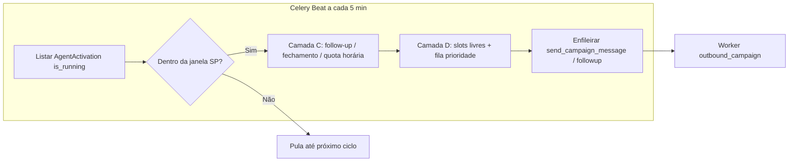
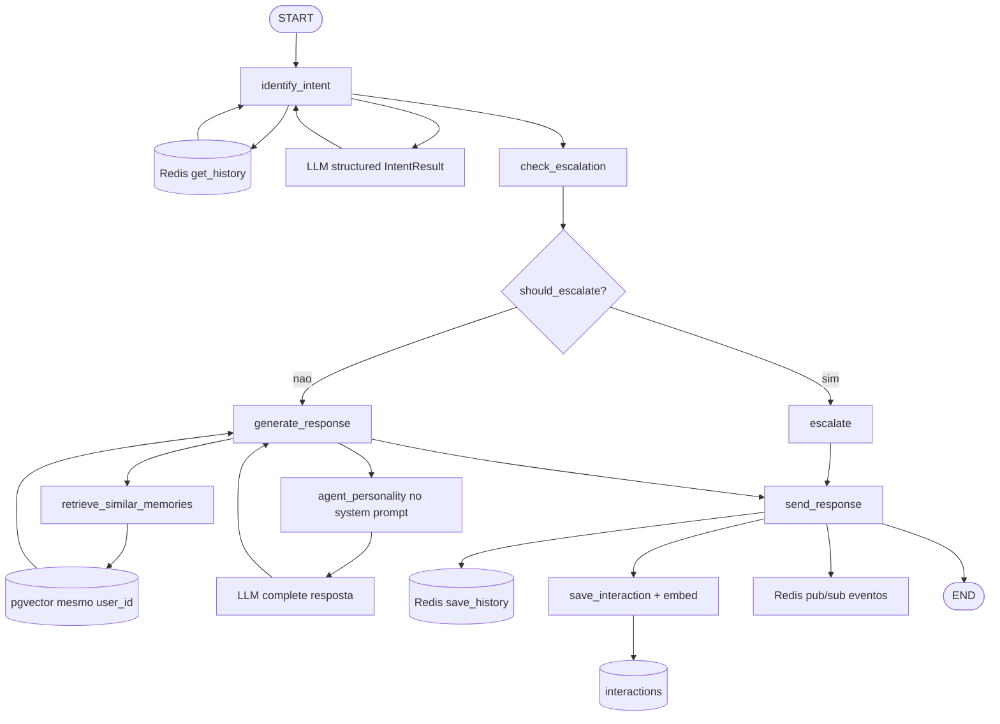
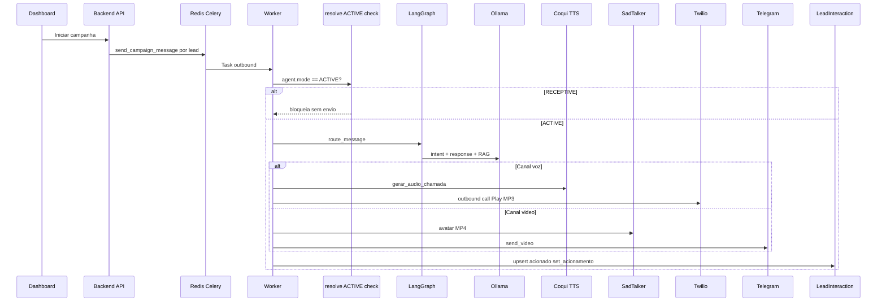
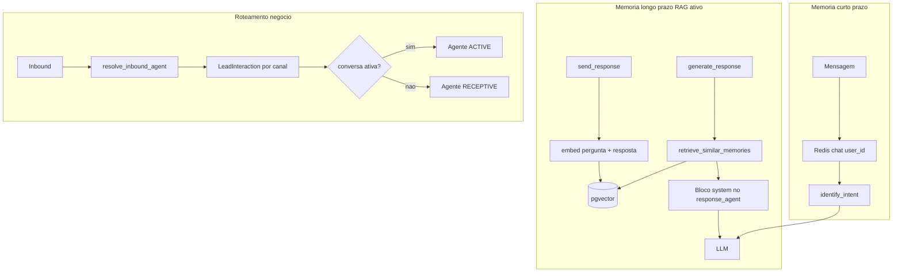

# Autonomous Agent

**Do operador ao agente: atendimento omnichannel com IA multi-agente, modelos locais e voz/avatar sintéticos.**

[](https://www.python.org/)
[](https://fastapi.tiangolo.com/)
[](https://nextjs.org/)
[](https://langchain-ai.github.io/langgraph/)
[](https://docs.docker.com/compose/)
[](LICENSE)

---

## Visão geral

O **Autonomous Agent** é um sistema de **IA aplicada** para atendimento autônomo em múltiplos canais. Dois agentes especializados de **processamento de linguagem** — classificação de intenção e geração de resposta — são orquestrados por um **grafo LangGraph** com memória em camadas (Redis + PostgreSQL/pgvector).

Além disso, o domínio de negócio define **dois perfis de agente de campanha** (`ACTIVE` e `RECEPTIVE`) e um **modelo de propriedade** que separa registros **do sistema** (globais, somente leitura) dos registros **do usuário** (privados, CRUD completo). O **roteamento por dono da conversa** decide qual perfil atende cada contato inbound/outbound.

Por padrão, toda a pilha de modelos roda **localmente** (Ollama, faster-whisper, Coqui XTTS-v2, SadTalker), com opção de trocar para provedores comerciais (OpenAI, ElevenLabs, D-ID) apenas via configuração.

O dashboard Next.js cobre campanhas **ativas** (outbound multi-canal), importação de leads, métricas, devolutivas em Excel, proteção visual de registros (`is_system`, bases IMPORT/MANUAL) e uma tela de **Configurações com hot-reload** sem reiniciar containers.

---

## Documentação

| Documento | Descrição |
|-----------|-----------|
| [Motor de acionamento](#motor-de-acionamento) (neste README) | Camadas A–D, defaults, scheduler, scripts `validate_layer_*` |
| [docs/ROTEIRO_APRESENTACAO.md](docs/ROTEIRO_APRESENTACAO.md) | Roteiro de demonstração para a banca (~15–20 min), com foco em IA aplicada |
| [docs/SMOKE_TEST.md](docs/SMOKE_TEST.md) | Checklist de verificação antes da apresentação (comandos e troubleshooting) |
| [infra/docker/sadtalker/README.md](infra/docker/sadtalker/README.md) | Notas do serviço SadTalker (GPU, build, API `/generate`) |
| [docs/demo-assets/README.md](docs/demo-assets/README.md) | Pasta para MP3/MP4/screenshots de fallback (Plano B da demo; arquivos não versionados) |

---

## Destaques de IA

### Sistema multi-agente (LangGraph)

| Agente (worker) | Módulo | Papel |
|-----------------|--------|--------|
| **Agente de intenção** | `agents/workers/intent_agent.py` | Classifica a mensagem (`greeting`, `question`, `complaint`, `purchase`, `cancel`, `escalate`, `other`), extrai entidades e retorna `confidence` via saída estruturada (Pydantic). |
| **Agente de resposta** | `agents/workers/response_agent.py` | Gera o texto final usando histórico Redis, intenção, entidades, canal, **memórias RAG** e **personalidade do agente de negócio** selecionado (`agent_personality` no `AgentState`). |

O grafo em `agents/orchestrator/graph.py` define os nós e arestas:

1. **`identify_intent`** — carrega histórico do Redis → LLM estruturado → evento `intent_detected`.
2. **`check_escalation`** — `should_escalate` se intenção `escalate` ou `confidence < 0.5`.
3. **Ramo condicional** (`route_after_escalation_check`):
   - **`escalate`** — resposta fixa de encaminhamento humano.
   - **`generate_response`** — recupera RAG + chama LLM de resposta.
4. **`send_response`** — persiste turno no Redis, grava interação + embedding no pgvector, publica `response_sent` ou `escalated`.

Entrada única: `route_message()` em `agents/orchestrator/router.py` (webhooks, Celery, Telegram). O worker inbound injeta `agent_context` (nome, modo, descrição) antes de invocar o grafo.

### Agentes de negócio: ATIVO e RECEPTIVO

Entidade `Agent` (`backend/app/models/agent.py`) com `mode: ACTIVE | RECEPTIVE` e `description` (texto rico usado no prompt).

| Modo | Papel de negócio | Gatilho típico |
|------|------------------|----------------|
| **ACTIVE** | Proativo: conduz **disparos outbound** de campanha; abre e mantém a “conversa ativa” após acionamento. | `worker/tasks/outbound_campaign.py` — exige `campaign.agent.mode == ACTIVE` para enviar. |
| **RECEPTIVE** | Passivo: atende **primeiro contato** ou retorno após conversa encerrada; não dispara outbound. | `worker/tasks/inbound_handler.py` + `resolve_inbound_agent()`. |

Seeds no startup (`seed_default_agents`): **Agente_Ativo** (ACTIVE) e **Agente_Receptivo** (RECEPTIVE), ambos `is_system=true`, com descrições orientando o comportamento no prompt.

### Roteamento por dono da conversa

Implementado em `worker/tasks/conversation_routing.py` e aplicado no inbound (`inbound_handler.py`). O outbound valida o agente da campanha antes de disparar.

**Regra resumida:**

| Situação | Agente que atende |
|----------|-------------------|
| **Outbound** (campanha dispara) | Agente **ACTIVE** da campanha (`Campaign.agent_id`). Se não for ACTIVE → disparo **bloqueado** (tracking com `status=erro`). |
| **Inbound** + conversa ativa **aberta** | Agente **ACTIVE** (preferência: agente da campanha da `LeadInteraction`; fallback: `Agente_Ativo` seed). |
| **Inbound** + primeiro contato ou conversa **encerrada** | Agente **RECEPTIVE** (preferência: agente RECEPTIVE da campanha; fallback: `Agente_Receptivo` seed). |
| **Contato desconhecido** (lead não identificado) | `Agente_Receptivo` (primeiro contato). |

**Conversa ativa aberta** (`is_active_conversation_open`) — todas as condições:

- Existe `LeadInteraction` para o par `(lead_id, channel_type)` mais recente.
- `data_acionamento` preenchido (houve acionamento outbound).
- `status` **não** está em status terminal: `convertido`, `recusou`, `nao_atendido`, `erro`.
- `(agora - data_ultimo_contato) ≤ active_conversation_timeout_hours` (default **24h**).

**Conversa encerrada** quando qualquer condição acima falha (inclui inatividade além do timeout).

> **Dois timeouts distintos:** `active_conversation_timeout_hours` (24h) encerra a conversa ativa para **roteamento** inbound. `status_timeout_hours` (48h, Celery Beat) marca `acionado` sem resposta como `nao_atendido` — sweep em `worker/tasks/status_sweep.py`.

### Memória e RAG (dois níveis) — **ativo no grafo**

| Camada | Tecnologia | Uso |
|--------|------------|-----|
| **Curto prazo** | Redis (`chat:{user_id}`, TTL 1h) | Histórico multi-turno em `identify_intent` / `send_response`. |
| **Longo prazo** | PostgreSQL + **pgvector** (`interactions.embedding`) | `save_interaction` após cada resposta; embedding via `ProviderFactory.get_llm().embed`. |
| **RAG na geração** | `LongTermMemory.retrieve_similar_memories()` | Chamado em `generate_response` (grafo); filtra por **mesmo `user_id`**, `rag_top_k` e `rag_similarity_threshold`; injeta bloco system em `response_agent.format_rag_context_block`. |

Dimensão do vetor: **768** com stack OSS (`EMBEDDING_DIMENSIONS=768`); migration `alter_interactions_embedding_dimensions` alinha a coluna ao `.env`.

**Isolamento:** cada contato no canal usa um `user_id` estável (telefone normalizado ou `telegram_id`); memórias semânticas não cruzam usuários.

### Modelos locais (padrão OSS)

| Função | Serviço | Modelo / nota |
|--------|---------|----------------|
| LLM | Ollama | `llama3.1` (chat + classificação + resposta) |
| Embeddings | Ollama | `nomic-embed-text` |
| STT | faster-whisper | `large-v3` (handler voz inbound — integração de chamada ainda limitada) |
| TTS + clonagem | Coqui XTTS-v2 | `reference.wav` no volume `/voices` |
| Avatar / lip-sync | SadTalker | Imagem em `/avatars` + áudio Coqui → MP4 (GPU NVIDIA) |

Ollama e SadTalker reservam GPU no Compose; Whisper e Coqui rodam em CPU por padrão.

### Providers agnósticos

`agents/provider_factory.py` seleciona implementações por `LLM_PROVIDER`, `STT_PROVIDER`, `TTS_PROVIDER`, `AVATAR_PROVIDER`. O grafo e os serviços (`voice_audio`, `avatar_video`) **não mudam** ao trocar OSS ↔ comercial — apenas `.env` / `app_settings` (UI com hot-reload).

---

## Regras de negócio

### Modelo de propriedade e proteção

Camada central: `backend/app/core/authorization.py` (`can_view`, `can_edit`, `can_delete`, `raise_if_cannot_*`).

| Tipo de registro | Visibilidade | Mutação (API + UI) |
|------------------|--------------|---------------------|
| **`is_system=true`** (padrão do sistema) | **Global** — todos os usuários autenticados veem | **Somente leitura** — PUT/DELETE retornam **403** com mensagem clara; UI: selo **“Padrão do sistema”** + botão Visualizar |
| **Do usuário** (`user_id` = dono) | Apenas o dono | CRUD completo (criar, editar, excluir) |

Aplica-se a **Agent**, **Channel**, **Campaign** e **Lead**. **LeadBase** deriva o dono via `Campaign.user_id`; listagens incluem bases de campanhas visíveis (`Campaign.is_system` ou dono).

Campanhas `is_system` não podem ser **iniciadas** por usuários comuns (`raise_if_cannot_edit` em `POST /campaigns/{id}/start`).

### Padrões do sistema (seed no startup)

Idempotente por nome (`backend/app/core/seed.py` + `ensure_seed_flags()` no lifespan):

| Recurso | Nomes | Detalhes |
|---------|-------|----------|
| **Admin** | `admin@admin.com` / `admin` | Criado se não existir |
| **4 canais** | `WhatsApp_Agent`, `Telegram_Agent`, `Voice_Agent`, `Video_Agent` | Credenciais do `.env`; `is_system=true` |
| **2 agentes** | `Agente_Ativo`, `Agente_Receptivo` | ACTIVE / RECEPTIVE; descrições longas; `config` `{tipo: outbound\|inbound}`; `is_system=true` |

O usuário **não começa do zero**: ao subir a stack, já pode usar canais e agentes padrão em campanhas (`agent_id` de agente sistema permitido via `can_view`).

### Regras de leads e bases

| Origem (`LeadBase.source`) | Leads individuais | Base inteira |
|----------------------------|-------------------|--------------|
| **IMPORT** (CSV via `/lead-bases/import`) | **Somente leitura** — PUT/DELETE do lead → 403 | Pode **excluir a base** (`DELETE /lead-bases/{id}`) — CASCADE nos leads |
| **MANUAL** (`POST /lead-bases/`) | CRUD completo | Exclusão permitida (se não `is_system`) |

Read-only de lead importado: checagem via `lead.lead_base.source` (`is_lead_from_import` em `authorization.py`), sem campo duplicado no lead.

### Decisão: qual agente atende o contato?


### Rastreamento, devolutiva e métricas

- **`LeadInteraction`** — por `(lead, campaign, channel_type)`: `status`, `devolutiva`, `data_acionamento`, `data_ultimo_contato`, vínculo com última `Interaction` do grafo quando aplicável.
- **Inbound** — `track_inbound_lead_interaction()` atualiza status conforme intenção (`convertido` / `recusou` / `em_andamento`).
- **Devolutiva** — Excel diário por base (`devolutiva.py` + Celery Beat); download sob demanda no dashboard.
- **Métricas** — agregação por campanha/base no dashboard (`metrics.py`).

---

## Motor de acionamento

Motor outbound para campanhas com agente **ACTIVE**: parâmetros por agente+canal, janela de horário, cadência de tentativas e concorrência com slots no Redis. API em `/api/v1/activation` e `/api/v1/agents/{id}/channel-settings`; UI em `/dashboard/activation`.

| Camada | Responsabilidade | Implementação principal |
|--------|------------------|-------------------------|
| **A** | Parâmetros por `(agente, canal)`: concorrência, cadência, horário; liga/desliga por campanha+canal | `activation_defaults.py`, `AgentChannelSettings`, `AgentActivation` |
| **B** | Janela `horario_inicio`–`horario_fim` no fuso **America/Sao_Paulo** (`ACTIVATION_TIMEZONE`); scheduler só enfileira dentro da janela | `activation_window.py`, Celery Beat `process_active_activations` (a cada 5 min, UTC) |
| **C** | Cadência: rate limit voz/vídeo por hora; 2ª mensagem WhatsApp/Telegram após N min; encerramento após N tentativas sem resposta | `activation_cadence.py`, `activation_scheduler.py` |
| **D** | Concorrência: slots atômicos no Redis (Lua), fila de prioridade (ZSET) para leads pulados por falta de slot | `activation_slots.py`, integração no scheduler + `outbound_campaign.py` |

### Defaults do sistema (por canal)

Valores padrão em `backend/app/core/activation_defaults.py` (editáveis por agente não-sistema na UI/API):

| Parâmetro | Voz / Vídeo | WhatsApp / Telegram |
|-----------|-------------|---------------------|
| Concorrência simultânea | `chamadas_simultaneas` = **1** | `chats_simultaneos` = **5** |
| Campanhas simultâneas (mesmo agente+canal) | `campanhas_simultaneas` = **1** | `campanhas_simultaneas` = **1** |
| Cadência | `tentativas_por_hora` = **6** | `tentativas_sem_resposta` = **2**, `minutos_segunda_mensagem` = **20** |
| Janela de horário | `horario_inicio` / `horario_fim` = **09:00** – **20:00** | idem |

**Camada D (comportamento):** voz/vídeo ocupam slot por chamada (~`CALL_SLOT_TTL_SECONDS`, default 300s) sem callback Twilio; messaging libera slot ao status terminal ou inatividade (`ACTIVE_CONVERSATION_TIMEOUT_HOURS`), com TTL de segurança `CHAT_SLOT_TTL_SECONDS`. Leads pulados entram na fila de prioridade e são atendidos antes de pendentes novos.

### Ciclo do scheduler (Beat)



Ordem de candidatos por ciclo: **(1)** fila de prioridade Redis → **(2)** follow-ups elegíveis → **(3)** leads pendentes (1ª mensagem), respeitando `campanhas_simultaneas` e limites de slot.

Variáveis de ambiente (seção `# Motor de acionamento` em `.env.example`): `ACTIVATION_TIMEZONE`, `CALL_SLOT_TTL_SECONDS`, `CHAT_SLOT_TTL_SECONDS`, `ACTIVE_CONVERSATION_TIMEOUT_HOURS`, `STATUS_TIMEOUT_HOURS`.

---

## Canais de atendimento

| Canal | Entrega | IA / mídia | Outbound | Inbound |
|-------|---------|------------|----------|---------|
| **WhatsApp** | Twilio | Texto via grafo (Ollama) | Campanha ACTIVE → `send_whatsapp_message` | Webhook `POST /api/v1/channels/webhooks/whatsapp` → Celery inbound |
| **Telegram** | Bot API | Texto ou **vídeo SadTalker** (`send_video`) | Campanha: texto ou MP4 + legenda | `TelegramHandler` (polling — processo separado, ver Setup) |
| **Voz** | Twilio `<Play>` MP3 Coqui ou `<Say>` fallback | Texto → Coqui → MP3 em `voice_audio` | **Ativo** — `make_outbound_call` + `set_acionamento` | Chamada ao vivo: futuro (`VoiceHandler`) |
| **Vídeo** | Telegram `send_video` | Texto → Coqui → SadTalker → MP4 | **Ativo** — destino = `telegram_id` do lead | Avatar em mensagem recebida: futuro |

Canais seed (`is_system`) já vêm configurados a partir do `.env` (Twilio, Telegram, números de voz).

---

## Arquitetura

A stack sobe com `make setup` (ver [Setup](#setup-passo-a-passo)).

### A. Arquitetura geral

```mermaid
flowchart LR
  subgraph clients [Clientes]
    U[Usuario / Lead]
  end

  subgraph app [Aplicacao]
    FE[Frontend Next.js]
    BE[Backend FastAPI]
    WK[Celery Worker]
    BT[Celery Beat]
  end

  subgraph data [Dados]
    PG[(PostgreSQL pgvector)]
    RD[(Redis)]
  end

  subgraph ai [Servicos de IA]
    OL[Ollama LLM+embed]
    WH[faster-whisper STT]
    CQ[Coqui TTS]
    ST[SadTalker GPU]
  end

  subgraph external [Externos opcionais]
    TW[Twilio]
    TG[Telegram API]
  end

  U --> FE
  FE --> BE
  BE --> PG
  BE --> RD
  BE --> OL
  BE --> WH
  BE --> CQ
  BE --> ST
  WK --> BE
  WK --> PG
  WK --> RD
  WK --> OL
  WK --> CQ
  WK --> ST
  BT --> WK
  WK --> TW
  WK --> TG
  BE --> TW
```



### B. Grafo do agente (LangGraph) — foco da banca



Antes do grafo, o **inbound** chama `resolve_inbound_agent()` e preenche `agent_personality` no estado.

### C. Fluxo outbound — voz e vídeo



### D. Memória, RAG e roteamento



---

## Stack tecnológica

| Camada | Tecnologia | Função |
|--------|------------|--------|
| Orquestração IA | **LangGraph** + LangChain | Grafo multi-agente, `AgentState` |
| API | **FastAPI** + SQLAlchemy 2 async | REST, webhooks, JWT, `authorization.py` |
| Frontend | **Next.js 15** + TypeScript + Tailwind | Dashboard com proteção `is_system` / IMPORT |
| Filas | **Celery** + **Redis** | Outbound, inbound, beat (devolutiva, sweep) |
| Banco | **PostgreSQL 16** + **pgvector** | CRM, embeddings, `app_settings` |
| Cache | **Redis** | Histórico chat, broker, eventos agente, settings version |
| LLM / embeddings | **Ollama** (padrão) ou OpenAI | Chat, structured output, embeddings |
| STT / TTS / Avatar | faster-whisper, Coqui, SadTalker (ou comerciais) | Voz clonada, avatar, STT |
| Telefonia | **Twilio**, **python-telegram-bot** | WhatsApp, PSTN, Telegram |
| Infra | **Docker Compose** | Stack reproduzível |

---

## Modelo de dados

Entidades principais (`backend/app/models/`):

```text
User
 ├── Agent (mode: ACTIVE | RECEPTIVE, description, config JSONB, is_system)
 ├── Channel (type, credentials JSONB, name, is_system)
 ├── Campaign (agent_id, status, is_system) ── CampaignChannel
 │    └── LeadBase (source: IMPORT | MANUAL, is_system) ── LeadBaseChannel
 │         └── Lead (telefones, aux_values, is_system)
 │              └── LeadInteraction (status, devolutiva, data_acionamento,
 │                                  data_ultimo_contato, channel_type)
 └── …

Interaction (pgvector) — memória semântica do grafo (user_id string, embedding, intent)

AppSetting — providers, temperaturas, prompts (hot-reload)
```

| Campo | Entidade | Papel |
|-------|----------|--------|
| `is_system` | Agent, Channel, Campaign, Lead, LeadBase | Registro padrão global / imutável |
| `source` | LeadBase | `IMPORT` (leads read-only) vs `MANUAL` |
| `description` | Agent | Personalidade injetada no prompt (`agent_personality`) |
| `mode` | Agent | ACTIVE vs RECEPTIVE — regras de outbound/inbound |
| `data_acionamento` | LeadInteraction | Marca abertura da conversa ativa (outbound) |
| `data_ultimo_contato` | LeadInteraction | Inatividade para encerrar conversa ativa (24h default) |

**Status LeadInteraction:** `pendente`, `acionado`, `em_andamento`, `convertido`, `recusou`, `nao_atendido`, `erro`.

---

## Funcionalidades de negócio (suporte à IA)

- **Campanhas multi-canal** — `LeadBaseChannel` define canais por base; outbound só com agente ACTIVE.
- **Importação CSV** — `source=IMPORT`; mapeamento `aux1`…`aux45`.
- **Proteção na UI** — selo sistema, visualizar/editar conforme `actionsFor` / `leadActionsFor`.
- **Devolutiva diária** — Excel + download histórico.
- **Métricas** — por campanha e base.
- **Configurações** — hot-reload sem restart.

---

## Pré-requisitos

| Requisito | Obrigatório para | Notas |
|-----------|------------------|-------|
| Docker + Compose v2 | Tudo | Caminho oficial do TCC |
| **NVIDIA GPU + Container Toolkit** | SadTalker e Ollama acelerado | Sem GPU: texto/WhatsApp seguem; vídeo avatar pode falhar healthcheck |
| ~15–30 GB disco | Modelos + build SadTalker | Primeiro `make up --build` demora |
| Conta Twilio | WhatsApp + voz outbound | Trial pode exigir tecla no destino |
| Bot Telegram | Telegram / vídeo outbound | `telegram_id` no lead |
| GNU Make | `make setup` | Windows: Chocolatey ou WSL |

---

## Setup passo a passo

```bash
git clone <url-do-repositorio>
cd autonomous-agent

cp .env.example .env
# Twilio, Telegram, PUBLIC_BASE_URL (voz outbound)

# Voz Coqui: reference.wav em infra/docker/coqui-tts/voices/
# ou upload em Configurações → Áudio após subir

make setup
# Stack + Ollama models + migrations + seed admin/canais/agentes

# Dashboard: http://localhost:3000
# API docs:  http://localhost:8000/docs
# Login seed: admin@admin.com / admin
```

**Após o primeiro `make setup` você já terá:**

- Usuário admin
- **4 canais** padrão (`is_system`) com credenciais do `.env`
- **2 agentes** padrão: Agente_Ativo (ACTIVE) e Agente_Receptivo (RECEPTIVE)

`ensure_seed_flags()` garante `is_system=true` em registros seed criados antes da flag existir.

**SadTalker:** aguarde container healthy (GPU). **Telegram inbound:** polling manual no worker (ver abaixo).

```bash
docker exec -it autonomous-agent-worker python -c "
from app.core.config import settings
from agents.channels.telegram import TelegramHandler
TelegramHandler(settings.telegram_bot_token).start()
"
```

---

## Configuração

### Arquivo `.env`

Defaults OSS em `.env.example`:

```env
LLM_PROVIDER=ollama
STT_PROVIDER=faster_whisper
TTS_PROVIDER=coqui
AVATAR_PROVIDER=sadtalker
EMBEDDING_DIMENSIONS=768
# Motor de acionamento (ver seção dedicada no README e bloco completo em .env.example)
ACTIVATION_TIMEZONE=America/Sao_Paulo
CALL_SLOT_TTL_SECONDS=300
CHAT_SLOT_TTL_SECONDS=86400
ACTIVE_CONVERSATION_TIMEOUT_HOURS=24
STATUS_TIMEOUT_HOURS=48
```

### Tela Configurações (`/dashboard/settings`)

`app_settings` + hot-reload (`settings_sync.py`).

| Aba | Parâmetros |
|-----|------------|
| **Texto (LLM)** | Providers OpenAI/Ollama, chaves, modelos |
| **Comportamento** | `intent_temperature`, `response_temperature`, `agent_system_prompt`, `rag_top_k`, `rag_similarity_threshold`, `response_max_tokens` |
| **Áudio** | STT/TTS, upload `reference.wav`, teste de voz |
| **Avatar / Vídeo** | SadTalker/D-ID, upload rosto, teste de vídeo |

---

## Scripts de validação e demonstração

Rodar **dentro do container** `autonomous-agent-backend` (ou worker com mesmo `PYTHONPATH`).

Scripts do **motor de acionamento** (regressão e demonstração das camadas A–D), em `backend/scripts/`:

| Script | Camada |
|--------|--------|
| `validate_layer_a_activation.py` | A — parâmetros, settings por canal, start/stop |
| `validate_layer_b_activation.py` | B — janela de horário + scheduler |
| `validate_layer_c_activation.py` | C — cadência, follow-up, quota horária |
| `validate_layer_d_activation.py` | D — slots Redis, fila de prioridade, campanhas simultâneas |

```bash
docker exec autonomous-agent-backend python /workspace/backend/scripts/validate_layer_a_activation.py
docker exec autonomous-agent-backend python /workspace/backend/scripts/validate_layer_b_activation.py
docker exec autonomous-agent-backend python /workspace/backend/scripts/validate_layer_c_activation.py
docker exec autonomous-agent-backend python /workspace/backend/scripts/validate_layer_d_activation.py
```

### RAG — `backend/scripts/validate_rag.py`

```bash
docker exec autonomous-agent-backend python scripts/validate_rag.py
```

**O que prova:** grava interações de teste no pgvector, executa `retrieve_similar_memories` e `route_message`, exibe o bloco RAG injetado e confirma isolamento por `user_id`. Útil para regressão da **IA aplicada** (memória semântica) e para a defesa do TCC.

### Roteamento ACTIVE/RECEPTIVE — `backend/scripts/validate_phase4_routing.py`

```bash
docker exec autonomous-agent-backend python scripts/validate_phase4_routing.py
```

**O que prova (cenários A–E):**

| Cenário | Resultado esperado |
|---------|-------------------|
| A — sem lead | Agente_Receptivo |
| B — conversa ativa (`acionado` + `data_acionamento`) | Agente ACTIVE |
| C — status `convertido` | Agente_Receptivo |
| D — inatividade > 24h | Agente_Receptivo |
| E — outbound com campanha RECEPTIVE | Disparo bloqueado |

---

## Uso (fluxo típico)

1. **Login** — `admin@admin.com` ou usuário registrado.
2. **Agentes** — usar **Agente_Ativo** (sistema) em campanhas outbound; criar agentes próprios se necessário.
3. **Canais** — usar canais seed ou adicionar credenciais próprias.
4. **Campanha** — agente ACTIVE, canais `whatsapp` / `telegram` / `voice` / `video`.
5. **Importar CSV** ou base manual — `telegram_id` para vídeo/Telegram; telefones para WhatsApp/voz.
6. **Configurações** — voz (`reference.wav`) e avatar (imagem).
7. **Iniciar campanha** — worker dispara outbound; abre conversa ativa.
8. **Inbound** — respostas roteadas ACTIVE/RECEPTIVE; grafo + RAG + personalidade do agente.
9. **Métricas / devolutiva / monitoramento** — dashboard e WebSocket `/api/v1/monitoring/ws`.

---

## Estrutura de pastas

```text
autonomous-agent/
├── agents/
│   ├── orchestrator/       # graph.py, router.py, AgentState (+ RAG + personality)
│   ├── workers/            # intent_agent, response_agent
│   ├── memory/             # short_term, long_term (retrieve_similar_memories)
│   ├── providers/
│   └── channels/
├── backend/app/
│   ├── core/               # authorization.py, seed.py, config.py
│   ├── api/v1/
│   ├── models/
│   └── services/
├── backend/scripts/        # validate_rag.py, validate_phase4_routing.py
├── worker/tasks/
│   ├── conversation_routing.py
│   ├── outbound_campaign.py
│   └── inbound_handler.py
├── frontend/src/           # dashboard + proteção is_system / IMPORT
├── infra/docker/
├── docs/
└── Makefile
```

---

## Comandos úteis (Makefile)

| Comando | Descrição |
|---------|-----------|
| `make setup` | Stack + Ollama + models + migrate + seed |
| `make up` / `make down` | Sobe / para containers |
| `make migrate` | `alembic upgrade head` |
| `make pull-models` | `llama3.1` + `nomic-embed-text` |
| `make logs` | Logs em tempo real |
| `make test` | pytest |

---

## Roadmap e limitações conhecidas

| Item | Situação |
|------|----------|
| **RAG** | **Ativo** em `generate_response` (threshold e top_k na UI) |
| **Roteamento ACTIVE/RECEPTIVE** | **Ativo** em outbound + inbound (`conversation_routing.py`) |
| **Propriedade `is_system`** | API + UI com selo e ações restritas |
| **Voz inbound (STT ao vivo)** | `VoiceHandler` esqueleto; sem Media Streams Twilio |
| **Vídeo inbound Telegram** | Outbound MVP; avatar em mensagem recebida: futuro |
| **Telegram receptivo no Compose** | Polling manual no worker |
| **Voz outbound Twilio trial** | Pode exigir pressionar tecla no destino |
| **SadTalker sem GPU** | Healthcheck com `gpu: true` — serviço não fica healthy |
| **Canal `video` em WhatsApp** | Apenas Telegram no MVP |
| **Campanha com agente RECEPTIVE** | Criação permitida (aviso na UI); **disparo bloqueado** no worker |

Fine-tuning: [`docs/fine-tuning/`](docs/fine-tuning/).

---

## Referência rápida — variáveis de ambiente

Ver `.env.example`: `DATABASE_URL`, Redis/Celery, providers, URLs dos microsserviços, Twilio/Telegram, `PUBLIC_BASE_URL`, `EMBEDDING_DIMENSIONS`, seção **Motor de acionamento** (`ACTIVATION_TIMEZONE`, `CALL_SLOT_TTL_SECONDS`, `CHAT_SLOT_TTL_SECONDS`, `ACTIVE_CONVERSATION_TIMEOUT_HOURS`, `STATUS_TIMEOUT_HOURS`), portas do host.

---

## Licença

MIT — ver [LICENSE](LICENSE).
