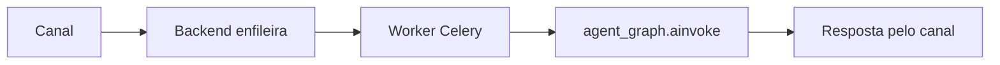

# Agents

Toda a lógica de IA do projeto vive aqui — **nunca** em `backend/`. O backend (FastAPI) e os workers (Celery) importam estes módulos via `PYTHONPATH` (raiz do projeto + `backend/`).

## Premissa: agnóstico de provedor

A IA roda a **stack OSS local por padrão** (Ollama, faster-whisper, Coqui), sem chaves de API. Cada camada (LLM/STT/TTS/embeddings) pode ser plugada a uma **alternativa de nuvem (opcional)** por variável de ambiente, sem alterar código — a seleção acontece em `provider_factory.py`.

## Estrutura

```
agents/
├── provider_factory.py   # seleciona LLM/STT/TTS/embeddings por env (agnóstico)
├── identity.py           # identidade institucional (workspace + override por agente)
├── escalation.py         # regra pura de escalonamento (resolve_should_escalate)
├── events.py             # publicação de eventos no Redis pub/sub (monitoramento)
├── channels/             # handlers de WhatsApp, Telegram e Voz (+ typing indicator)
├── orchestrator/         # grafo LangGraph, roteamento e estado da conversa
├── workers/              # agentes especializados (intenção, resposta, tabulação…)
├── memory/               # memória de curto prazo (Redis) e longo prazo (pgvector)
├── providers/            # implementações concretas dos provedores (llm/stt/tts)
├── services/             # serviços de apoio (embedding_service)
└── tools/                # ferramentas dos agentes (knowledge_base ✅, crm/calendar 🚧)
```

## Como a IA é invocada



Passos equivalentes:

1. Um canal recebe a mensagem e o backend enfileira uma tarefa Celery.
2. O worker monta o `AgentState` e chama `agent_graph.ainvoke(state)` (`orchestrator/graph.py`).
3. O grafo identifica a intenção, checa escalonamento e gera a resposta com RAG.
4. A resposta é persistida (curto prazo no Redis, longo prazo no pgvector) e devolvida pelo canal.

## Convenções

- Código de IA fica em `agents/` na raiz; `backend/` cuida apenas da API.
- Tasks Celery são síncronas — chame código async com `asyncio.run(...)`.
- Nunca acople um provedor específico no fluxo: use sempre `ProviderFactory`.

Documentação detalhada do comportamento dos agentes: [`docs/agentes.md`](../docs/agentes.md).
