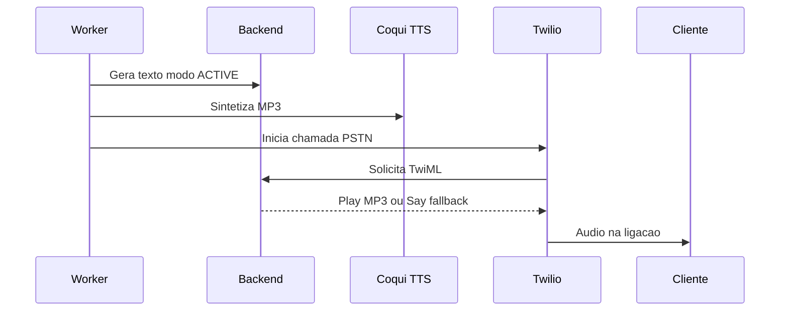
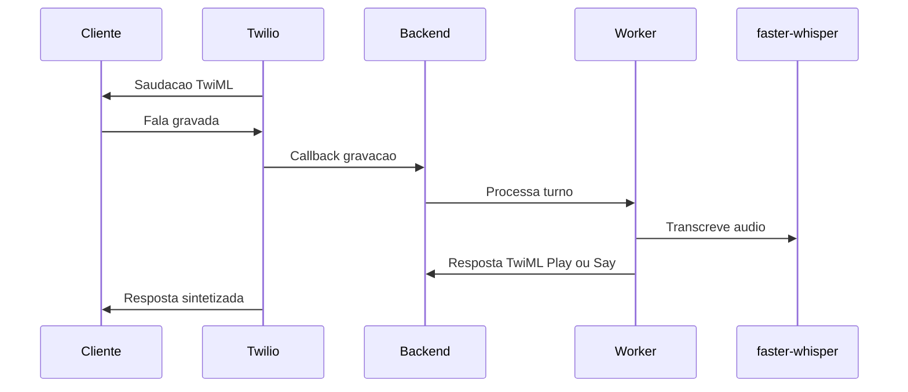

# Voice Channel

Canal de **voz por telefonia (PSTN)** via **Twilio Voice**. A fala é sintetizada por TTS e a entrada do cliente é transcrita por STT — ambos agnósticos de provedor (Coqui/faster-whisper local por padrão; alternativas de nuvem opcionais).

## Arquivos

| Arquivo | Papel |
|---|---|
| `handler.py` | Orquestra a chamada: gera o TwiML, sintetiza a fala e processa os turnos |
| `twilio_voice_client.py` | Cliente Twilio Voice (iniciar chamadas, montar respostas) |
| `tts_stt.py` | Síntese (TTS) e transcrição (STT) via `ProviderFactory` |

## TTS (saída de voz)

1. O texto gerado pelo agente é sintetizado em áudio pelo **Coqui XTTS-v2** (português) → MP3 de telefonia.
2. O áudio é reproduzido na ligação via TwiML `<Play>`.
3. **Fallback:** se a síntese falhar, usa-se a voz padrão da Twilio em português — `<Say>` Polly pt-BR.

## STT (entrada de voz)

- A fala do cliente é transcrita por **faster-whisper** (modelo `large-v3` por padrão).
- A transcrição alimenta o grafo como mensagem de texto.

## Outbound (chamada ativa)



A campanha de voz inicia a chamada PSTN pela Twilio; o backend serve o TwiML que toca o áudio sintetizado. Para a intenção em voz, usa-se uma **heurística leve** (`agents/workers/voice_intent_heuristic.py`) em vez de uma chamada extra ao LLM, reduzindo latência.

## Inbound ao vivo (parcial)



O STT por faster-whisper está implementado no manipulador de chamada, mas a **transcrição bidirecional em tempo real** (Twilio Media Streams) ainda não está totalmente conectada — ver [`roadmap.md`](../../../docs/roadmap.md).

## Configuração

```env
TWILIO_ACCOUNT_SID=...
TWILIO_AUTH_TOKEN=...
TWILIO_PHONE_NUMBER=+1...        # número de voz
TTS_PROVIDER=coqui               # ou elevenlabs (nuvem, opcional)
STT_PROVIDER=faster_whisper      # ou openai (nuvem, opcional)
```

Webhooks de voz ficam sob `/api/v1/channels/webhooks/voice/...` e dependem de URL pública (túnel Cloudflare). Mais detalhes: [`docs/canais.md`](../../../docs/canais.md).
