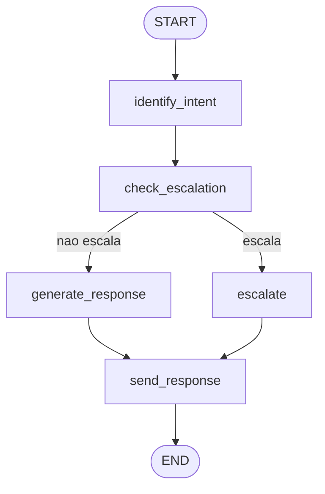

# Orchestrator

Orquestração da conversa com **LangGraph**. Define o grafo de agentes, o roteamento de entrada e o estado compartilhado entre os nós.

## Arquivos

| Arquivo | Papel |
|---|---|
| `graph.py` | Monta e compila o grafo (`agent_graph`) com os nós e as arestas condicionais |
| `router.py` | Roteamento de entrada por canal (`route_message`) e decisão pós-escalonamento |
| `state.py` | `AgentState` — o dicionário tipado que trafega entre os nós |

## Grafo

| Nó | Função |
|---|---|
| `identify_intent` | Classifica a intenção (saída estruturada do LLM; heurística leve em voz), usando o histórico do Redis |
| `check_escalation` | Decide escalonamento via `agents/escalation.py` (`resolve_should_escalate`) |
| `escalate` | Monta a resposta de encaminhamento para humano |
| `generate_response` | Gera a resposta com **RAG em dois níveis** (memória do contato + base de conhecimento), em paralelo |
| `send_response` | Persiste no Redis (curto prazo) e no pgvector (longo prazo) e publica eventos de monitoramento |

A aresta condicional após `check_escalation` é resolvida por `route_after_escalation_check` (`router.py`).

## Roteamento de entrada

`route_message` valida o canal (`telegram`, `whatsapp`, `voice`) antes de processar. Canais desconhecidos são rejeitados.

Visão completa do comportamento: [`docs/agentes.md`](../../docs/agentes.md).
