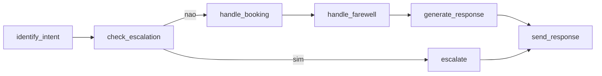

# Roteiro de apresentação — Defesa do TCC

**Título:** *Do operador ao Agente: Transformando um atendente de telemarketing em um Agente de Inteligência Artificial Autônomo* (ICMC/USP)

**Público:** banca de IA aplicada  
**Duração alvo:** ~25 min (+ buffer 5 min)  
**Pré-requisito operacional:** `docs/CHECKLIST_DEMO.md` e `docs/SMOKE_TEST.md` verdes no dia anterior e ~30 min antes.

---

## Gestão de tempo (leia antes de subir ao palco)

| Marco | Minuto acumulado | Ação se atrasar |
|-------|------------------|-----------------|
| **Clímax (ligação)** | ~6–13 | Prioridade máxima — não adie |
| **Beat pós-clímax (lembrete proativo)** | ~13–14 | **CORTÁVEL** — pular se já passou de min 14 ou se Bloco 4 precisa começar |
| **Núcleo RAG + Erlang** | ~13–22 | Se passar de **min 18** no Bloco 4, encurte 4b para 2 min (só tela Capacity) |
| **Bloco 5 (reforço + métricas)** | ~22–26 | **CORTÁVEL** — pular inteiro se restarem **< 8 min** para perguntas |
| **Fechamento** | ~26–28 | Nunca cortar por completo; 1 min mínimo |

**Conteúdo novo (fora dos 25 min originais):** beat de acionamento proativo (+~1 min) e métricas de campanha (+~30–45 s) são **cortáveis / carta na manga** — o apresentador decide no ensaio. **Não inflar** Bloco 3 nem Bloco 4.

**Regra de ouro:** se passar de **15 min** sem ter feito a ligação (Bloco 3), **pule para o Bloco 3 agora** e encurte o Bloco 4 depois.

---

## Tabela de URLs e telas (acesso rápido)

| Recurso | URL |
|---------|-----|
| **Dashboard (visão geral + tabela de campanhas)** | http://localhost:3000/dashboard |
| Login (seed) | `admin@admin.com` / `admin` |
| **Agendamentos** ★ | http://localhost:3000/dashboard/appointments |
| **Disponibilidade (Fase D)** | http://localhost:3000/dashboard/availability |
| **Capacidade (Erlang C)** ★ | http://localhost:3000/dashboard/capacity |
| Conhecimento (KB) | http://localhost:3000/dashboard/knowledge |
| Monitoramento | http://localhost:3000/dashboard/monitoring |
| Configurações (+ Túnel & Webhooks, versão 1.0.0) | http://localhost:3000/dashboard/settings |
| Agentes / Canais | http://localhost:3000/dashboard/agents · `/channels` |
| API Swagger | http://localhost:8000/docs |

---

## BLOCO 1 — Abertura e tese (~2 min)

### O que fazer
- Slide com título do TCC + logo USP/ICMC.
- **Não** abrir terminal ainda.

### O que falar
> "Um atendente de telemarketing **disca**, **qualifica**, **responde dúvidas**, **registra desfecho** e **marca horários**. Este trabalho mostra uma **IA fazendo isso sozinha** — nos três canais que importam: WhatsApp, Telegram e **voz telefônica**."
>
> "A tese: transformar o operador em um **agente autônomo** com engenharia de produção — não um chatbot de prompt. Vamos demonstrar **ligação real** com agendamento e desligamento autônomo, depois o **núcleo acadêmico**: **RAG** com pgvector e **teoria de filas (Erlang C)** para dimensionamento."

---

## BLOCO 2 — Fundação arquitetural (~4 min)

### O que fazer
1. README — seção **Arquitetura** ou diagrama de microsserviços.
2. Slide/diagrama do **grafo LangGraph** (`agents/orchestrator/graph.py`):



3. Tabela mental **100% local por padrão**:

| Camada | Local (padrão) | Plugável |
|--------|----------------|----------|
| LLM | Ollama `llama3.1` | OpenAI `gpt-4o` |
| Embeddings | `nomic-embed-text` (768d) | OpenAI (1536d) |
| STT | faster-whisper `large-v3` | Whisper API |
| TTS | Coqui XTTS-v2 (GPU) | ElevenLabs |

### O que falar
> "Stack **agnóstica de provedor** (`ProviderFactory`): troca por variável de ambiente, sem reescrever código. **Por padrão roda local** — reprodutibilidade, custo zero de inferência, dados no ambiente controlado."
>
> "O grafo não é um único prompt: **intenção** → **escalonamento** → **agendamento** (`handle_booking`) → **despedida na voz** (`handle_farewell`) → **RAG** → resposta. Há fila receptiva, capacidade ponderada e **797 testes** automatizados."

### Antecipar a pergunta "usa ChatGPT?"
> "Não na demonstração: **Ollama na GPU**. OpenAI existe como alternativa opcional — mesma interface, outro provider."

### Plano B
- Screenshot do README / `docs/demo-assets/diagrama-grafo.png` (gerar antes).

---

## BLOCO 3 — ★ CLÍMAX: ligação ao vivo (~6–7 min)

**Objetivo memorável:** o agente **atende**, **oferece um horário por voz**, **agenda** e **desliga sozinho** — enquanto o dashboard mostra o compromisso.

### Pré-condições (CHECKLIST_DEMO)
- Stack no ar (`make up` ou `make setup`).
- Túnel **named** + `PUBLIC_BASE_URL` fixa (`docs/CHECKLIST_DEMO.md` §0).
- Twilio Voice configurado; lead com telefone válido vinculado.
- Disponibilidade com slots livres: `/dashboard/availability` (grade seg–sex, ex. 09:00–18:00).
- Abas abertas: **Agendamentos** + **Monitoramento** (opcional).

### Sequência ensaiada

**1. Disparar ou receber a ligação** (outbound de teste ou inbound para o número Twilio).

**2. Roteiro da fala (cliente/banca):**
- *"Quero marcar um horário."* → intent `schedule`
- Agente oferece **um slot por vez**, por extenso: *"Tenho **terça-feira às quatorze horas**, serve?"*
- Cliente: *"Sim."* → confirmação → gravação em `appointments`
- Agente pergunta se há mais alguma coisa; cliente encerra → **desligamento autônomo** (`farewell` / wrap-up → `should_hangup` → TwiML `<Hangup/>`)

**3. Em paralelo no navegador:**
- http://localhost:3000/dashboard/appointments — **atualizar** → novo registro `created_by=AGENT`, canal `voice`

**4. Destaques técnicos (30 s cada, se couber):**
- **Data/hora por extenso:** `format_slot_label_spoken` — código determinístico, não o LLM inventando data para TTS
- **1 slot por vez na voz:** STT de sim/não mais robusto que "opção 3"
- **Tudo local:** STT faster-whisper + LLM Ollama + TTS Coqui (cache de latents do speaker reduz latência entre turnos)
- **Agenda interna Postgres** — não Google Calendar; conflito checado antes de gravar

### O que falar
> "Fechamos o ciclo operacional: voz → grafo → Postgres → dashboard. O operador humano **não** precisou anotar o horário nem desligar a linha."

### Plano B — ligação

| Situação | Ação |
|----------|------|
| Ligação não conecta em **45 s** | **Parar.** Dizer: *"Rede/túnel instável — mostro o vídeo de backup."* Tocar `docs/demo-assets/ligacao-voz-backup.mp4` |
| Twilio/túnel OK mas áudio falha | Mostrar aba Agendamentos com registro de ensaio anterior + rodar script abaixo |
| Sem Twilio no auditório | Vídeo backup + script `validate_voice_inbound.py` |

**⚠ Recurso a preparar:** não há vídeo versionado no repositório. **Gravar antes da banca** um MP4 da ligação completa (agendar + hangup) e salvar em `docs/demo-assets/ligacao-voz-backup.mp4` (gitignored).

**Script alternativo (sem Twilio — pipeline STT→grafo→TTS):**

```bash
docker exec autonomous-agent-backend python /workspace/backend/scripts/validate_voice_inbound.py
```

Mede turno completo com WAV em `/voices/reference.wav`. Útil para provar pipeline local; **não** substitui o impacto da ligação real.

---

## BEAT PÓS-CLÍMAX (opcional) — Fechamento do ciclo: acionamento proativo (~60–90 s)

> **⛔ CORTÁVEL / carta na manga** — encaixe **recomendado** logo após o Bloco 3: o agente marcou o horário na ligação; quando a hora chega, **ele mesmo aciona o lead de volta**. Conecta o ciclo operacional sem competir com o clímax.
>
> **⏱ +~1 min** se incluir. **Não é demo ao vivo** (depende de tempo real e do sweep Celery Beat); é **narrativa falada** + opcionalmente mostrar `docs/documentacao.md` §10.7 ou trecho de código. Se houver vídeo de ensaio com lembrete disparando, mencionar — senão, só falar.
>
> **Se atrasado:** pule inteiro e cite uma frase no fechamento (Bloco 6) ou responda só se a banca perguntar.

### O que fazer (opcional)
- **Não** esperar o lembrete ao vivo na banca.
- (Opcional) Abrir §10.7 no laptop ou `worker/tasks/appointment_reminder_sweep.py` por 10 s — só se sobrar tempo e a banca pedir detalhe.

### O que falar
> "O ciclo não termina na gravação do compromisso. Quando o horário se aproxima, o sistema **aciona o lead proativamente** — lembrete antecipado e acionamento na hora — pelo **mesmo canal** da marcação: voz, Telegram ou WhatsApp."
>
> "São **dois disparos idempotentes** por appointment: marcamos `reminder_sent_at` e `due_notified_at` **antes do commit** — o sweep **não liga nem manda mensagem repetida**."
>
> "Diferencial de design: isso **não passa pelo gate de campanha outbound**. Lembrete é **contato consentido** — o lead pediu o horário na conversa —, distinto de prospecção fria. O gate de modo ATIVO para campanhas **permanece intacto**."

### Plano B
- Omitir beat; apontar para §10.7 e perguntas da banca abaixo.

---

## BLOCO 4 — ★ NÚCLEO TÉCNICO: RAG + Teoria de Filas (~8–9 min)

### 4a. RAG (~4 min)

#### Fundamentos (falar — ~1,5 min)

> "Fine-tuning atualiza o modelo inteiro, é caro e opaco sobre **de onde veio** a informação. **RAG** mantém fatos na base documental + memória do contato, recupera por **similaridade vetorial** e injeta no prompt — atualizável sem retreinar."
>
> "Pipeline: texto → **embedding** (`nomic-embed-text`, **768 dimensões**) → armazenamento **pgvector** → busca `<=>` (distância cosseno) → **similaridade = 1 − distância** → filtro `top-k` + **threshold** → bloco no prompt. KB: chunking (~512 tokens, overlap 64) na ingestão assíncrona."

#### Demo ao vivo (~2 min)

**Passo 1 — Limpar memória curta** (não confundir Redis com RAG):

```bash
docker exec autonomous-agent-redis redis-cli DEL chat:RAGTEST
```

**Passo 2 — Rodar validação RAG** (script real: `backend/scripts/validate_rag.py`):

```bash
docker cp backend/scripts/validate_rag.py autonomous-agent-worker:/tmp/validate_rag.py
docker exec autonomous-agent-worker python /tmp/validate_rag.py
```

**Passo 3 — Destacar na saída (ordem do script):**

| Linha / etapa | O que mostrar |
|---------------|---------------|
| Seed | 3 interações para `RAGTEST` + 1 para `OTHERUSER` |
| `get_similar` | `sim=…` — pergunta sobre horário próxima de *"Que horas vocês abrem?"* |
| Bloco RAG | `Bloco RAG injetado? SIM` |
| Isolamento | `Vazamento: NAO (OK)` |
| `route_message` | Resposta citando **9h–18h**; `rag_memories` ≥ 1 |

**Passo 4 (opcional, 30 s):** http://localhost:3000/dashboard/knowledge — documento `READY` ingerido.

#### O que falar (fechar 4a)
> "Memória longa só no Postgres; Redis deste contato está vazio. Mesmo filtro `WHERE user_id = $1` que `retrieve_similar_memories` no nó `generate_response`."

#### Plano B — RAG
- `docs/demo-assets/validate-rag-output.txt` — gerar antes: `docker exec … > docs/demo-assets/validate-rag-output.txt`
- Trecho de `agents/memory/long_term.py` + `agents/orchestrator/graph.py` na tela

---

### 4b. Teoria de filas / Erlang C (~4–5 min)

#### O problema (falar — ~1 min)

> "Telemarketing não é só gerar texto: é **quantos atendentes** (ou slots de IA) preciso para atender **X ligações/hora** com **80% respondidas em 20 segundos**? Isso é **dimensionamento de call center**."

#### O modelo (falar com fórmulas do código — ~2 min)

Implementação: `backend/app/core/erlang.py` · uso: `backend/app/services/capacity_analysis.py` · tela: `/dashboard/capacity`

**Premissas clássicas Erlang C:** chegadas Poisson, tempo de serviço exponencial, fila infinita, servidores homogêneos.

**Fórmulas (como no código):**

- Intensidade de tráfego: **A = λ × AHT** (λ em contatos/h, AHT em horas; default AHT = **180 s**)
- **Erlang B** — probabilidade de bloqueio
- **Erlang C** — probabilidade de espera: `C(N,A) = B(N,A) × N / (N − A)` (requer **A < N**)
- **Nível de serviço:** `SL = 1 − C(N,A) × exp(−(N − A) × T / AHT)` com **T = 20 s** (`service_level_target_seconds`), alvo **80%** (`erlang_target_service_level`)
- **`required_agents`:** menor N tal que SL ≥ alvo

> "Importante: Erlang aqui é **planejamento analítico** — a feedback na aba Capacidade. Quem **bloqueia** fila e outbound em runtime é o **Redis** (`MAX_WEIGHTED_CAPACITY`, pesos por canal)."

#### Demo (~1–2 min)

1. Abrir http://localhost:3000/dashboard/capacity
2. Mostrar: recursos do container (estimativa), uso ativo vs receptivo, **λ** e **AHT** observados/default, **SL previsto** com N atual, **N necessário** para 80/20
3. (Opcional, terminal) script de regressão Erlang:

```bash
docker exec -e MAX_WEIGHTED_CAPACITY_OVERRIDE=2 autonomous-agent-worker \
  python /workspace/backend/scripts/validate_layer_rc_capacity.py
```

Referência interna: A=10 Erlangs, N=14, AHT=180s, T=20s → SL ≈ **87%** (tolerância ±2% no script).

#### O que falar (amarrar na tese)
> "Agente autônomo **+** dimensionamento analítico = operação de telemarketing **modelada**, não só demonstrada."

#### Plano B — Erlang
- Screenshot da aba Capacidade com números legíveis
- Saída de `validate_layer_rc_capacity.py` salva em `docs/demo-assets/validate-layer-rc-output.txt`

#### ⏱ Se atrasado no Bloco 4
- Se já passou **min 18:** pule a demo terminal; mostre só a tela Capacity + cite as fórmulas verbalmente.

---

## BLOCO 5 — Reforço: 3 canais + disponibilidade (~3–4 min)

> **⛔ BLOCO CORTÁVEL — pular se restarem < 8 min para perguntas ou se o Bloco 4 estourou.**

### 5a. Agendamento por texto (~1,5 min)

- WhatsApp ou Telegram: *"Quero agendar"* → lista **numerada** de slots (até `booking_max_offered_slots`)
- Escolha → confirmação → registro em `/dashboard/appointments`

### 5b. Disponibilidade configurável — Fase D (~1,5 min)

- http://localhost:3000/dashboard/availability
- Mostrar grade semanal (tenant ou agente)
- Explicar hierarquia: **agente > tenant > default** (`resolve_availability`)
- Alterar faixa de um dia (ex. fechar sábado) → slots oferecidos mudam na próxima conversa

### 5c. Túnel (15 s, se sobrar tempo)

- Settings → aba **Túnel & Webhooks** — status auto-refresh 10s, URLs de webhook

### 5d. Métricas de campanha — funil de telemarketing (~30–45 s)

> **⛔ CORTÁVEL** — incluir só se Bloco 5 não for pulado e restarem **≥ 2 min** antes do fechamento. Alternativa: 1 frase no Bloco 6.

- Abrir http://localhost:3000/dashboard (visão geral)
- Mostrar a **tabela de campanhas**: colunas **Acionáveis**, **Spin**, **Contato**, **CPC**, **Recusa**, **Sucesso**, **Conversão**

### O que falar
> "O dashboard fala a **língua do telemarketing**: funil **Tentativas ≥ Contato ≥ CPC = Sucesso + Recusa**; **Conversão = Sucesso / CPC** — taxa de aceite entre quem **decidiu**. **Spin** é tentativas por ponto de contato, não percentual. Contagem por **ocorrência**, não por lead distinto — reflete retentativas e multi-canal. Fonte: `get_dashboard_campaigns` em `dashboard_metrics.py` (§11.1)."

---

## BLOCO 6 — Fechamento (~2 min)

### O que falar
> "Demonstramos o arco **operador → agente autônomo**: voz com agendamento e hangup, texto omnichannel, RAG rastreável, dimensionamento Erlang C, disponibilidade configurável."
>
> *(Se pulou o beat pós-clímax:)* "O ciclo fecha também com **lembrete proativo** na hora do compromisso — contato consentido, idempotente — documentado em §10.7."
>
> *(Se pulou métricas no Bloco 5:)* "A home do dashboard traz **métricas de campanha** alinhadas ao funil de telemarketing (§11.1)."
>
> "**797 testes** (303 unit + 146 integração + 288 API), **CI verde**, versão **1.0.0**, documentação técnica completa (`docs/documentacao.md`)."
>
> "**Limitações honestas:** Media Streams (voz bidirecional em tempo real) ainda não conectado; tabulação SIP automática depende de callback Twilio; estimativa de capacidade na UI usa recursos do **container**, não benchmark de GPU."
>
> "Obrigado — perguntas."

---

## Comandos úteis (referência rápida)

| Objetivo | Comando |
|----------|---------|
| Subir stack (1ª vez) | `make setup` |
| Subir / rebuild | `make up` |
| Aquecer Ollama | `make warm-ollama` |
| Testes unitários | `make test` |
| Validar RAG | ver Bloco 4a |
| Validar Erlang/capacidade | `validate_layer_rc_capacity.py` (Bloco 4b) |
| Pipeline voz sem Twilio | `validate_voice_inbound.py` (Plano B Bloco 3) |
| Listar modelos Ollama | `docker exec autonomous-agent-ollama ollama list` |

Outros scripts de regressão (mencionar, não rodar todos ao vivo): `validate_phase4_routing.py`, `validate_layer_ra_receptive.py`, `validate_receptive_b1.py`, `validate_human_mode_b2.py`, `validate_tabulacao_t2.py`, `validate_test_dispatch.py`.

---

## Perguntas prováveis da banca — respostas curtas

| Pergunta | Resposta |
|----------|----------|
| **Usa ChatGPT?** | **Não por padrão.** Ollama `llama3.1` local. OpenAI é plugável via `LLM_PROVIDER=openai` — mesma factory, sem mudar código. |
| **Por que local?** | Reprodutibilidade da defesa, custo zero de inferência, dados no ambiente controlado, independência de API externa. |
| **Por que RAG e não fine-tuning?** | Atualização de KB sem retreinar; **rastreabilidade** da fonte; custo menor; memória por contato isolada no pgvector. |
| **Por que Erlang C?** | Linguagem clássica de call center para traduzir λ e AHT em SLA — complementa a IA (texto) com **dimensionamento** (concorrência). Implementado em `erlang.py`; **não** substitui fila Redis em runtime. |
| **Como garante qualidade?** | **797 testes** em 3 camadas + CI GitHub Actions; scripts de validação ponta a ponta (`validate_rag.py`, etc.). |
| **E se o LLM alucinar?** | Prompt global anti-alucinação; identidade separada da KB; RAG injeta só contexto recuperado; agente neutro sem KB; escalonamento se confiança < 0,25 ou reclamação grave. |
| **Escala?** | API stateless; workers Celery horizontais; gargalo típico = **GPU do Ollama/Coqui**; fila receptiva com capacidade ponderada no Redis. |
| **Por que 1 slot por vez na voz?** | STT de **sim/não** é mais robusto que reconhecer "opção três" ou datas faladas. |
| **Por que agenda Postgres e não Google Calendar?** | Coerência transacional com leads/tenant; sem OAuth; conflitos no mesmo banco. |
| **Hangup autônomo — não desliga cedo demais?** | Conservador: `confidence ≥ 0,9` para farewell; bloqueado durante booking ativo; wrap-up explícito pós-agendamento. |
| **Disponibilidade — agente vs tenant?** | Hierarquia **agente > tenant > default**; regras do agente **substituem** as do tenant (não faz merge dia a dia). |
| **O sistema não vai ligar/mandar mensagem repetidamente para o lead?** | **Idempotência:** cada appointment tem `reminder_sent_at` e `due_notified_at`. O sweep (`appointment_reminder_sweep`) **grava a coluna antes do commit** e enfileira uma única task por disparo — lembrete antecipado e acionamento na hora **só uma vez** cada. |
| **As métricas do dashboard refletem o negócio real?** | Sim — funil de telemarketing por **ocorrência** (`lead_interactions`), não lead distinto: **Tentativas ≥ Contato ≥ CPC = Sucesso + Recusa**; **Conversão = Sucesso / CPC**. Mesmo lead pode negociar várias vezes; fallback por `status` só sem tabulação. Ver §11.1 / `dashboard_metrics.py`. |
| **Por que o lembrete de agendamento ignora o modo do agente (RECEPTIVE)?** | Lembrete = **contato consentido** (horário pedido na conversa), não prospecção fria. Entrega direta via `outbound_delivery.py`, **fora** do gate de campanha (`outbound_campaign.py`). Campanhas outbound continuam exigindo agente **ACTIVE** — testado. Ver §10.7 e §18. |

Detalhes e trade-offs: `docs/documentacao.md` §18.

---

## Planos B por bloco (resumo)

| Bloco | Fallback |
|-------|----------|
| 1–2 Arquitetura | Screenshots README / diagramas em `docs/demo-assets/` |
| **3 Ligação** | **`ligacao-voz-backup.mp4`** (gravar antes) · `validate_voice_inbound.py` · screenshot Agendamentos |
| **4a RAG** | `validate-rag-output.txt` |
| **4b Erlang** | Screenshot `/dashboard/capacity` · `validate-layer-rc-output.txt` |
| 5 Reforço | Pular bloco |
| 6 Fechamento | Sempre verbal — números na slide |

Gerar `.txt` antes da banca: rodar scripts com smoke verde e redirecionar saída — ver `docs/demo-assets/README.md`.

---

## Checklist do apresentador (~5 min antes)

Resumo — detalhe operacional em **`docs/CHECKLIST_DEMO.md`**.

- [ ] Stack verde (`make up`, Ollama quente: `make warm-ollama`)
- [ ] Túnel named + `PUBLIC_BASE_URL` OK (Settings → Túnel & Webhooks)
- [ ] Browser: **Agendamentos**, **Dashboard** (tabela campanhas, se for Bloco 5d), **Availability**, **Capacity**, Knowledge, Monitoramento, Settings
- [ ] `redis-cli DEL chat:RAGTEST` (antes do RAG ao vivo)
- [ ] Saídas salvas em `docs/demo-assets/` (RAG, Erlang)
- [ ] **Vídeo backup da ligação** pronto no laptop (`ligacao-voz-backup.mp4`)
- [ ] Lead + telefone testados; slots livres na grade de disponibilidade
- [ ] Slide de abertura + slide de fechamento (797 testes, v1.0.0)

---

## Recursos que o roteiro assume — status

| Recurso | Existe? | Ação |
|---------|---------|------|
| `backend/scripts/validate_rag.py` | ✅ | Usar no Bloco 4a |
| `backend/scripts/validate_layer_rc_capacity.py` | ✅ | Opcional Bloco 4b |
| `backend/scripts/validate_voice_inbound.py` | ✅ | Plano B voz sem Twilio |
| Tela `/dashboard/appointments` | ✅ | Bloco 3 e 5 |
| Tela `/dashboard` (tabela campanhas §11.1) | ✅ | Bloco 5d (cortável) |
| Tela `/dashboard/availability` | ✅ | Bloco 5 |
| Tela `/dashboard/capacity` (Erlang) | ✅ | Bloco 4b |
| `docs/demo-assets/validate-rag-output.txt` | ⚠ Gerar | Rodar script e salvar antes da banca |
| `docs/demo-assets/ligacao-voz-backup.mp4` | ❌ Não versionado | **Gravar ensaio completo** antes da defesa |
| `docs/demo-assets/voz-demo.mp3` | ⚠ Opcional | Aba Settings → Áudio |

---

*Consistente com `docs/documentacao.md`: grafo com `handle_booking`/`handle_farewell`, agenda Postgres, acionamento proativo §10.7, métricas §11.1, 1-slot na voz, hierarquia de disponibilidade, 797 testes, versão 1.0.0, túnel polling 10s.*
