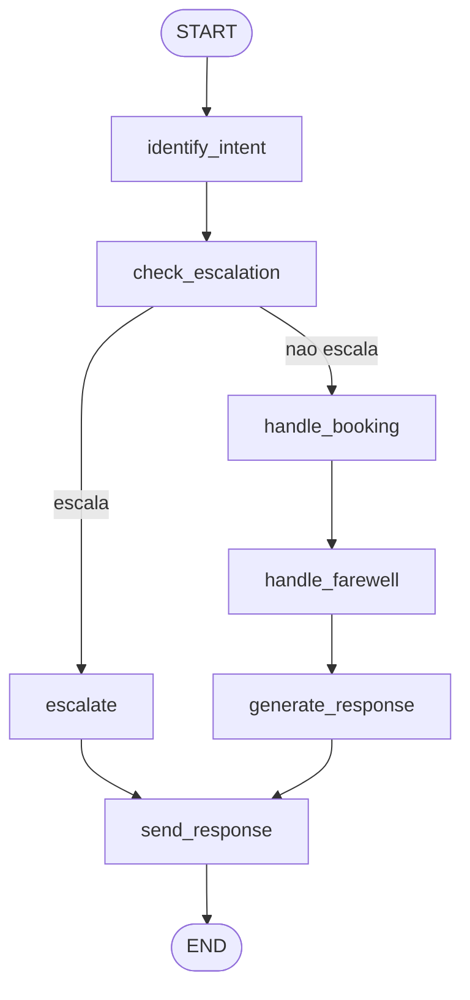
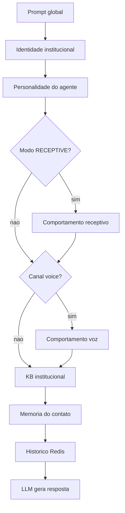
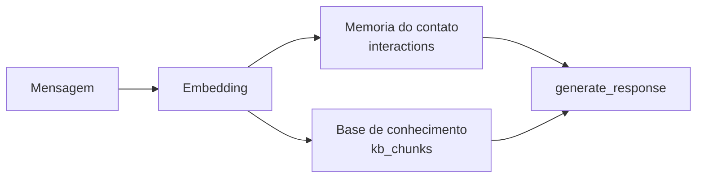

# Agentes e orquestração

O comportamento do agente é orquestrado por um grafo (LangGraph) que identifica a intenção da mensagem, decide se deve escalar para um humano e gera a resposta com apoio de RAG.

## Grafo de agentes

Definido em `agents/orchestrator/graph.py`, o fluxo é:

| Nó | Função |
|---|---|
| `identify_intent` | Classifica a intenção (saída estruturada do LLM; heurística leve em voz, incl. `schedule` e `farewell`), usando o histórico do Redis |
| `check_escalation` | Decide se o atendimento deve ir para um humano (ver gatilhos abaixo) |
| `handle_booking` | Avança o fluxo de agendamento conversacional (`booking_handler.process_booking_turn`); prepara `booking_context` ou resposta pré-montada na voz |
| `handle_farewell` | Encerramento autônomo de ligação de voz (`farewell_handler.process_farewell_turn`); pode definir `should_hangup` |
| `generate_response` | Gera a resposta com RAG (memória do contato + base de conhecimento); injeta `booking_context` quando presente |
| `send_response` | Envia a resposta, persiste no histórico (Redis) e na memória de longo prazo (pgvector) e publica eventos |

Intenções reconhecidas (`intent_agent`): `greeting`, `question`, `complaint`, `purchase`, `cancel`, `escalate`, **`schedule`**, `other`. Na **voz**, a heurística também reconhece **`farewell`** (desligamento). Detalhes do fluxo de agendamento e encerramento: [`documentacao.md`](documentacao.md) §9.4–9.5 e §10.5–10.6.

O roteamento de entrada é feito por `agents/orchestrator/router.py` (`route_message`), válido para os canais `telegram`, `whatsapp` e `voice`.

Workers de apoio ativos: identificação de intenção, geração de resposta e tabulação. **`calendar_tool`** está implementado (facade assíncrona sobre a agenda interna Postgres — `list_available_slots` / `create_appointment`). Há stubs previstos para escalonamento e memória dedicados (veja [roadmap.md](roadmap.md)).

## Escalonamento para humano (handoff)

O agente escala o atendimento para um operador humano em três situações (`agents/escalation.py`):

| Gatilho | Condição |
|---|---|
| Pedido explícito | Intenção identificada como "escalar" |
| Baixa confiança | Confiança da resposta abaixo de `0,25` |
| Reclamação grave | Intenção de reclamação com severidade alta |

Quando em **modo humano**, a IA é curto-circuitada: as mensagens daquele contato deixam de ser respondidas automaticamente, ficando a cargo do operador. O estado é mantido no Redis (`human_mode:{canal}:{user_id}`).

Um sweep periódico (Celery Beat) devolve o atendimento ao bot após um tempo de inatividade configurável. A interface de modo humano fica na tela de Monitoramento, e há endpoints para assumir, finalizar e reativar (`/api/v1/handoff/...`).

## Identidade institucional

A identidade que o agente assume é **configurável** e **injetada no prompt** (`agents/identity.py`), separada da base de conhecimento. Ela define *quem* o agente é (e o autoriza a se apresentar assim); a KB guarda os *fatos* (preços, prazos, políticas).

Campos: `company_name`, `display_name`, `tone`, `business_context`, `greeting_hint`.

Resolução em **duas camadas**, com merge campo a campo (agente preenchido > workspace > omitido):

| Camada | Escopo | Endpoint |
|---|---|---|
| Workspace | Identidade padrão do dono da conta | `GET/PUT /api/v1/settings/identity` |
| Override por agente | Ajustes específicos de um agente | `PATCH /api/v1/agents/{id}/identity` |

A função `resolve_identity_config` combina workspace + `agent.config.identity` antes do grafo (`enrich_agent_context_with_identity`), e `format_institutional_identity_block` monta o bloco de sistema. Sem identidade configurada, o agente se apresenta de forma neutra (sem adotar marca/empresa de terceiros).

## Tabulação

Cada atendimento pode ser classificado com um código de tabulação (padrão de call center, ex.: códigos SIP/NEG). O seed cria 16 códigos iniciais. A atribuição pode ser por regra ou assistida por IA. A tabulação automática a partir de eventos de chamada (Twilio) está prevista, mas ainda não conectada — veja [roadmap.md](roadmap.md).

## Capacidade e acionamento

O acionamento de campanhas (outbound) e a fila receptiva (inbound) são governados por camadas de controle:

- **Janela de horário:** disparos outbound respeitam horário de início/fim (fuso de São Paulo); o receptivo tem janelas configuráveis por canal (padrão 24/7).
- **Cadência e slots:** controle de tentativas por hora e de conversas simultâneas, com slots mantidos no Redis.
- **Capacidade global:** um teto ponderado limita o total de atendimentos simultâneos entre os canais.
- **Erlang C:** a tela de Capacidade usa o modelo de Erlang C (`core/erlang.py`) para dimensionar quantos atendimentos simultâneos são necessários para um nível de serviço — uma ferramenta de planejamento.

## Memória

| Tipo | Implementação | Uso |
|---|---|---|
| Curto prazo | Redis (`chat:{user_id}`, TTL 1h) | Contexto imediato da conversa |
| Agendamento (multi-turno) | Redis (`booking:{canal}:{user_id}`, TTL configurável) | Estado do fluxo conversacional de marcação de horário |
| Longo prazo | PostgreSQL + pgvector (tabela `interactions`) | Memória semântica por contato, recuperada via busca vetorial |
| Eventos | Redis pub/sub (`agent_events`) | Feed em tempo real do dashboard |

## RAG (Retrieval-Augmented Generation)

Na geração da resposta, o agente combina duas fontes:

1. **Memória do contato:** interações passadas semanticamente semelhantes, isoladas por `user_id` (não há vazamento entre contatos).
2. **Base de conhecimento (KB):** trechos de documentos institucionais previamente ingeridos (upload → chunking → embeddings → pgvector), filtrados por documentos prontos e escopo do dono.

Se não houver KB relevante cadastrada, o agente atua de forma neutra, sem inventar identidade ou informações — comportamento reforçado no prompt padrão do sistema.

A ingestão de documentos é assíncrona (`worker/tasks/kb_ingestion.py`): o upload dispara o processamento em background que fragmenta e indexa o conteúdo.
