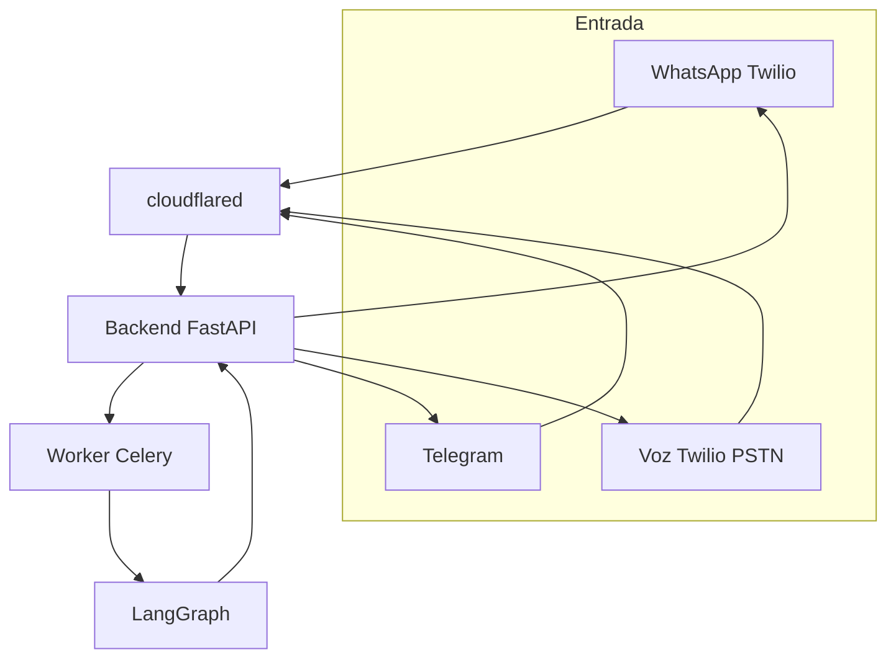
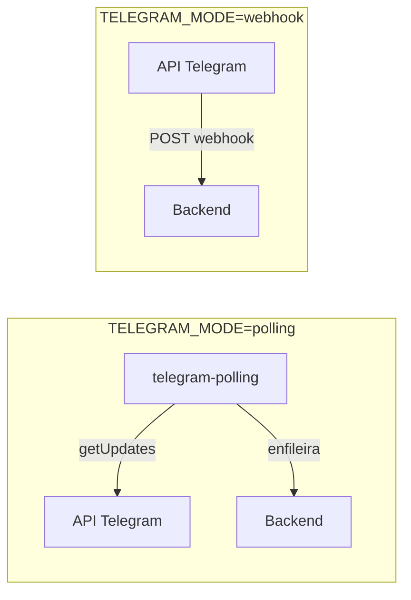
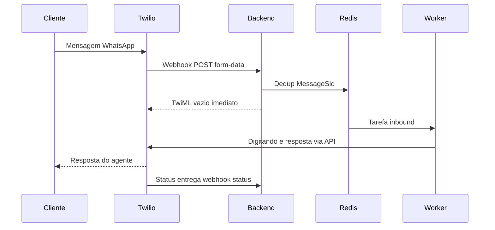
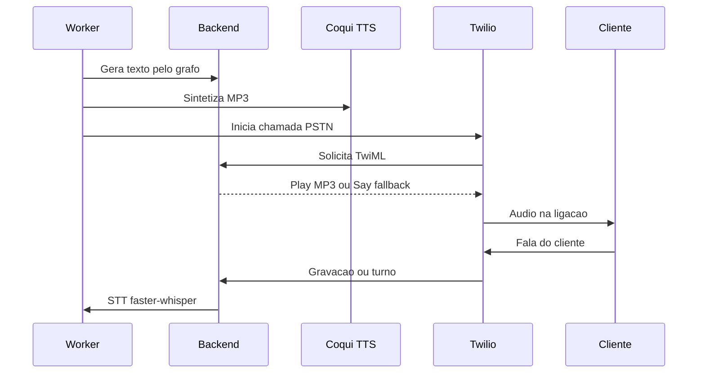

# Canais

O sistema atende por três canais: **WhatsApp**, **Telegram** e **Voz**. Cada canal tem um caminho de entrada (inbound) e de saída (outbound), além do indicador de "digitando...".

> Os canais são representados pelo enum `ChannelType` (`WHATSAPP`, `TELEGRAM`, `VOICE`). O seed cria um agente/canal padrão para cada um: `WhatsApp_Agent`, `Telegram_Agent`, `Voice_Agent`.

## Visão geral dos três canais

## Telegram

| Aspecto | Detalhe |
|---|---|
| Modos | `polling` (padrão) ou `webhook` (via `TELEGRAM_MODE`) |
| Polling | Serviço Docker no profile `telegram-polling` (opt-in, sobe à parte) |
| Webhook | `POST /api/v1/channels/webhooks/telegram` |
| Arquivos | `agents/channels/telegram/handler.py`, `client.py` |
| Digitando | Envia `sendChatAction(typing)` em loop (~4s) enquanto o agente processa |

No modo polling, o serviço `telegram-polling` consulta a API do Telegram continuamente e enfileira as mensagens recebidas. No modo webhook, o Telegram entrega as atualizações diretamente ao backend (requer URL pública — veja o túnel em [infra.md](infra.md)).

> Não rode polling e webhook ao mesmo tempo — a API retorna 409.

## WhatsApp

| Aspecto | Detalhe |
|---|---|
| Provider | Twilio |
| Inbound | Webhook `POST /api/v1/channels/webhooks/whatsapp` (form-data) |
| Deduplicação | Chave Redis por `MessageSid` (janela de 24h) evita processar a mesma mensagem duas vezes |
| Arquivos | `agents/channels/whatsapp/handler.py`, `twilio_client.py` |
| Digitando | Indicador via API beta da Twilio (requer `message_sid`) |

O webhook responde imediatamente com TwiML vazio e o processamento ocorre de forma assíncrona no worker; a resposta do agente é enviada depois pela API da Twilio (não no corpo do TwiML).

Para desenvolvimento/demonstração, costuma-se usar o **Twilio WhatsApp Sandbox**, que exige opt-in do número (`join <palavra-chave>`) e tem janela de sessão de 24h.

## Voz

| Aspecto | Detalhe |
|---|---|
| Outbound | Chamada PSTN via Twilio; TwiML servido pelo backend |
| TTS (saída) | Tenta Coqui (XTTS-v2, português) → MP3 de telefonia; fallback para voz padrão Twilio (`<Say>` Polly pt-BR) |
| STT (entrada) | faster-whisper (`agents/channels/voice/tts_stt.py`) |
| Arquivos | `agents/channels/voice/handler.py`, `twilio_voice_client.py`, `tts_stt.py` |

No fluxo outbound, o texto gerado pelo agente é sintetizado em áudio (Coqui) e reproduzido na ligação. O STT por faster-whisper está implementado no manipulador de chamada, mas o **inbound de voz ao vivo** (transcrição bidirecional em tempo real via Twilio Media Streams) ainda não está conectado — veja [roadmap.md](roadmap.md).

## Indicador "digitando..."

Implementado em `agents/channels/typing_indicator.py`, é acionado antes de o agente começar a processar e encerrado ao enviar a resposta:

| Canal | Comportamento |
|---|---|
| Telegram | Loop assíncrono reenviando o status a cada ~4s até o fim do atendimento |
| WhatsApp | Disparo único com `message_sid` (validade de ~25s) |
| Voz | Não se aplica |

Falhas no indicador são registradas em log, mas nunca interrompem o atendimento.

## Resumo de webhooks

| Canal | Endpoint |
|---|---|
| WhatsApp (inbound) | `POST /api/v1/channels/webhooks/whatsapp` |
| WhatsApp (status de entrega) | `POST /api/v1/channels/webhooks/whatsapp/status` |
| Telegram (inbound, modo webhook) | `POST /api/v1/channels/webhooks/telegram` |
| Voz (inbound/outbound TwiML) | rotas sob `/api/v1/channels/webhooks/voice/...` |

Todos os webhooks externos dependem da URL pública fornecida pelo túnel Cloudflare (veja [infra.md](infra.md)).
