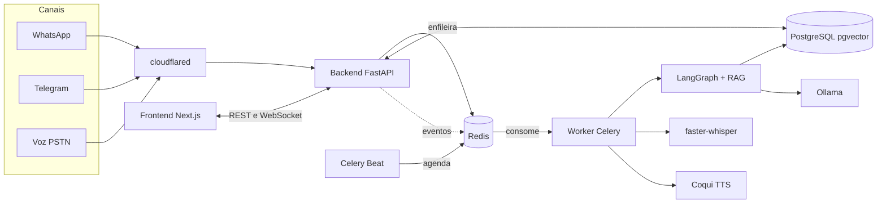
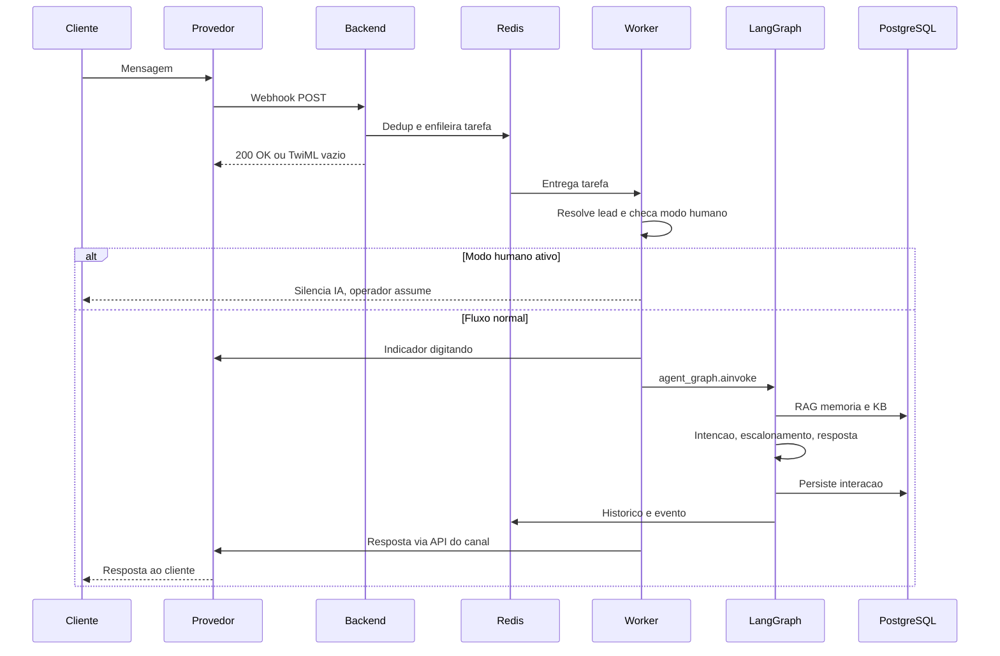
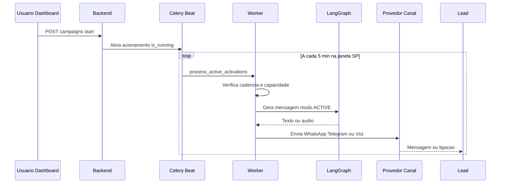
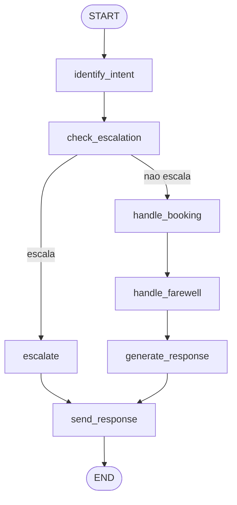
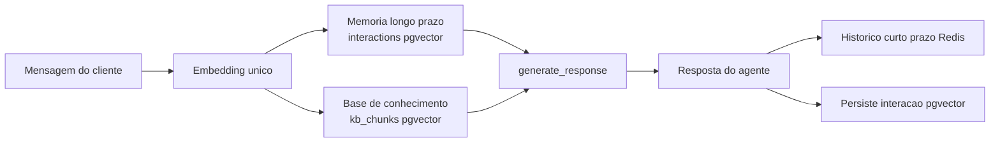

# Documentação Técnica — Autonomous Agent

> **Documento de referência (guarda-chuva).** Esta é a documentação técnica completa e aprofundada do projeto: arquitetura, banco de dados, IA, canais, decisões de design e trade-offs. Cada tema também tem um documento dedicado em `docs/` (citado em cada seção) para detalhes operacionais; aqui o conteúdo está consolidado e explica **o porquê** de cada escolha, não apenas o quê.
>
> **Fonte da verdade é o código.** As afirmações técnicas (modelos, versões, rotas, tabelas, defaults) foram conferidas no código-fonte. Itens não verificáveis estão marcados com `(TODO: confirmar)`.

---

## Sumário

1. [Proposta e visão geral](#1-proposta-e-visão-geral)
2. [Arquitetura geral](#2-arquitetura-geral)
3. [Stack tecnológica](#3-stack-tecnológica)
4. [Banco de dados (PostgreSQL + pgvector)](#4-banco-de-dados-postgresql--pgvector)
5. [Cache e filas (Redis)](#5-cache-e-filas-redis)
6. [Backend (FastAPI)](#6-backend-fastapi)
7. [Worker (Celery)](#7-worker-celery)
8. [Inteligência artificial (camada agnóstica)](#8-inteligência-artificial-camada-agnóstica)
9. [Agentes e orquestração (LangGraph)](#9-agentes-e-orquestração-langgraph) — intents, booking, farewell
10. [Canais de atendimento](#10-canais-de-atendimento) — WhatsApp, Telegram, Voz; agendamento conversacional, disponibilidade (Fase D), acionamento proativo (§10.7) e evolução para streaming (§10.8)
11. [Motor de acionamento (modo ativo)](#11-motor-de-acionamento-modo-ativo) — inclui métricas de campanha (§11.1)
12. [Atendimento receptivo e teoria de filas](#12-atendimento-receptivo-e-teoria-de-filas)
13. [Frontend (Next.js 15)](#13-frontend-nextjs-15)
14. [APIs (referência)](#14-apis-referência)
15. [Configuração e deploy](#15-configuração-e-deploy)
16. [Qualidade e testes](#16-qualidade-e-testes)
17. [Segurança e multi-tenancy](#17-segurança-e-multi-tenancy)
18. [Decisões de arquitetura e trade-offs](#18-decisões-de-arquitetura-e-trade-offs)
19. [Glossário](#19-glossário)

---

## 1. Proposta e visão geral

### 1.1 O problema

O telemarketing tradicional depende de operadores humanos para tarefas repetitivas: discar para listas de leads, qualificar interessados, responder dúvidas frequentes e registrar o desfecho de cada contato (tabulação). Esse modelo é caro, difícil de escalar, sujeito a variação de qualidade e limitado por horário e capacidade humana.

### 1.2 A proposta

O **Autonomous Agent** transforma o operador de telemarketing em um **agente de IA autônomo**: um sistema multi-agente que atende clientes em múltiplos canais, identifica intenções, mantém contexto conversacional, consulta uma base de conhecimento (RAG) e escala para um humano apenas quando necessário. Ele cobre os dois lados da operação:

- **ACTIVE (ativo / outbound):** o agente inicia o contato, disparando mensagens para uma base de leads carregada pelo usuário (campanhas).
- **RECEPTIVE (receptivo / inbound):** o agente responde a clientes que entram em contato, com fila e controle de capacidade.

### 1.3 Contexto acadêmico (TCC)

Trabalho de Conclusão de Curso intitulado **"Do operador ao Agente: Transformando um atendente de telemarketing em um Agente de Inteligência Artificial Autônomo"**, apresentado ao Instituto de Ciências Matemáticas e de Computação (ICMC) da Universidade de São Paulo (USP).

### 1.4 Princípios de design

| Princípio | O que significa | Por quê |
|---|---|---|
| **Local por padrão** | A stack OSS (Ollama `llama3.1`, faster-whisper, Coqui XTTS-v2, `nomic-embed-text`) sobe sem nenhuma chave de API. | Custo zero de inferência, privacidade dos dados (nada sai da máquina), reprodutibilidade da defesa do TCC sem depender de serviços pagos. |
| **Agnóstico de provedor** | Cada camada de IA (LLM/STT/TTS/embeddings) é plugável a uma alternativa de nuvem por variável de ambiente, **sem alterar código** (`agents/provider_factory.py`). | Evita lock-in; permite comparar local vs. nuvem; demonstra que a arquitetura não está acoplada a um fornecedor. |
| **Multi-tenant** | Cada usuário (`user_id`) é dono dos seus recursos; registros `is_system` são compartilhados e somente leitura. | Isolamento entre clientes/contas na mesma instância. |
| **Reprodutível** | Tudo sobe via Docker Compose com um comando (`make setup`); schema vem de migrations versionadas. | Ambiente determinístico, fácil de recriar. |
| **Assíncrono e desacoplado** | Canais só recebem e enfileiram; o processamento pesado roda em workers. | Resiliência (retry), latência baixa no webhook, escala horizontal de workers. |

### 1.5 O que o sistema faz em alto nível

- Atende por **três canais**: WhatsApp (Twilio), Telegram e Voz (Twilio PSTN).
- Orquestra a conversa por um **grafo de agentes** (LangGraph): intenção → escalonamento → resposta com RAG.
- Mantém **memória** de curto prazo (Redis) e longo prazo (pgvector), além de uma **base de conhecimento** institucional (RAG documental).
- Opera **campanhas ativas** (discagem/disparo programado com janela, cadência e capacidade) e **atendimento receptivo** (fila dimensionada por teoria de filas — Erlang C).
- Oferece um **dashboard** (Next.js) para gestão e monitoramento em tempo real.

---

## 2. Arquitetura geral

### 2.1 Visão de microsserviços

O sistema é um conjunto de serviços orquestrados por **Docker Compose**. Os serviços abaixo estão definidos em `infra/docker/docker-compose.yml`:

| Serviço | Imagem/base | Papel |
|---|---|---|
| `backend` | FastAPI (Python 3.12) | API REST, webhooks, WebSocket de monitoramento; no startup roda migrations e seed |
| `frontend` | Next.js 15 | Dashboard de gestão (build target `dev`) |
| `worker` | Celery (mesma imagem do backend) | Processa tarefas assíncronas (inbound, campanhas, ingestão, sweeps) |
| `celery-beat` | Celery Beat | Agendador periódico (devolutivas, sweeps, scheduler de acionamento, fila receptiva) |
| `postgres` | `pgvector/pgvector:pg16` | Banco relacional + extensão pgvector; `max_connections=200` |
| `redis` | `redis:7-alpine` | Cache/histórico, broker e result do Celery, pub/sub de eventos, modo humano, slots de capacidade |
| `ollama` | `ollama/ollama:latest` | LLM (`llama3.1`) + embeddings (`nomic-embed-text`); GPU NVIDIA |
| `faster-whisper` | REST `:8001` | STT (transcrição); GPU NVIDIA (`cuda`/`float16` por padrão) |
| `coqui-tts` | REST `:8002` | TTS (XTTS-v2, português); GPU NVIDIA |
| `cloudflared` | Cloudflare Tunnel | Expõe o backend publicamente (webhooks Twilio/Telegram) |
| `telegram-polling` | profile `telegram-polling` | Polling do Telegram (opt-in; **não** sobe no `up` padrão) |

Os três serviços de IA (`ollama`, `faster-whisper`, `coqui-tts`) usam o bloco YAML `x-gpu` (reserva de GPU NVIDIA via Container Toolkit). Em host sem GPU, esses blocos podem ser comentados ou sobrescritos.

### 2.2 Diagrama de componentes



> No modo de nuvem (opcional), `Ollama` é substituído por OpenAI (LLM/embeddings), `faster-whisper` pela Whisper API e `Coqui` pela ElevenLabs — sem mudar o restante do fluxo.

### 2.3 Fluxo de uma mensagem inbound (receptivo) ponta a ponta



Detalhes verificados:
- A recepção do WhatsApp deduplica por `MessageSid` no Redis e responde **TwiML vazio** de imediato; a resposta real do agente é enviada depois pela **API da Twilio** (não no corpo do TwiML).
- O roteamento valida o canal (`telegram`, `whatsapp`, `voice` — `agents/orchestrator/router.py`) antes de invocar o grafo.
- Antes de invocar o grafo, `route_message` chama `ensure_settings_fresh_async()` (hot-reload de settings — ver §6.4).

### 2.4 Fluxo de uma campanha outbound (ativo) ponta a ponta



Passos detalhados:
1. `POST /api/v1/campaigns/{id}/start` marca a campanha e enfileira/ativa o acionamento.
2. O **scheduler** roda no Celery Beat a cada 5 min (`process-active-activations`): para cada ativação `is_running`, verifica a **janela de horário** (fuso `America/Sao_Paulo`), a **cadência** (tentativas por período) e a **capacidade global** (slots no Redis).
3. A tarefa de campanha monta o `AgentState` com a personalidade **ACTIVE** e gera a mensagem pelo grafo.
4. Entrega pelo canal:
   - **WhatsApp/Telegram:** envio direto pela API. Fora da janela de sessão de 24h do WhatsApp, usa **templates Meta** aprovados (HSM) quando habilitado.
   - **Voz:** o texto é sintetizado (Coqui → MP3) e tocado na ligação via TwiML `<Play>`, com fallback `<Say>` Polly pt-BR.
5. O resultado é registrado em `lead_interactions` (tentativas, status, último contato, tabulação).

### 2.5 Por que essas escolhas de arquitetura

- **Por que Celery + Redis (broker):** o webhook de um canal precisa responder em milissegundos (a Twilio/Telegram reenviam em timeout). Processar o LLM (segundos) de forma síncrona estouraria esse limite e duplicaria mensagens. Enfileirar desacopla a recepção do processamento, dá **retry** automático e permite **escalar workers** horizontalmente.
- **Por que Redis também para cache/pub-sub:** já está no stack como broker; reaproveitá-lo para histórico de chat (com TTL), eventos de monitoramento (pub/sub) e slots de capacidade evita introduzir mais um componente.
- **Por que PostgreSQL + pgvector:** o RAG precisa de busca vetorial; o pgvector adiciona vetores ao mesmo banco relacional, evitando um banco vetorial dedicado e mantendo transações/joins entre dados de negócio e embeddings.
- **Por que LangGraph:** o atendimento é uma máquina de estados (intenção → decisão de escalar → resposta), com arestas condicionais. O LangGraph modela isso explicitamente como grafo, deixando o fluxo legível e testável, em vez de um encadeamento ad-hoc de chamadas.

Mais detalhe: [`docs/arquitetura.md`](arquitetura.md).

---

## 3. Stack tecnológica

### 3.1 Linguagens e frameworks

| Camada | Tecnologia | Versão (conferida) |
|---|---|---|
| Backend/Worker/Agentes | Python | 3.12 |
| API | FastAPI | `>=0.115` (Uvicorn `>=0.32`) |
| ORM | SQLAlchemy | `>=2.0.36` (async, asyncpg `>=0.30`) |
| Migrations | Alembic | `>=1.14` |
| Vetores | pgvector (`pgvector` Python) | `>=0.3` |
| Validação/config | Pydantic / pydantic-settings | `>=2.10` / `>=2.6` |
| Fila | Celery / redis-py | `>=5.4` / `>=5.2` |
| Orquestração IA | LangGraph / LangChain | `>=0.2` / `>=0.3` |
| Canais | twilio `>=9.3`, python-telegram-bot `>=21`, elevenlabs `>=1.9` | — |
| KB | pypdf `>=5`, python-docx `>=1.1`, openpyxl `>=3.1` | — |
| Testes | pytest `>=8.3`, pytest-asyncio `>=0.24`, pytest-cov `>=6` | — |
| Frontend | Next.js 15, React 19, TypeScript 5.8, Tailwind 3.4 | `next ^15`, `react ^19`, `typescript 5.8.2` |
| Frontend (libs) | Recharts `^3.8`, lucide-react, next-themes | — |
| Node (dev/CI) | Node 20+ em dev; **Node 22** no CI | — |

Fontes: `backend/requirements.txt`, `worker/requirements.txt` (reusa a imagem do backend), `frontend/package.json`.

### 3.2 Modelos de IA (padrão local) e o porquê

| Função | Provider local (padrão) | Modelo | Por que essa escolha |
|---|---|---|---|
| LLM | Ollama | `llama3.1` | Modelo aberto forte, roda local via Ollama com keep-alive; bom português em tarefas de atendimento |
| Embeddings | Ollama | `nomic-embed-text` (768 dimensões) | Embeddings locais de qualidade, dimensão compacta (768) que reduz custo de armazenamento/índice no pgvector |
| STT | faster-whisper | `large-v3` (default) | Implementação CTranslate2 do Whisper, rápida em GPU; `large-v3-turbo` recomendado para menor latência |
| TTS | Coqui | XTTS-v2 (multilíngue, português) | Clonagem de voz por amostra (`speaker_wav`), saída transcodificada para MP3 (compatível com `<Play>` da Twilio) |

**Alternativas de nuvem (opcionais):** OpenAI `gpt-4o` (`LLM_PROVIDER=openai`) e `text-embedding-3-small` (1536d), OpenAI Whisper API (`STT_PROVIDER=openai`), ElevenLabs (`TTS_PROVIDER=elevenlabs`). Cada uma exige sua chave (`OPENAI_API_KEY` / `ELEVENLABS_API_KEY`) **apenas quando ativada**.

Mais detalhe: [`docs/stack.md`](stack.md).

---

## 4. Banco de dados (PostgreSQL + pgvector)

### 4.1 Modelo de dados

Os modelos SQLAlchemy estão em `backend/app/models/`. Abaixo, cada entidade com seu propósito e campos-chave (conferidos no código).

#### User (`users`)
Conta do sistema e raiz do multi-tenant.
- `id` (UUID, PK), `email` (único), `hashed_password`, `full_name`, `is_active`, `created_at`.
- Relacionamentos (cascade): `agents`, `channels`, `leads`, `campaigns`, `tabulacoes`, `kb_documents`.

#### Agent (`agents`)
Configuração de um agente de IA.
- `id`, `user_id` (FK), `name`, `description`, `mode` (`AgentMode`: `ACTIVE` | `RECEPTIVE`), `status` (default `draft`), `config` (**JSONB** — guarda `identity` e parâmetros operacionais), `is_system`, `created_at`.
- Relacionamentos: `campaigns`, `channel_settings`, `activations`.

#### Channel (`channels`)
Um canal configurado pelo usuário.
- `id`, `user_id`, `name`, `type` (`ChannelType`: `WHATSAPP` | `TELEGRAM` | `VOICE`), `credentials` (JSONB), `is_active`, `is_system`, `created_at`.

#### AgentChannelSettings (`agent_channel_settings`)
Configuração de um canal específico para um agente (relacionado a `Agent.channel_settings`).

#### Lead (`leads`)
Contato a ser trabalhado.
- `id`, `user_id`, `lead_base_id` (FK), `id_cliente`, `nome_cliente`, `cpf_cliente`, `email_cliente`, `telefone_1..3`, `aux_values` (JSONB — colunas customizadas do CSV), `is_system`, `created_at`.

#### LeadBase (`lead_bases`) e LeadBaseChannel (`lead_base_channels`)
Agrupamento de leads dentro de uma campanha.
- `LeadBase`: `id`, `campaign_id` (FK), `data_recebimento`, `data_inicio`, `data_fim`, `column_mapping` (JSONB — mapeamento das colunas do CSV), `source` (`LeadBaseSource`: `IMPORT` | `MANUAL`), `is_system`.
- `LeadBaseChannel`: associação (PK composta) entre base e `channel_type`.
- **Regra de negócio:** leads de base com `source=IMPORT` são **somente leitura** (ver §17).

#### Campaign (`campaigns`) e CampaignChannel (`campaign_channels`)
Campanha do modo ativo.
- `Campaign`: `id`, `user_id`, `agent_id` (FK), `name`, `status` (default `draft`), `leads_count`, `is_system`.
- `CampaignChannel`: associação (PK composta) entre campanha e `channel_type`.

#### AgentActivation (`agent_activations`)
Estado/janela de acionamento por agente/campanha (modo ativo). Liga-se a `Agent.activations` e `Campaign.activations`.

#### LeadInteraction (`lead_interactions`)
Estado do acionamento e desfecho de um lead em um canal — o "coração" do CRM operacional.
- `lead_id`, `campaign_id`, `channel_type`, `status` (default `pendente`), `devolutiva`.
- Acionamento: `data_acionamento`, `data_ultimo_contato` (último inbound do lead), `tentativas`, `data_ultima_tentativa` (último outbound), `inactivity_warning_sent_at`, `lifecycle_version` (0 = legado/fora do sweep; ≥1 = regras novas).
- Tabulação: `tabulacao_id` (FK), `tabulacao_origem` (`INTENT`/`IA`/`SIP`/`MANUAL`), `tabulacao_aplicada_em`.
- Correlação/entrega: `last_interaction_id` (FK → `interactions`), `twilio_call_sid`, `twilio_message_sid`, `last_delivery_status`, `last_delivery_error_code` (ex.: `63015` sandbox).

#### Interaction (`interactions`) — memória de longo prazo
Cada troca relevante, vetorizada.
- `id`, `user_id` (String — identificador do contato, **não** FK), `message`, `response`, `intent`, `embedding` (`Vector(EMBEDDING_DIMENSIONS)`), `created_at`.

#### KBDocument (`kb_documents`) e KBChunk (`kb_chunks`) — base de conhecimento
- `KBDocument`: `id`, `user_id`, `title`, `source_type` (`UPLOAD`/`MANUAL`), `filename`, `mime_type`, `file_path`, `status` (`KBDocumentStatus`: `PROCESSING`/`READY`/`ERROR`), `error_message`, `is_system`, `chunk_count`, `total_chunks_estimated`, `chunks_processed`.
- `KBChunk`: `id`, `document_id` (FK), `owner_user_id` (indexado — escopo do RAG), `chunk_index`, `content`, `embedding` (`Vector(EMBEDDING_DIMENSIONS)`).

#### Tabulacao (`tabulacoes`)
Catálogo de códigos de desfecho (estilo call center).
- `id`, `user_id`, `nome`, `codigo` (único — `uq_tabulacoes_codigo`), `categoria` (`TabulacaoCategoria`: `TELEFONIA` | `NEGOCIO` | `CUSTOMIZADO`), `is_terminal`, `is_system`, `descricao`.

#### QueueEntry (`queue_entries`) — histórico da fila receptiva
- `channel_type`, `user_id`, `lead_id`, `agent_id`, `enqueued_at`, `answered_at`, `abandoned_at`, `wait_seconds`, `status` (`QueueEntryStatus`: `WAITING`/`ANSWERED`/`ABANDONED`).
- **Estado quente** da fila fica no Redis; esta tabela persiste métricas (KPIs de call center). Abandono só ocorre em voz.

#### AppSetting (`app_settings`) — settings dinâmicas
- `scope` (default `global`), `user_id` (nullable), `key`, `value` (Text), `is_secret`, `updated_at`.
- Constraint única `(scope, user_id, key)` com `nulls_not_distinct` — permite um valor global (`user_id=NULL`) por chave.

#### Appointment (`appointments`) — agenda interna
Compromissos por tenant, vinculados a um lead (e opcionalmente a um agente).
- `id`, `user_id` (FK → `users`, index), `lead_id` (FK → `leads`, index), `agent_id` (FK → `agents`, nullable, `SET NULL`).
- `starts_at`, `ends_at` (timestamptz), `title`, `notes` (nullable).
- `status` (`SCHEDULED` | `CONFIRMED` | `CANCELLED` | `COMPLETED` | `NO_SHOW`; bloqueio de slot usa `SCHEDULED` e `CONFIRMED`).
- `created_by` (`AGENT` | `MANUAL`), `channel` (nullable — canal de origem conversacional).
- `reminder_sent_at`, `due_notified_at` (timestamptz, nullable) — marcas de **idempotência** do acionamento proativo (§10.7): uma por tipo de disparo (lembrete antecipado / acionamento na hora); o sweep não reenvia após preenchimento.
- `created_at`, `updated_at`.
- Relacionamentos: `user`, `lead`, `agent`.

#### AvailabilityRule (`availability_rules`) — disponibilidade configurável (Fase D)
Grade semanal por tenant e, opcionalmente, por agente (`agent_id` NULL = tenant; preenchido = override do agente).
- `id`, `user_id` (FK, index), `agent_id` (FK, nullable, index).
- `weekday` (0=segunda … 6=domingo), `start_time` / `end_time` (`HH:MM`), `slot_minutes` (nullable), `timezone` (nullable), `is_active`.
- Unique `(user_id, agent_id, weekday)` com `nulls_not_distinct`; índice parcial `is_active`.
- Por ora, no máximo **uma faixa por dia** por escopo (múltiplas faixas no mesmo weekday é trabalho futuro).

### 4.2 Multi-tenancy no schema

O isolamento é por **`user_id`** (o tenant). A maioria das entidades tem `user_id` (FK → `users`). Registros com **`is_system=True`** são "registros padrão do sistema": visíveis a todos e somente leitura (exceto campanhas, que o dono pode operar). Em `kb_chunks`, o escopo do RAG é dado por `owner_user_id` + a flag `is_system` do documento (institucional global vs. do dono). Ver §17 para as regras de autorização.

### 4.3 pgvector: armazenamento e busca

- Embeddings ficam em colunas `Vector(N)`, onde `N = settings.embedding_dimensions` (**768** local / **1536** OpenAI).
- A busca usa o operador de **distância de cosseno** do pgvector, `<=>`: `0` = idênticos, `2` = opostos (vetores normalizados). A similaridade exposta é `similarity = 1 - distance`.
- Padrão de query (em `agents/memory/long_term.py` e `agents/tools/knowledge_base.py`):

```sql
SELECT ..., (embedding <=> $query) AS distance,
            (1 - (embedding <=> $query)) AS similarity
FROM interactions
WHERE user_id = $1
ORDER BY embedding <=> $query
LIMIT $k
```

- Quando há `threshold > 0`, busca-se `top_k * 3` candidatos e filtra-se por `similarity >= threshold` em Python (rede de segurança para rankings ruidosos).

### 4.4 Migrations (Alembic) e a dimensão do vetor

- O schema é criado/evoluído por **migrations versionadas** em `backend/alembic/`. No startup, o `backend` cria a extensão `vector` e roda `alembic upgrade head` (fonte única do schema). `make migrate` é idempotente.
- **Decisão importante:** a dimensão da coluna `Vector` depende do provedor de embeddings. Uma migration dedicada (`a7b8c9d0e1f2_alter_interactions_embedding_dimensions`) **ajusta dinamicamente** a dimensão a partir de `settings.embedding_dimensions`, truncando a tabela se a dimensão mudar (vetores de dimensões diferentes são incompatíveis). Por isso, alternar entre local (768) e OpenAI (1536) é seguro do ponto de vista de schema, mas **invalida embeddings antigos** — eles precisam ser regerados.

### 4.5 Decisões de design do schema

- **`Interaction.user_id` é String, não FK:** o "contato" externo (telefone/chat id) não é um `User` do sistema; é o identificador do cliente no canal. Isso isola a memória conversacional por contato sem acoplá-la à tabela de contas.
- **JSONB em `Agent.config`, `Channel.credentials`, `Lead.aux_values`:** campos com forma variável (identidade, credenciais por provedor, colunas customizadas de CSV) ganham flexibilidade sem explosão de colunas/migrations.
- **Estado quente no Redis, histórico no Postgres:** a fila viva é volátil (Redis); o `QueueEntry`/`LeadInteraction` guardam a trilha auditável e as métricas.

---

## 5. Cache e filas (Redis)

O Redis acumula vários papéis, separados por **banco lógico** (DB):

| Uso | DB / chave | Estrutura | Por quê |
|---|---|---|---|
| Histórico de chat (curto prazo) | DB0, `chat:{user_id}` | String JSON, **TTL 3600s** | Contexto imediato barato e auto-expirável (não cresce sem limite) |
| Broker do Celery | DB1 | filas Celery | Desacopla recepção do processamento |
| Result backend do Celery | DB2 | resultados de tarefas | Acompanhar status/resultados |
| Eventos de monitoramento | DB0, canal pub/sub `agent_events` | pub/sub | Feed em tempo real para o dashboard via WebSocket |
| Modo humano (handoff) | DB0, chave por canal/contato | String com TTL | Silenciar a IA enquanto o operador atende |
| Slots de capacidade | DB0 | chaves com TTL | Controlar conversas simultâneas (rede de segurança via TTL) |
| Versão de settings | DB0 | contador + evento | Hot-reload (invalida cache de settings em backend/workers) |
| Estado de agendamento (multi-turno) | DB0, `booking:{canal}:{user_id}` | JSON, TTL `booking_state_ttl_seconds` | Fluxo conversacional de marcação de horário (WhatsApp/Telegram/Voz) |

Detalhes conferidos:
- `agents/memory/short_term.py`: prefixo `chat:`, `TTL_SECONDS = 3600`; ao salvar, faz `_sanitize_history` (descarta turnos de assistente vazios — limpa histórico legado poluído).
- `agents/events.py`: canal `agent_events`; há versão **síncrona** (`publish_event`, segura em tasks Celery) e **assíncrona** (`publish_event_async`, para nós do grafo e FastAPI). Cada evento carrega `type`, `timestamp` (UTC ISO) e o payload.
- Configuração (de `docker-compose.yml`): `REDIS_URL=redis://redis:6379/0`, `CELERY_BROKER_URL=.../1`, `CELERY_RESULT_BACKEND=.../2`.

**Por que TTL no histórico:** uma conversa de atendimento é efêmera; manter o histórico imediato por ~1h cobre a sessão típica sem virar um banco de mensagens. A memória que importa a longo prazo é destilada para o pgvector.

---

## 6. Backend (FastAPI)

### 6.1 Estrutura

```
backend/app/
├── main.py        # instância FastAPI, CORS, lifespan (migrations + seed + bootstrap de settings)
├── api/v1/         # routers REST + WebSocket de monitoramento
├── core/           # config, database, security, authorization, seed, erlang, activation_*, tunnel…
├── models/         # SQLAlchemy (schema)
├── schemas/        # Pydantic v2 (contratos da API)
└── services/       # regra de negócio (identidade, KB, handoff, capacidade, voz, settings…)
```

A lógica de IA fica em `agents/` (raiz) e é importada via `PYTHONPATH` (`/workspace:/workspace/backend:/workspace/worker`).

### 6.2 Startup (lifespan)

No arranque, `app/main.py`:
1. Cria a extensão PostgreSQL `vector` (pgvector).
2. Executa `alembic upgrade head`.
3. Faz seed do admin de desenvolvimento (`admin@admin.com` / `admin`) e dos agentes/canais/tabulações padrão.
4. Faz bootstrap das settings dinâmicas (carrega do banco).

### 6.3 Autenticação e autorização

- **Autenticação:** JWT Bearer. `app/core/security.py` cuida do hash de senha (passlib/bcrypt) e da emissão/validação de token (`python-jose`). `access_token_expire_minutes = 1440` (24h).
- **Autorização/ownership:** `app/core/authorization.py` centraliza as regras:
  - `can_view`: registros `is_system` são visíveis a todos; senão, só o dono.
  - `can_edit`: registros `is_system` **não** são editáveis (exceto `Campaign`, que o dono pode operar).
  - `can_delete`: campanhas `is_system` nunca são deletáveis; demais seguem `can_edit`.
  - Leads de base **importada** (`source=IMPORT`) são somente leitura.
  - Os helpers `raise_if_cannot_*` retornam **404** para recursos de terceiros (não vaza existência) e **403** para registros do sistema.

### 6.4 Settings dinâmicas (hot-reload)

Parâmetros de comportamento do agente (temperatura, prompt, `rag_top_k`, thresholds, voz, handoff, seleção de provider) podem ser alterados **em tempo de execução**, sem reiniciar containers:
- São persistidos em `app_settings` (chave/valor, escopo global ou por usuário).
- Ao salvar, uma **versão** é incrementada no Redis e um evento de invalidação é publicado.
- Antes de processar uma mensagem, `route_message` chama `ensure_settings_fresh_async()`; backend e workers recarregam quando detectam mudança de versão. O esquema/whitelist do que é gerenciável fica em `app/services/settings_schema.py` e `settings_sync.py`.

**Por quê:** ajustar o agente (ex.: tom, agressividade do escalonamento, top_k do RAG) durante a demonstração/operação sem downtime.

### 6.5 Webhooks e WebSocket

- Webhooks de canais ficam sob `/api/v1/channels/webhooks/...` (WhatsApp inbound + status, Telegram, Voz). Ver §10 e §14.
- WebSocket de monitoramento: `/api/v1/monitoring/ws`, alimentado pelo pub/sub `agent_events` do Redis.

Mais detalhe: [`docs/backend.md`](backend.md).

---

## 7. Worker (Celery)

### 7.1 Papel e configuração

O `worker` executa as tarefas pesadas/assíncronas; o `celery-beat` agenda as periódicas. Ambos usam a imagem do backend e importam IA de `agents/`. Broker/result no Redis (DB1/DB2). Serialização JSON, timezone UTC (`worker/celery_app.py`).

### 7.2 Tarefas principais (`worker/tasks/`)

| Tarefa | Papel |
|---|---|
| `inbound_handler.py` | Processa mensagem recebida: resolve lead/agente, checa modo humano, invoca o grafo, envia resposta |
| `conversation_routing.py` | Roteamento/encaminhamento de conversas |
| `voice_inbound_turn.py` | Processa um turno de chamada de voz recebida |
| `receptive_queue.py` | Avança a fila receptiva (dequeue FIFO) conforme a capacidade |
| `outbound_campaign.py` | Envia mensagem ativa de campanha para um lead |
| `activation_scheduler.py` | Retoma leads pendentes respeitando janela/cadência/capacidade |
| `kb_ingestion.py` | Ingestão de documentos KB (extração → chunking → embeddings → pgvector) |
| `inactivity_sweep.py` | Inatividade em conversas `em_andamento` (aviso e encerramento) |
| `human_handoff_sweep.py` | Timeouts do modo humano (devolve ao bot / finaliza) |
| `status_sweep.py` | Marca acionados sem resposta como `nao_atendido` |
| `queue_abandon_sweep.py` | Abandono na fila (voz) |
| `devolutiva_task.py` | Gera devolutivas/tabulações de fechamento (Excel) |
| `lead_tracking.py` | Atualiza rastreamento/estado dos leads |
| `voice_cleanup.py` | Limpeza de MP3s de chamadas |

### 7.3 Celery Beat

Conferido em `worker/celery_app.py` → `beat_schedule`:

| Tarefa | Intervalo |
|---|---|
| `gerar-devolutivas-diarias` | `crontab(hour=0, minute=0)` (00:00 UTC) |
| `marcar-nao-atendidos` | a cada hora (`minute=0`) |
| `limpar-audios-voz` | `crontab(hour=3, minute=0)` (03:00 UTC) |
| `process-active-activations` | a cada 5 min (`*/5`) |
| `process-receptive-queue` | `receptive_queue_beat_seconds` (~30s) |
| `sweep-queue-abandonment` | a cada 2 min (`*/2`) |
| `sweep-human-handoff-timeouts` | `human_handoff_sweep_seconds` (~60s) |
| `sweep-messaging-inactivity` | `inactivity_sweep_seconds` (~60s) |
| `sweep-appointment-reminders` | `appointment_reminder_sweep_seconds` (~60s) |

**Por quê Beat:** várias regras de negócio são baseadas em tempo (retomar leads na janela, expirar handoff, encerrar conversas inativas, abandonar fila, lembretes de agendamento). O Beat centraliza esses gatilhos periódicos em vez de espalhar `sleep`/cron pelo sistema.

**Lembrete proativo de agendamentos:** a tarefa `sweep-appointment-reminders` enfileira lembretes antecipados e acionamentos na hora para compromissos elegíveis. Detalhes completos (janelas, idempotência, canais, isenção do gate de modo de agente) em §10.7.

### 7.4 Padrão async em tasks Celery

Tasks Celery são síncronas, mas o grafo e o I/O do projeto são `async`. O padrão é `worker/async_runner.py` (`run_celery_async`). Após cada execução async em worker prefork, os clientes globais (ex.: Redis de `ShortTermMemory`) são recriados (`reset_worker_async_clients`), porque o event loop anterior é fechado e reutilizá-lo causaria erro de "loop fechado". No init de cada processo filho, as settings são recarregadas do banco (`bootstrap_settings`).

Mais detalhe: [`worker/README.md`](../worker/README.md).

---

## 8. Inteligência artificial (camada agnóstica)

### 8.1 ProviderFactory

`agents/provider_factory.py` é o ponto único de seleção de provedor, por env (lazy import — só importa a implementação escolhida):

| Camada | Método | `ollama`/local | nuvem |
|---|---|---|---|
| LLM | `get_llm()` | `OllamaLLMProvider` | `OpenAILLMProvider` |
| STT | `get_stt()` | `FasterWhisperSTTProvider` | `OpenAISTTProvider` |
| TTS | `get_tts()` | `CoquiTTSProvider` | `ElevenLabsTTSProvider` |

Um valor desconhecido em `LLM_PROVIDER`/`STT_PROVIDER`/`TTS_PROVIDER` levanta `ValueError` explícito. As implementações concretas ficam em `agents/providers/{llm,stt,tts}/` sob uma interface comum (`agents/providers/base.py`).

**Por quê:** isolar a decisão de provedor num único lugar permite trocar o motor por configuração e mantém o resto do código (grafo, workers) escrito contra a interface, não contra um SDK específico.

### 8.2 Embeddings e RAG

- O texto vira vetor via `agents/services/embedding_service.py` → `ProviderFactory.get_llm().embed()`. No Ollama, usa `nomic-embed-text` (768d) pelo endpoint `/api/embeddings`; no OpenAI, `text-embedding-3-small` (1536d).
- A busca semântica (memória de longo prazo + KB) usa pgvector (ver §4.3). Na geração da resposta, **um único embedding** da mensagem é calculado e reaproveitado para as duas buscas, que rodam **em paralelo** (`asyncio.gather` em `graph._fetch_rag_context`) — com fallback sequencial em caso de erro. Ambas as buscas **degradam graciosamente** (retornam `[]` em falha), para nunca derrubar o atendimento por causa do RAG.

### 8.3 Parsing robusto da saída do LLM

LLMs locais nem sempre respeitam "responda só com JSON". O `OllamaLLMProvider._coerce_structured_output` é defensivo e **nunca levanta exceção** por conteúdo malformado, tentando, em ordem:
1. `json.loads` direto;
2. remoção de cercas markdown (` ```json ... ``` `);
3. extração do **primeiro objeto `{...}` balanceado** (ignorando chaves dentro de strings);
4. validação contra o schema Pydantic; se tudo falhar, usa um **fallback estruturado seguro** (ex.: `IntentResult` → `intent="question"`, `confidence=0.5`).

Para forçar o formato, quando há `structured_output_schema`, o provider injeta um system prompt com o JSON Schema e envia `"format": "json"` ao Ollama. Há teste dedicado (`backend/tests/unit/test_ollama_json_parse.py`).

**Por quê:** robustez. Um caractere extra do modelo local não pode quebrar a classificação de intenção; o pior caso degrada para um default seguro.

---

## 9. Agentes e orquestração (LangGraph)

### 9.1 O grafo

Definido em `agents/orchestrator/graph.py` e compilado em `agent_graph`:



| Nó | Função (verificada) |
|---|---|
| `identify_intent` | Classifica a intenção. Em **voz**, usa heurística leve (`voice_intent_heuristic`, incl. `schedule` e `farewell`); nos demais canais, chama `intent_agent` (saída estruturada). Publica `intent_detected`. |
| `check_escalation` | Aplica `resolve_should_escalate` (regra pura) sobre intenção/confiança/severidade. |
| `handle_booking` | Avança o fluxo de agendamento (`process_booking_turn` em `booking_handler.py`); prepara `booking_context` / `booking_phase` ou resposta pré-montada na voz. |
| `handle_farewell` | Encerramento autônomo de ligação de voz (`process_farewell_turn`); pode definir `should_hangup` + frase fixa. |
| `escalate` | Monta a mensagem de encaminhamento para humano. |
| `generate_response` | Busca RAG (memória + KB em paralelo) e gera a resposta com `response_agent`, **exceto** na voz quando já há resposta pré-montada (booking/farewell). Injeta `booking_context` quando presente. |
| `send_response` | Salva histórico (Redis), persiste a interação (pgvector) e publica `response_sent` ou `escalated`. Se a resposta vier vazia, usa um fallback (`EMPTY_RESPONSE_FALLBACK`). |

A aresta condicional após `check_escalation` é `route_after_escalation_check` (`router.py`): `escalate` se `should_escalate`, senão `handle_booking` (mesmo quando o booking será no-op).

### 9.2 Estado (`AgentState`)

`agents/orchestrator/state.py` define um `TypedDict` com: `message`, `channel`, `user_id`, `intent`, `confidence`, `entities`, `response`, `should_escalate`, `conversation_history`, e campos opcionais `rag_memories`, `kb_chunks`, `owner_user_id`, `complaint_severity`, `agent_id`, `agent_name`, `agent_mode`, `agent_personality`, `agent_config`, `lead_id`, `lead_name`, `twilio_call_sid`, **`booking_context`**, **`booking_phase`**, **`should_hangup`**, além de métricas (`intent_ms`, `rag_ms`, `response_ms`).

### 9.3 Classificação de intenção

`agents/workers/intent_agent.py` usa saída estruturada (`IntentResult`):
- `intent`: `greeting | question | complaint | purchase | cancel | escalate | schedule | other` (texto); na **voz**, a heurística também reconhece `farewell` (`voice_intent_heuristic.py`).
- `confidence` (0..1), `entities` (dict — em `schedule`, pode trazer `preferred_date`, `preferred_time`, `appointment_type`), `complaint_severity` (`low | high`, forçado a `low` quando `intent != complaint`).
- Temperatura `intent_temperature=0.0` (determinismo), limite `intent_max_tokens=128`.

Regras de `schedule` no prompt: marcar quando o cliente quer marcar/remarcar reunião/visita/horário; **não** confundir com pergunta genérica de horário de funcionamento (`question`).

### 9.4 Agendamento conversacional (grafo + Redis)

Fluxo multi-turno orquestrado por `agents/orchestrator/booking_handler.py`, com estado quente em Redis (`agents/memory/booking_state.py`, chave `booking:{canal}:{user_id}`, TTL configurável).

**Fases (`BookingPhase`):** `offering`, `awaiting_choice`, `confirming`, `done`. Fases ativas (`offering`/`awaiting_choice`/`confirming`) bloqueiam encerramento por farewell na mesma ligação.

**Entrada:** intent `schedule` **ou** retomada de estado Redis ativo. Exige `owner_user_id` (tenant) e `lead_id`; sem lead, degrada com mensagem honesta.

**Slots:** `list_available_slots` (`appointment_service.py`) gera candidatos via `resolve_availability` (agente → tenant → default), subtrai conflitos com appointments ativos do tenant (`SCHEDULED`/`CONFIRMED`). Facade assíncrona: `agents/tools/calendar_tool.py` → `create_appointment` / `list_available_slots`.

**Gravação no Postgres:** só após confirmação explícita (`extract_booking_confirmation` em texto; sim/não na voz com limiar de confiança). `create_appointment` valida ownership do lead e lança `AppointmentSlotConflictError` se o intervalo sobrepõe outro compromisso.

**Texto (WhatsApp/Telegram):** oferece até `booking_max_offered_slots` horários numerados; escolha → fase `confirming` → sim/não → `_commit_booking`.

**Voz:** modo `voice_mode` — **um slot por vez** (`all_slots` + `slot_cursor`); frases TTS usam `format_slot_label_spoken` (dia da semana + hora por extenso, sem data numérica). Recusa avança o cursor; esgotados os slots, encerra sem gravar. Após sucesso, `set_wrap_up_pending` no `call_sid` (pergunta “mais alguma coisa?” antes de desligar).

O `response_agent` recebe o bloco `booking_context` (instruções + slots) para redigir a mensagem final; na voz, respostas determinísticas podem pular o LLM (`generate_response` reutiliza `response` pré-montada).

### 9.5 Encerramento autônomo de voz (farewell)

`agents/orchestrator/farewell_handler.py` roda **depois** de `handle_booking`. Desliga a chamada (`should_hangup=True`) somente no canal `voice`, sem escalonamento, e quando **não** há turno consumido por booking, se:
- `intent == farewell` com `confidence >= 0.9` (heurística ou LLM), **ou**
- `wrap_up_pending` ativo no Redis (`voice_call_state`) e a fala casa com recusa curta (`matches_wrap_up_decline`).

Resposta fixa: `VOICE_FAREWELL_PHRASE` (“Até logo, obrigado pelo contato!”). O webhook de voz (`channels.py`) monta TwiML `_build_voice_hangup_twiml` (`<Play>` ou `<Say>` + `<Hangup/>`) quando `should_hangup` chega no turno pronto.

### 9.6 Escalonamento para humano

`agents/escalation.py` (módulo puro, `ESCALATION_CONFIDENCE_THRESHOLD = 0.25`):
- `intent == escalate` (pedido explícito / frustração extrema), **ou**
- `confidence < 0.25` (incerteza na classificação), **ou**
- `intent == complaint` **e** `complaint_severity == high`.
- Reclamações **leves** não escalam — o bot tenta resolver.

O modo humano usa Redis com TTL; sweeps do Beat devolvem ao bot após inatividade (`human_handoff_queue_ttl_seconds=1800`) ou finalizam após 4h (`human_handoff_finalize_ttl_seconds=14400`). Há rotas para listar/assumir/finalizar/reativar (router `handoff`).

### 9.7 Montagem do prompt em camadas

`agents/workers/response_agent.py` (`build_response_messages`) monta as mensagens de sistema **nesta ordem** (verificada):
1. **Prompt global** (`DEFAULT_AGENT_SYSTEM_PROMPT` ou override em settings) — define conduta e **guardrails anti-alucinação**.
2. **Identidade institucional** (se houver `agent_config.identity`).
3. **Personalidade** do agente (`agent_personality`).
4. **Comportamento RECEPTIVO** (`RECEPTIVE_BEHAVIOR_PROMPT`) — só quando `agent_mode == RECEPTIVE`.
5. **Comportamento de VOZ** (`VOICE_BEHAVIOR_PROMPT`) — só no canal `voice` (respostas curtas para TTS/latência).
6. **Base de conhecimento (KB)** — bloco institucional, precede a memória.
7. **Memória de contato (RAG)** — conversas anteriores relevantes.
8. **Contexto** — canal, intenção e entidades.
9. **Histórico** imediato (Redis).
10. **Mensagem atual** do usuário.

No canal voz, a resposta ainda passa por `cap_voice_response_for_telephony` (1 frase, ~90 chars, sem cortar palavra) e `voice_response_max_tokens=35` no LLM.

**Por que em camadas:** separar "quem é o agente" (identidade), "como ele se comporta" (modo/canal) e "o que ele sabe" (KB/memória) torna o comportamento previsível, auditável e configurável sem reescrever prompt.

### 9.8 Identidade institucional híbrida

`agents/identity.py` resolve a identidade em **duas camadas, campo a campo** (`merge_institutional_identity`): valor do **agente** vence o do **workspace**; campo vazio cai para o workspace; ausente é omitido. Campos: `company_name`, `display_name`, `tone`, `business_context`, `greeting_hint`.

- **Workspace:** identidade padrão do dono da conta (`GET/PUT /api/v1/settings/identity`).
- **Override por agente:** `PATCH /api/v1/agents/{id}/identity` (guardado em `agent.config.identity`).

A **identidade é separada da KB**: a identidade autoriza o agente a se apresentar com aquele nome/posicionamento; a KB guarda os fatos (preços, prazos, políticas). O bloco de identidade injeta uma regra explícita: *"NÃO invente preços, prazos, políticas ou detalhes de produto que não estejam na base de conhecimento."* Sem identidade configurada, o agente se apresenta de forma **neutra** (sem assumir marca de terceiros).

### 9.9 Memória de dois níveis e RAG



- **Curto prazo (Redis):** histórico imediato (`chat:{user_id}`, TTL 1h).
- **Longo prazo (pgvector):** `interactions`, busca por similaridade **isolada por `user_id`** (`rag_top_k=5`; voz usa `voice_rag_top_k=3` e `voice_rag_similarity_threshold=0.5`).
- **KB documental (pgvector):** `kb_chunks`, escopo institucional (`is_system`) + dono (`owner_user_id`), só documentos `READY` (`kb_similarity_threshold=0.62`; voz `0.50`; `kb_top_k=0` → usa `rag_top_k`).

Mais detalhe: [`docs/agentes.md`](agentes.md).

---

## 10. Canais de atendimento

Três canais (`ChannelType`: `WHATSAPP`, `TELEGRAM`, `VOICE`). O seed cria um agente/canal padrão para cada (`WhatsApp_Agent`, `Telegram_Agent`, `Voice_Agent`).

### 10.1 WhatsApp (Twilio)

- **Inbound:** `POST /api/v1/channels/webhooks/whatsapp` (form-data). Deduplicação por `MessageSid` no Redis; resposta **TwiML vazio** imediata; processamento assíncrono; resposta enviada depois pela API da Twilio.
- **Status de entrega:** `POST /api/v1/channels/webhooks/whatsapp/status` (queued → sent → delivered → read/failed), persistido em `lead_interactions.last_delivery_status`/`last_delivery_error_code`.
- **Templates Meta (HSM):** fora da janela de sessão de 24h, mensagens proativas exigem templates aprovados. Propósitos de campanha/inatividade: `inicial`, `followup`, `retomada` (SIDs com default em `config.py`). Propósitos de **lembrete de agendamento** (Fatia 2): `appointment_reminder` (antecipado) e `appointment_due` (na hora) — variáveis `{{1}}` nome, `{{2}}` data/hora (`format_slot_label`); SIDs em `WHATSAPP_TEMPLATE_APPOINTMENT_REMINDER` / `WHATSAPP_TEMPLATE_APPOINTMENT_DUE` **sem default** até aprovação na Meta. Master switch `whatsapp_use_templates` + `whatsapp_template_mode` (`auto`/`sandbox`/`production`). Modo `auto` desliga templates no sandbox Twilio (`+14155238886`). SID vazio → fallback para texto livre (não quebra o envio).
- **Digitando:** disparo único via API beta da Twilio (requer `message_sid`, ~25s).

### 10.2 Telegram

- **Modos:** `polling` (padrão; serviço `telegram-polling` no profile, opt-in) ou `webhook` (`TELEGRAM_MODE=webhook`, `POST /api/v1/channels/webhooks/telegram`). Rodar os dois juntos causa conflito 409.
- **Digitando:** loop assíncrono reenviando `sendChatAction(typing)` a cada ~4s.

### 10.3 Voz (Twilio PSTN)

- **Outbound:** chamada PSTN; o backend serve o TwiML. O texto é sintetizado (Coqui → MP3, volume `voice_audio`) e tocado via `<Play>`; fallback `<Say>` Polly pt-BR.
- **STT:** faster-whisper (`agents/channels/voice/tts_stt.py`).
- **Inbound conversacional por turnos:** modo `voice_inbound_mode` (`record` por padrão). A `<Record>` encerra após `voice_record_silence_timeout_sec=2` de silêncio (responsivo), limite de fala `voice_record_max_length_sec=30`. O turno é processado de forma assíncrona com polling via `Redirect` (`voice_turn_max_poll_attempts=60`, `voice_turn_poll_pause_seconds=1`). Tratamento de silêncio: aviso em `voice_silence_warning_seconds=30`, encerra em `voice_silence_close_seconds=15`.
- **Latência:** por isso a voz usa heurística de intenção (sem LLM extra), respostas curtas (1 frase / ~90 chars / 35 tokens) e thresholds de RAG próprios.
- **Agendamento por voz:** mesmo fluxo Redis/`booking_handler` dos canais de texto, mas com `voice_mode=True` — oferece **um slot por vez** (`slot_cursor` sobre `all_slots`); confirmação por sim/não (`extract_booking_confirmation` com limiar de confiança). Labels TTS vêm de `format_slot_label_spoken` (ex.: *"terça-feira às quinze horas"*, sem data numérica). Após commit, `set_wrap_up_pending` pergunta se há mais alguma coisa antes de permitir desligar.
- **Encerramento autônomo:** quando `should_hangup` chega no turno pronto, `channels.py` monta `_build_voice_hangup_twiml` (reproduz a despedida + `<Hangup/>`). Ver §9.5.
- **TTS — cache de speaker (Coqui):** o serviço `infra/docker/coqui-tts/app.py` mantém `_speaker_latent_cache` indexado por path+mtime do sample de voz; latents (`gpt_cond_latent`, `speaker_embedding`) são reutilizados entre sínteses, reduzindo `speaker_ms` a ~0 em hits (warmup também pré-carrega).
- **Inbound de voz em tempo real (Media Streams):** o transporte bidirecional foi **validado em PoC** (§10.8, Fase 0); a integração ao sistema de produção ainda não está conectada — ver também [`roadmap.md`](roadmap.md).

### 10.4 Túnel Cloudflare

Webhooks externos exigem o backend acessível publicamente. O serviço `cloudflared` provê isso:

| Modo | Como funciona | Quando usar |
|---|---|---|
| `temporary` | Quick tunnel; URL `*.trycloudflare.com` aleatória, gravada em `tunnel_url_file` | Testes rápidos |
| `named` | Túnel nomeado (token), URL fixa via `PUBLIC_BASE_URL` | Uso estável (recomendado) — webhook não precisa ser reajustado após reinícios |

`settings.resolve_public_base_url()` prioriza `PUBLIC_BASE_URL` (.env); senão, no modo `temporary`, lê a URL do arquivo do quick tunnel.

### 10.5 Agendamento conversacional (ponta a ponta)

Fluxo multi-turno nos **três canais**, orquestrado pelo grafo LangGraph (§9.4) e persistido quente em Redis (`booking:{canal}:{user_id}`).

| Etapa | WhatsApp / Telegram | Voz |
|---|---|---|
| Gatilho | Intent `schedule` ou retomada de estado ativo | Idem (+ heurística `schedule` em `voice_intent_heuristic`) |
| Oferta de horários | Lista numerada (até `booking_max_offered_slots`) | Um slot por turno, label falado por extenso |
| Escolha | Número ou texto livre → fase `confirming` | Sim/não; recusa avança `slot_cursor` |
| Confirmação | Sim explícito → `_commit_booking` | Idem; após sucesso, wrap-up pendente |
| Gravação Postgres | Só após confirmação (`create_appointment`, `created_by=AGENT`) | Idem |
| Conflito | `AppointmentSlotConflictError` → mensagem honesta, sem gravar | Idem |

**Pré-requisitos:** `owner_user_id` (tenant) e `lead_id` resolvidos no contexto do canal; sem lead, o bot informa a limitação.

**Facade de calendário:** `agents/tools/calendar_tool.py` delega para `appointment_service.list_available_slots` / `create_appointment` — agenda **interna** em Postgres, não Google Calendar.

**Dashboard:** `/dashboard/appointments` — listagem com filtros (lead, status, intervalo), criação manual (`created_by=MANUAL`) e cancelamento/edição via API REST.

### 10.6 Disponibilidade configurável (Fase D)

Horários de atendimento para geração de slots, persistidos em `availability_rules` e resolvidos por `resolve_availability` (`appointment_service.py`):

1. **Agente** — regras ativas com `agent_id` preenchido (substituem totalmente o tenant para aquele agente).
2. **Tenant** — regras com `agent_id IS NULL`.
3. **Default** — `default_availability()` (env: `appointment_window_start/end`, `appointment_slot_minutes`, timezone `America/Sao_Paulo`).

Cada regra define `weekday` (0=seg … 6=dom), `start_time`/`end_time`, `slot_minutes` e `timezone` opcionais (NULL herda do escopo superior). `AvailabilitySchedule` agrega regras por weekday; `list_available_slots` gera candidatos e remove intervalos que colidem com appointments `SCHEDULED`/`CONFIRMED`.

**API:** `GET/PUT /api/v1/availability-rules` (tenant) e `GET/PUT /api/v1/agents/{id}/availability-rules` (override por agente). Substituição atômica via `replace_availability_rules`.

**Dashboard:** `/dashboard/availability` — grade semanal editável (tenant ou agente selecionado), espelhando a API.

### 10.7 Acionamento proativo de agendamentos (outbound pós-marcação)

Complementa o agendamento **conversacional** (§10.5): após o compromisso gravado, o sistema **aciona o lead proativamente** quando o horário se aproxima ou chega — sem depender de nova mensagem inbound.

**O quê — dois disparos por appointment** (`SCHEDULED` ou `CONFIRMED`):

| Disparo | Janela (`now` em UTC) | Coluna de idempotência |
|---|---|---|
| **Lembrete antecipado** | `[starts_at − lead_minutes, starts_at − grace_minutes]` | `reminder_sent_at` |
| **Acionamento na hora** | `[starts_at, starts_at + tolerance_minutes]` | `due_notified_at` |

Defaults em `app/core/config.py`: `appointment_reminder_lead_minutes=30`, `appointment_reminder_grace_minutes=5`, `appointment_due_tolerance_minutes=15`, `appointment_reminder_sweep_seconds=60`. A detecção de janelas e candidatos está em `app/services/appointment_reminder_service.py` (`is_in_reminder_window`, `is_in_due_window`, `SWEEP_CHANNELS`).

**Idempotência:** o sweep (`worker/tasks/appointment_reminder_sweep.py`) **grava a coluna correspondente antes do `commit`** e enfileira a task Celery; candidatos já marcados não entram de novo na query. Evita ligar/mensagear repetidamente o mesmo lead.

**Canais:** usa o `channel` gravado no appointment (`voice`, `telegram`, `whatsapp`). `channel` nulo → contabilizado como `skipped_no_channel` (sem envio). WhatsApp: dentro da janela Meta 24h → texto livre; fora → template Meta (`appointment_reminder` / `appointment_due`) — ver §10.1.

**Isenção do gate de modo de agente (decisão deliberada):** o lembrete **não** passa por `worker/tasks/outbound_campaign.py` (que exige agente ACTIVE para prospecção). A entrega usa caminho **direto** via `app/services/outbound_delivery.py` → `deliver_outbound_message`, invocado por `worker/tasks/appointment_reminder.py` (`send_appointment_reminder`, `kind` = `reminder` | `due`). **Justificativa:** lembrete de horário já **consentido** pelo lead (marcação conversacional), distinto de campanha outbound fria. O gate de prospecção permanece intacto para campanhas (`send_campaign_message` continua bloqueando agente RECEPTIVE — coberto por testes de integração).

**Arquitetura (fluxo):**

```
Beat sweep-appointment-reminders
  → appointment_reminder_sweep.py (_try_dispatch)
  → appointment_reminder_service.py (plan_appointment_reminder_sweep)
  → send_appointment_reminder.delay (Celery)
  → appointment_reminder.py (_send_appointment_reminder_with_session)
  → outbound_delivery.deliver_outbound_message
```

Textos fixos: `app/core/appointment_reminder_text.py` (`build_reminder_message`, `build_due_message`); horário por extenso via `format_slot_label` (`app/services/appointment_service.py`). Registro opcional em `lead_interactions` quando há campanha resolvível para o lead (`resolve_campaign_for_lead`).

**Stats retornados pelo sweep:** `reminders_sent`, `due_notified`, `skipped_no_channel`, `skipped_no_recipient`.

Mais detalhe: [`docs/canais.md`](canais.md) e [`docs/infra.md`](infra.md).

### 10.8 Evolução da voz: roadmap para streaming

Esta subseção consolida o **estado atual** do canal de voz, a **motivação** para migrar de turnos com gravação para **Twilio Media Streams** (WebSocket bidirecional) e um **roadmap faseado** com o que já foi validado em ambiente real versus o que permanece plano.

#### Pipeline atual (turnos com gravação)

O inbound de voz em produção usa o modo `voice_inbound_mode=record` (§10.3). O ciclo de um turno é **sequencial** e **não pipelinizado**:

1. Twilio executa TwiML `<Record>`; o lead fala até silêncio (`voice_record_silence_timeout_sec=2`) ou limite de duração.
2. Twilio POSTa `RecordingUrl` em `/api/v1/channels/webhooks/voice/inbound/record-callback`.
3. O webhook enfileira Celery (`worker/tasks/voice_inbound_turn.py` → `app/services/voice_turn_processor.py`).
4. O worker processa o **arquivo completo**: download da gravação → STT (faster-whisper REST) → grafo LangGraph (LLM) → TTS (Coqui → MP3 em `voice_audio_root`).
5. Enquanto isso, a Twilio faz **polling** via `<Redirect>` em `/turn-ready` até Redis marcar o turno `ready`.
6. Twilio toca a resposta com `<Play>` (URL pública do MP3) e reabre `<Record>` para o próximo turno.

**Latências medidas em ambiente quente** (instrumentação em `voice_turn_processor.py`): STT ~1,2 s, LLM ~1,5 s, TTS ~1–1,8 s; **turno total ~4 s**. Cada etapa espera a anterior terminar — não há sobreposição de processamento nem streaming de áudio.

Detecção de fim de fala hoje: **timeout do `<Record>` da Twilio**, não VAD no backend. Estado de turno/chamada: Redis (`voice_turn_state`, `voice_call_state`).

#### Motivação para streaming

O modelo por turnos funciona e, com stack quente, ~4 s por turno é aceitável para o TCC — sobretudo porque respostas de voz já são curtas (`cap_voice_response_for_telephony`, ~70–90 caracteres). Ainda assim, o desenho impõe custos estruturais:

- **Polling ocioso** no loop `<Redirect>` enquanto STT + LLM + TTS rodam no worker.
- **Silêncio percebido** entre o fim da fala do lead e o início do `<Play>` da resposta (soma de todas as etapas + download do MP3).
- **Impossibilidade de pipelinizar** enquanto o transporte exige gravação e arquivo completos.

**Streaming** (Media Streams) permite **processar enquanto o áudio flui** e eliminar o polling TwiML, melhorando a **fluidez percebida** da conversa. Importante: o ganho é em **sobreposição e percepção**, não em tornar cada componente intrinsecamente mais rápido — o LLM quente continua na ordem de **~1,5 s** para produzir a resposta; o STT e o TTS batch também mantêm seus tempos de inferência. O que muda é a possibilidade de começar a falar (ou transcrever) antes do turno “fechar” e de reduzir espera morta entre etapas.

#### Roadmap faseado

| Fase | Objetivo | O que muda | Risco | Reversibilidade | Status |
|---|---|---|---|---|---|
| **0 — Prova de transporte** | Validar WSS + protocolo Twilio + μ-law no ambiente real | PoC **standalone** (fora do repo; pasta `poc/` não versionada): FastAPI com WebSocket `/media`, TwiML `<Connect><Stream>`, beep inicial + eco do áudio do lead | Mínimo — não toca `backend/`, `worker/` nem `agents/` | Descartável | **✅ VALIDADA** |
| **1 — LLM com streaming de tokens** | Pipelinizar LLM → TTS **sem** mudar o transporte | `stream: true` no Ollama/OpenAI; iniciar TTS na primeira frase completa em vez de esperar o texto inteiro. `<Record>` / `<Play>` / polling **permanecem** | Baixo | Reversível por env/provider | Plano |
| **2 — WebSocket recebendo áudio (STT incremental)** | Substituir `<Record>` por Media Streams na entrada | Endpoint WS (ponto natural: `agents/channels/voice/handler.py`, hoje stub); frames μ-law 8 kHz; reamostragem 8→16 kHz; STT incremental; **VAD** para fim de utterance (hoje: timeout do `<Record>`). Coexistência possível: `VOICE_INBOUND_MODE=stream` vs `record` | **Alto** — divisor de águas | Modo dual por env | Plano |
| **3 — Saída de áudio em streaming (TTS em chunks)** | Tocar resposta enquanto sintetiza | Enviar `{"event":"media",...}` em chunks pelo WS. **Trade-off de produto:** Coqui (`infra/docker/coqui-tts/app.py`) gera **arquivo completo** por request REST — não há streaming nativo. Opções: (a) refatorar o serviço Coqui para emitir chunks; (b) TTS com streaming nativo (ex.: ElevenLabs), sacrificando **clonagem de voz local** (diferencial OSS do projeto) | **Alto** + decisão de produto | **Ponto de não-retorno** arquitetural | Plano |
| **4 — Orquestração full-duplex** | Adaptar lógica de negócio ao fluxo contínuo | Booking, farewell, silêncio e tabulação passam a reagir a eventos de fala parcial/final (não gravações); sessão por `call_sid`; **barge-in** (lead interrompe o agente); reescrita da suite `test_voice_*` (~81 testes hoje — maioria de TwiML/polling/Record ficaria obsoleta) | Médio conceitual, **alto em volume** | Acoplado à Fase 3 | Plano |

##### Fase 0 — detalhe do que foi validado (✅)

Prova de conceito executada **fora do sistema** (servidor Python isolado, não commitado):

- **Transporte:** `cloudflared` expondo **WSS** público; webhook Twilio em `GET|POST /twiml` retornando `<Connect><Stream url="wss://…/media"/>`.
- **Protocolo:** sequência observada em ligação real — `connected` → `start` (`streamSid`) → `media` (inbound) → `mark` → `stop`.
- **Formato:** `audio/x-mulaw`, 8 kHz, payload base64 **sem header** de arquivo; eco reenvia o mesmo `media.payload` com `streamSid` correto.
- **Saída:** beep inicial (~450 ms, 23 frames); Twilio confirmou reprodução via `mark` (`intro_done`).
- **Eco bidirecional:** **1242 frames** de entrada = **1242 frames** de saída na mesma chamada de teste.
- **Latência de rede** (round-trip puro, sem STT/LLM/TTS): **&lt; 1 s** — orçamento fixo sobre o qual um pipeline de streaming somaria o processamento.

**Conclusão da Fase 0:** o transporte de streaming é **viável** na infra atual (túnel Cloudflare + FastAPI ASGI + protocolo Twilio). Não há obstáculo de rede, túnel ou formato de áudio identificado neste teste.

##### Fases 1–4 — escopo resumido

- **Fase 1** oferece ganho **modesto** porque respostas de voz já são uma frase curta; ainda assim é o passo de menor risco antes de tocar o transporte.
- **Fase 2** exige STT incremental (o endpoint `POST /transcribe` do faster-whisper recebe **arquivo completo** hoje) e VAD próprio — substitui o “turno” definido pela Twilio.
- **Fase 3** força escolha entre **voz clonada local (Coqui)** e **streaming full-duplex** com provedor que emita chunks.
- **Fase 4** propaga a mudança para booking (`voice_mode`), farewell (`should_hangup`), silêncio acumulado, tabulação terminal e testes.

#### Trade-off resumido

| | Modelo atual (turnos + gravação) | Streaming (Media Streams) |
|---|---|---|
| **Ganho** | Simples, estável, voz clonada Coqui, ~4 s quente aceitável | Fluidez, fim do polling, pipeline LLM↔TTS↔áudio sobreposto, barge-in possível |
| **Custo** | Latência percebida entre turnos; polling; sem full-duplex | Reescrita do núcleo de voz; VAD; STT/TTS incrementais; tensão Coqui vs TTS streaming; ~81 testes de voz a repensar |
| **Decisão atual** | **Mantido em produção** — preserva diferencial OSS (Coqui + faster-whisper + Ollama) e atende o escopo do TCC | **Evolução futura** — Fase 0 provou que o caminho de transporte é viável; fases 1–4 permanecem planejadas |

#### Referências no código

| Componente | Caminho |
|---|---|
| Webhooks e TwiML de turno | `backend/app/api/v1/channels.py` |
| Pipeline STT → agente → TTS | `backend/app/services/voice_turn_processor.py` |
| Task Celery de turno | `worker/tasks/voice_inbound_turn.py` |
| Stub Media Streams (Fase 2+) | `agents/channels/voice/handler.py` |
| STT batch (arquivo) | `agents/providers/stt/faster_whisper_provider.py`, `infra/docker/faster-whisper/app.py` |
| TTS batch (arquivo) | `agents/providers/tts/coqui_provider.py`, `infra/docker/coqui-tts/app.py` |
| LLM sem streaming hoje | `agents/providers/llm/ollama_provider.py` (`"stream": false`) |

---

## 11. Motor de acionamento (modo ativo)

Cobre a operação outbound: **campanhas** que disparam mensagens para **bases de leads**.

- **Campanha → bases → leads:** uma campanha tem um agente (ACTIVE), canais e uma ou mais bases; cada base agrupa leads (importados via CSV ou manuais).
- **Janela de horário:** o acionamento respeita início/fim no fuso `America/Sao_Paulo` (`activation_timezone`). O Beat agenda em UTC e a conversão para SP é feita na verificação da janela.
- **Cadência e slots:** número de tentativas por período e conversas simultâneas, com slots no Redis (TTL de segurança — `chat_slot_ttl_seconds=24h` para mensageria, `call_slot_ttl_seconds=300s` para voz).
- **Follow-up e retomada:** leads pendentes são retomados pelo scheduler (`process-active-activations`, a cada 5 min) enquanto a ativação estiver `is_running` e dentro da janela.
- **Sweep de inatividade:** conversas `em_andamento` (com `lifecycle_version >= 1`) recebem um aviso ("Ainda está aí?") após `inactivity_warning_minutes=20` e são encerradas após mais `inactivity_close_minutes=20`. O `status_sweep` marca como `nao_atendido` acionamentos sem resposta após `status_timeout_hours=48`.

Mais detalhe: [`docs/agentes.md`](agentes.md) (seções de acionamento), telas em §13 e **métricas de campanha** em §11.1.

### 11.1 Métricas de campanha (dashboard)

A **visão geral** (`/dashboard`, `frontend/src/app/dashboard/page.tsx`) exibe cards de resumo (`GET /api/v1/dashboard/summary`) e uma **tabela por campanha** (`GET /api/v1/dashboard/campaigns`). A agregação é feita em **`app/services/dashboard_metrics.py`** — função **`get_dashboard_campaigns`** (fonte única da semântica abaixo). Filtro opcional por canal via query `channel_type` (`whatsapp` | `telegram` | `voice`).

**Colunas da tabela:**

| Coluna | Significado |
|---|---|
| Campanha | Nome da campanha visível ao tenant |
| Leads | `COUNT(DISTINCT lead.id)` via `lead_bases` da campanha |
| Acionáveis | Soma, por lead, dos **pontos de contato** preenchidos: `telefone_1`, `telefone_2`, `telefone_3`, `email_cliente`, `aux_values.telegram_id` (cada campo não vazio = 1 ponto) |
| Recebimento | `MIN(lead_base.data_recebimento)` |
| Início | `MIN(lead_base.data_inicio)` |
| Vigência | `MAX(lead_base.data_fim)` |
| Tentativas | `SUM(lead_interactions.tentativas)` — total de outbounds registrados |
| Spin | `tentativas / acionáveis` (média de tentativas por ponto de contato; **razão decimal**, ex.: 1,5 — não é percentual) |
| Contato | **Ocorrências** (`COUNT(lead_interactions.id)`) em que o cliente respondeu ou finalizou contato telefônico |
| CPC | **Ocorrências finalizadoras** do cliente: `Sucesso + Recusa` (identidade garantida) |
| Recusa | Ocorrências classificadas como recusa |
| Sucesso | Ocorrências classificadas como sucesso/venda |
| Conversão | `sucesso / cpc` (taxa de aceite entre quem decidiu; exibida como % no frontend) |

**Predicados de classificação** (em `dashboard_metrics.py`):

| Métrica | Regra SQL (resumo) |
|---|---|
| **Contato** | `data_ultimo_contato IS NOT NULL` **OU** tabulação `SIP:200` / `NEG:ESCALADO` |
| **Sucesso** | tabulação `NEG:SUCESSO` / `NEG:VENDA`; **fallback** `status = 'convertido'` somente se `tabulacao_id IS NULL` |
| **Recusa** | tabulação `NEG:RECUSADO`; **fallback** `status = 'recusou'` somente se `tabulacao_id IS NULL` |
| **CPC** | `sucesso + recusa` (calculado em Python após as queries) |

**Regra-chave — contagem por ocorrência, não por lead distinto:** Contato, CPC, Recusa e Sucesso contam **linhas de `lead_interactions`**. O mesmo lead pode gerar várias ocorrências (retentativas, canais distintos). O fallback por `status` só entra quando **não há tabulação** (`tabulacao_id IS NULL`), evitando dupla contagem.

**Funil de leitura (telemarketing):**

```
Tentativas  ≥  Contato  ≥  CPC  =  Sucesso + Recusa
                                    ↳ Conversão = Sucesso / CPC
```

- **Tentativas:** esforço de discagem/disparo.
- **Contato:** alguém atendeu/respondeu (inclui quem depois recusa ou converte).
- **CPC:** subset que **decidiu** (sucesso ou recusa explícita).
- **Conversão:** entre os que decidiram, quantos fecharam positivamente.

A página **`/dashboard/metrics`** (§13.2) é **separada**: métricas por agente e fila receptiva (`app/services/metrics.py`), não a tabela de campanhas acima.

---

## 12. Atendimento receptivo e teoria de filas

### 12.1 Fila receptiva

No perfil RECEPTIVE, quando a capacidade está saturada, novos contatos entram numa **fila** (estado quente no Redis; histórico em `queue_entries`). O Beat processa a fila (`process-receptive-queue`, ~30s) em FIFO, liberando atendimentos quando há capacidade. Atendimento imediato (sem espera) grava `wait_seconds=0`.

### 12.2 Capacidade ponderada por canal

Canais custam recursos diferentes; uma chamada de voz pesa mais que uma mensagem. Pesos/custos configuráveis:

| Canal | `channel_weight_*` | `channel_cost_*` |
|---|---|---|
| WhatsApp | 1 | 1.0 |
| Telegram | 1 | 1.0 |
| Voz | 3 | 3.0 |

A capacidade global é um **teto ponderado** compartilhado entre ativo e receptivo (`max_weighted_capacity=50` como legado; `max_weighted_capacity_override>0` força manual; senão é derivado do hardware via `capacity_cpu_units_per_core`, `capacity_mb_per_unit`).

### 12.3 Erlang C (dimensionamento)

`backend/app/core/erlang.py` implementa o modelo clássico de call center (motor de **planejamento**, não de runtime):

- Intensidade de tráfego: `A = λ × AHT` (λ em contatos/h, AHT em horas).
- Erlang B (forma recursiva estável), Erlang C (probabilidade de espera, requer `A < N`).
- Nível de serviço: `SL = 1 − C(N,A) × exp(−(N − A) × T / AHT)`.
- `required_agents`: menor `N ≥ ceil(A)` que atinge o `target_sl`.

Defaults: `erlang_target_service_level=0.80`, `service_level_target_seconds=20`, `default_aht_seconds=180`. A tela de **Capacidade** usa isso para estimar atendimentos simultâneos para um nível de serviço alvo.

### 12.4 Tabulação e devolutiva

- **Tabulação:** classificação do desfecho do atendimento (catálogo `tabulacoes`, categorias `TELEFONIA`/`NEGOCIO`/`CUSTOMIZADO`). A origem pode ser `INTENT`, `IA`, `SIP` ou `MANUAL`. Um worker de IA (`tabulacao_agent`) pode sugerir o código.
- **Devolutiva:** geração diária (Beat `gerar-devolutivas-diarias`, 00:00 UTC) de um arquivo Excel (openpyxl) com o resultado por lead/campanha.
- **Métricas/SLA:** nível de serviço (`service_level_target_seconds=20`) e abandono (`queue_abandon_timeout_seconds=60`, só voz).

Mais detalhe: [`docs/agentes.md`](agentes.md).

---

## 13. Frontend (Next.js 15)

Dashboard em **Next.js 15 (App Router) + React 19 + TypeScript + Tailwind**. Consome a API REST e o WebSocket de monitoramento.

### 13.1 Estrutura

```
frontend/src/
├── app/         # rotas (App Router): (auth) + dashboard/*
├── components/   # ui, layout, providers, leads, monitoring
└── lib/          # clientes de API (api*.ts) + helpers (csv, credenciais, labels)
```

### 13.2 Telas (rotas conferidas em `app/dashboard/`)

| Rota | Tela |
|---|---|
| `/dashboard` | Visão geral — **cards** (`GET /dashboard/summary`) + **tabela de campanhas** com métricas de funil (§11.1; `GET /dashboard/campaigns`) + gráficos (leads acionados/virgens, tentativas por canal/status) |
| `/dashboard/agents` | Agentes (ACTIVE/RECEPTIVE) + identidade por agente |
| `/dashboard/channels` | Canais e credenciais (WhatsApp/Telegram/Voz) |
| `/dashboard/leads` | Bases, importação CSV (wizard), CRUD |
| `/dashboard/campaigns` | Campanhas (3 canais), iniciar/parar |
| `/dashboard/activation` | Motor de acionamento, teste ad-hoc, histórico |
| `/dashboard/capacity` | Estimativa de hardware + Erlang C |
| `/dashboard/knowledge` | Base de conhecimento (upload/cadastro, ingestão, chunks) |
| `/dashboard/appointments` | Agenda interna — listagem, filtros, criação/cancelamento manual |
| `/dashboard/availability` | Grade semanal de disponibilidade (tenant ou agente) |
| `/dashboard/tabulacoes` | Catálogo de tabulações |
| `/dashboard/metrics` | **Página separada** — métricas por agente + fila receptiva (Recharts); **não** é a tabela de campanhas da home |
| `/dashboard/monitoring` | Tempo real (WebSocket) + histórico + modo humano |
| `/dashboard/settings` | Providers de IA, prompts, RAG, voz, identidade do workspace, **Túnel & Webhooks** |

**Settings — Túnel & Webhooks:** aba dedicada (`activeTab === "tunnel"`) em `settings/page.tsx`. Consulta `GET /api/v1/tunnel/status` ao abrir e a cada **10s** (`TUNNEL_POLL_MS`) enquanto a aba está ativa; botão manual "Atualizar"; indicador "atualizando…" sem flash no auto-refresh (`tunnelLastVerifiedAt`). Exibe URL pública resolvida, modo do túnel, health probe e URLs de webhook (WhatsApp/Telegram).

**Versão do produto:** semver **`1.0.0`** exposta no header de Settings via `NEXT_PUBLIC_APP_VERSION` (injetada de `frontend/package.json` em `next.config.js`).

### 13.3 Como consome a API

- A base da API vem de `NEXT_PUBLIC_API_URL`. Os clientes ficam em `src/lib/` (`api.ts`, `api-entities.ts`, `api-monitoring.ts`, `api-activation.ts`, `api-tunnel.ts`, `api-availability.ts`).
- Autenticação por JWT (proteção de rotas em `src/lib/protection.ts`).
- Monitoramento via WebSocket (`/api/v1/monitoring/ws`), alimentado pelo pub/sub do Redis.

Mais detalhe: [`docs/frontend.md`](frontend.md).

---

## 14. APIs (referência)

Todos os routers ficam em `backend/app/api/v1/` e são montados em `api_router` sob `/api/v1`. A referência **viva e interativa** é o Swagger gerado pelo FastAPI:

- Swagger UI: <http://localhost:8000/docs>
- OpenAPI JSON: <http://localhost:8000/openapi.json>

| Grupo | Responsabilidade |
|---|---|
| `auth` | Login JWT, registro, usuário atual |
| `agents` | CRUD de agentes + identidade por agente (`PATCH /{id}/identity`) |
| `channels` | Canais + webhooks (WhatsApp inbound/status, Telegram, Voz) + áudio outbound |
| `lead_bases` | Bases de leads, import CSV, devolutiva, métricas |
| `leads` | CRUD de leads |
| `campaigns` | CRUD + start/stop + ciclo de vida (métricas por campanha na home: §11.1, `GET /dashboard/campaigns`) |
| `activation` | Janela, cadência, agendamento, test-dispatch, histórico |
| `capacity` | Estimativa de capacidade (hardware + Erlang C) |
| `tabulacoes` | Catálogo de tabulações |
| `handoff` | Modo humano: listar, assumir, finalizar, reativar |
| `knowledge` | Documentos KB: upload (`.txt`/`.pdf`/`.docx`), cadastro manual, ingestão, listagem |
| `settings` | Settings (hot-reload) + identidade do workspace (`/settings/identity`) + amostra/teste de voz |
| `dashboard` | Home: `GET /dashboard/summary` (cards + gráficos) e `GET /dashboard/campaigns` (tabela §11.1) |
| `metrics` | Métricas por agente e fila receptiva (`/dashboard/metrics`) |
| `monitoring` | WebSocket de eventos em tempo real + histórico |
| `tunnel` | Status e controle do túnel Cloudflare |
| `appointments` | CRUD de compromissos (`GET/POST /`, `GET/PATCH /{id}`; filtros `lead_id`, `status`, `from`, `to`; conflito → 409) |
| `availability` | Regras semanais tenant (`GET/PUT /availability-rules`) e por agente (`GET/PUT /agents/{id}/availability-rules`) |

Mais detalhe: [`docs/backend.md`](backend.md) e [`docs/api/README.md`](api/README.md).

---

## 15. Configuração e deploy

### 15.1 Variáveis de ambiente (por finalidade)

Configuração via `.env` (a partir de `.env.example`). Dentro do Compose, `DATABASE_URL`/`REDIS_URL` usam hostnames Docker (`postgres`, `redis`); fora, `localhost`.

| Grupo | Variáveis (exemplos) |
|---|---|
| Aplicação | `DEBUG`, `SECRET_KEY`, `FRONTEND_URL` |
| Banco | `DATABASE_URL`, `POSTGRES_*` |
| Redis/Celery | `REDIS_URL`, `CELERY_BROKER_URL`, `CELERY_RESULT_BACKEND` |
| **Seleção de provider** | `LLM_PROVIDER` (ollama\|openai), `STT_PROVIDER` (faster_whisper\|openai), `TTS_PROVIDER` (coqui\|elevenlabs), `EMBEDDING_DIMENSIONS` (768\|1536) |
| Ollama | `OLLAMA_BASE_URL`, `OLLAMA_MODEL` (`llama3.1`) |
| Whisper | `WHISPER_BASE_URL`, `WHISPER_MODEL` (`large-v3`), `WHISPER_DEVICE`, `WHISPER_COMPUTE_TYPE` |
| Coqui | `COQUI_BASE_URL`, `COQUI_MODEL`, `COQUI_VOICE_SAMPLE` |
| Alternativas de nuvem | `OPENAI_API_KEY`, `OPENAI_MODEL` (`gpt-4o`), `ELEVENLABS_API_KEY`, `ELEVENLABS_VOICE_ID` |
| Canais | `TWILIO_ACCOUNT_SID/AUTH_TOKEN/PHONE_NUMBER/VOICE_NUMBER`, `TELEGRAM_BOT_TOKEN`, `TELEGRAM_MODE` |
| Túnel | `TUNNEL_MODE` (temporary\|named), `CLOUDFLARE_TUNNEL_TOKEN`, `PUBLIC_BASE_URL` |
| Comportamento do agente | `INTENT_TEMPERATURE`, `RESPONSE_TEMPERATURE`, `RAG_TOP_K`, thresholds de RAG/KB, limites de voz |
| Acionamento/Capacidade | `ACTIVATION_TIMEZONE`, pesos/custos por canal, Erlang, fila receptiva, handoff, inatividade |
| Lembrete de agendamento | `APPOINTMENT_REMINDER_LEAD_MINUTES`, `APPOINTMENT_REMINDER_GRACE_MINUTES`, `APPOINTMENT_DUE_TOLERANCE_MINUTES`, `APPOINTMENT_REMINDER_SWEEP_SECONDS` |
| KB | `KB_CHUNK_SIZE` (512), `KB_CHUNK_OVERLAP` (64), `KB_MAX_UPLOAD_BYTES` (10MB) |

**Premissa local por padrão:** os defaults de `Settings` (`backend/app/core/config.py`) apontam para a stack OSS (`ollama`/`faster_whisper`/`coqui`/`768`) e **não exigem nenhuma chave de API**. As chaves de nuvem só são necessárias ao ativar a respectiva alternativa. O `.env` contém segredos e **não é versionado**.

### 15.2 Instalação e Makefile

```bash
cp .env.example .env
make setup     # 1ª vez: up + aguarda Ollama + pull-models (llama3.1, nomic-embed-text) + warm + migrate
make up        # desenvolvimento (subidas seguintes)
make down
make logs
make test / make test-integration / make lint
make prod-up   # produção (override prod)
```

O `telegram-polling` é subido à parte (profile): `docker compose --profile telegram-polling up -d telegram-polling`.

Portas (host→container): Postgres `25432→5432`, Redis `16379→6379`, Backend `8000`, Frontend `3000`, faster-whisper `8001`, coqui-tts `8002`, Ollama `11434`.

### 15.3 Deploy

- **Local (real):** Docker Compose, descrito acima e em [`docs/deployment/local-docker.md`](deployment/local-docker.md).
- **Nuvem (planejado):** os diretórios `infra/{aws,azure,gcp}/terraform` e `aws/cloudformation` existem como **esqueletos** (`Status: planejado / não implementado`). Quando implementados, devem prover equivalentes gerenciados (PostgreSQL+pgvector, Redis, execução de containers, GPU para os provedores locais ou uso das alternativas de nuvem). Ver [`docs/deployment/`](deployment/README.md).

Mais detalhe: [`docs/configuracao.md`](configuracao.md) e [`docs/infra.md`](infra.md).

---

## 16. Qualidade e testes

### 16.1 Pirâmide de testes

A suíte automatizada fica em `backend/tests/` (pytest), com **797 testes** (via `pytest tests/ --collect-only -q`):

| Camada | Marcador | Quantidade | Foco |
|---|---|---|---|
| Unitários | `@pytest.mark.unit` | 303 | Lógica pura (Erlang, escalonamento, parsing JSON, identidade, chunking, TwiML de voz…) |
| Integração | `@pytest.mark.integration` | 146 | Dependências reais (Postgres/pgvector, Redis, sweeps, RAG/KB) |
| API | `@pytest.mark.api` | 288 | FastAPI TestClient + autenticação/ownership |

Execução: `make test` (unit), `make test-integration` (integração), `make test-api` (API). O diretório `tests/` na raiz contém apenas READMEs que apontam para `backend/tests/`.

### 16.2 CI (GitHub Actions)

`ci.yml`: `backend-tests` (Python 3.12, unit), `backend-integration` (Postgres pgvector + Redis, integração + API com migrations em banco limpo), `frontend-build` (Node 22, build do Next.js). Sem secrets obrigatórios.

### 16.3 Filosofia de teste

Lógica de negócio crítica e determinística (Erlang, escalonamento, parsing) é coberta por **unit tests rápidos**; comportamento que depende de banco/Redis (RAG, filas, sweeps, ownership) por **integração**; contratos HTTP por **API**. O parsing defensivo do LLM tem teste dedicado porque é um ponto de falha real com modelos locais.

Mais detalhe: [`docs/testes.md`](testes.md). Scripts de validação ponta a ponta (executáveis, não pytest): [`docs/scripts.md`](scripts.md).

---

## 17. Segurança e multi-tenancy

- **Isolamento por tenant:** cada recurso tem dono (`user_id`); o acesso a recursos de terceiros retorna **404** (não vaza existência). Ver `app/core/authorization.py`.
- **Registros do sistema (`is_system`):** visíveis a todos, somente leitura (403 em alteração/exclusão). Exceção: campanhas `is_system` podem ser **operadas** pelo dono (start/stop, nome, canais, bases), mas não excluídas.
- **Leads importados:** bases com `source=IMPORT` geram leads somente leitura.
- **Autenticação:** JWT (24h), senha com hash bcrypt.
- **Segredos:** `.env` não versionado; settings sensíveis em `app_settings` têm flag `is_secret`. Credenciais por canal ficam em `Channel.credentials` (JSONB).
- **Guardrails do agente (anti-alucinação):** o prompt global instrui o modelo a usar **somente** o que está no contexto (KB/identidade/histórico), a não inventar empresa/preço/política e a se apresentar de forma neutra sem identidade configurada. Trechos ilustrativos/ficção na KB são explicitamente desautorizados como fonte de identidade. A identidade institucional autoriza nome/posicionamento, mas reforça que fatos vêm da KB.

---

## 18. Decisões de arquitetura e trade-offs

| Decisão | Alternativas | Por que esta | Trade-off |
|---|---|---|---|
| **Local por padrão (OSS)** | Nuvem (OpenAI/ElevenLabs) como padrão | Custo zero, privacidade, reprodutibilidade da defesa | Exige GPU para boa latência; qualidade do LLM local < `gpt-4o` em alguns casos |
| **Agnóstico de provedor (factory)** | Acoplar a um SDK | Sem lock-in; troca por env; comparabilidade | Mais uma camada de abstração; menor denominador comum entre providers |
| **Microsserviços via Compose** | Monolito único | Separação de responsabilidades, escala de workers, isolamento de GPU | Mais peças móveis; orquestração local pesada (GPU + 3 modelos) |
| **Celery + Redis** | Processar no request; outra fila (RabbitMQ) | Latência baixa no webhook, retry, Redis já presente | Redis acumula muitos papéis; semântica de entrega "at-least-once" exige idempotência (dedup) |
| **pgvector no Postgres** | Banco vetorial dedicado (Qdrant/pgvector externo) | Um banco só; joins/transações com dados de negócio | Índices vetoriais grandes podem competir com a carga relacional |
| **LangGraph** | Encadeamento manual / framework de agentes | Fluxo explícito como grafo, testável | Dependência de um framework em evolução rápida |
| **Identidade configurável separada da KB** | Identidade só via prompt fixo / só via KB | Permite multi-tenant com personas distintas sem reescrever prompt; reduz alucinação | Mais um conceito a configurar |
| **Heurística de intenção na voz** | LLM também na voz | Latência de telefonia | Heurística é menos precisa que o LLM |
| **Agenda interna (Postgres)** | Google Calendar / CalDAV externo | Coerência transacional com leads/tenant; sem OAuth extra; slots e conflitos no mesmo banco | Sem sincronização bidirecional com calendários pessoais do operador |
| **1 slot por vez na voz** | Lista numerada como no texto | STT de sim/não é mais robusto que reconhecer "opção 3" ou datas faladas | Mais turnos de fala para esgotar alternativas |
| **Data/hora por extenso (código)** | LLM formata para TTS | Determinístico, testável (`format_slot_label_spoken`); evita alucinação de datas | Menos flexível que linguagem natural livre |
| **Hangup conservador na voz** | Desligar em qualquer despedida vaga | `confidence >= 0.9` + bloqueio durante booking ativo; wrap-up explícito pós-agendamento | Client-side desligamentos tardios se o cliente não usar frases reconhecidas |
| **Hierarquia de disponibilidade agente > tenant > default** | Só env global | Retrocompatível (sem regras → comportamento anterior); override fino por agente | Agente com regras parciais **substitui** o tenant (não faz merge dia a dia) |
| **Lembrete de agendamento isento do gate de modo** | Exigir ACTIVE também no lembrete | Lembrete = contato **consentido** (horário pedido pelo lead), não prospecção fria; permite acionar mesmo com `Agente_Receptivo` na campanha | Dois caminhos de outbound (campanha vs lembrete) — documentado em §10.7 |
| **Modelo de voz por turnos (record)** | Media Streams desde o início | Preserva voz clonada Coqui, pipeline testado (~4 s quente), heurística de intent sem LLM extra | Polling TwiML, sem full-duplex; ver roadmap §10.8 |
| **Métricas de campanha por ocorrência** | Contar leads distintos | Reflete retentativas e multi-canal; funil Tentativas ≥ Contato ≥ CPC alinhado ao telemarketing | Mesmo lead pode inflar Contato/CPC se houver várias interações |

### Limitações conhecidas e trabalhos futuros

- **Voz ao vivo (Media Streams):** o **transporte** bidirecional foi validado em PoC (§10.8, **Fase 0 ✅**); a integração ao backend de produção e as fases 1–4 (LLM/TTS pipelinizado, STT incremental, TTS em chunks, orquestração full-duplex) permanecem **plano**. Inbound por turnos (`record`) segue o modo em produção. Abandono real de fila depende de inbound de voz com volume.
- **Telefonia/SIP:** discador SIP próprio e tabulação automática a partir do `StatusCallback` da chamada Twilio são ganchos previstos.
- **Agentes dedicados:** `escalation_agent` e `memory_agent` são stubs (`# TODO`); hoje escalonamento é regra pura e memória é gerida diretamente.
- **Tools:** `knowledge_base` e `calendar_tool` estão implementados; `crm_tool` permanece stub (`# TODO`).
- **Deploy em nuvem:** Terraform/CloudFormation são esqueletos planejados.

Ver [`docs/roadmap.md`](roadmap.md).

---

## 19. Glossário

| Termo | Definição |
|---|---|
| **Lead** | Contato a ser trabalhado (cliente potencial). Pertence a uma base e a uma campanha. |
| **Base de leads** | Agrupamento de leads (importado via CSV ou manual) dentro de uma campanha. |
| **Acionamento** | Ato de o agente iniciar contato com um lead (modo ativo), respeitando janela, cadência e capacidade. |
| **Modo ATIVO / RECEPTIVO** | Ativo: o agente disca/dispara (outbound). Receptivo: o agente responde quem chega (inbound). |
| **Tabulação** | Código que classifica o desfecho de um atendimento (estilo call center): telefonia, negócio ou customizado. |
| **Devolutiva** | Relatório (Excel) do resultado por lead/campanha, gerado periodicamente. |
| **Handoff** | Transferência do atendimento da IA para um operador humano (modo humano). |
| **Erlang C** | Modelo de teoria de filas que estima quantos atendentes/canais são necessários para um nível de serviço. |
| **AHT** | *Average Handle Time* — tempo médio de atendimento (usado no Erlang). |
| **Nível de serviço (SL)** | % de contatos atendidos dentro de um tempo-alvo (ex.: 80% em 20s). |
| **RAG** | *Retrieval-Augmented Generation* — enriquecer a resposta do LLM com trechos recuperados (memória + KB). |
| **Embedding** | Representação vetorial de um texto, usada para busca semântica (pgvector). |
| **KB (base de conhecimento)** | Documentos institucionais ingeridos (chunking + embeddings) consultados via RAG. |
| **Chunk** | Pedaço de um documento (≈512 tokens, overlap 64) com seu embedding. |
| **Provider (provedor)** | Implementação de uma camada de IA (LLM/STT/TTS/embeddings); local ou de nuvem, selecionável por env. |
| **STT / TTS** | *Speech-to-Text* (transcrição) / *Text-to-Speech* (síntese de voz). |
| **Slot de capacidade** | Marcador no Redis que representa uma conversa simultânea ocupando recurso. |
| **`is_system`** | Flag de registro padrão do sistema: visível a todos, somente leitura (com exceção de campanhas). |
| **Tenant** | Inquilino lógico (uma conta `user_id`) cujos dados são isolados dos demais. |
| **Sweep** | Tarefa periódica (Celery Beat) que varre estados e aplica regras de tempo (inatividade, abandono, timeouts, lembretes de agendamento). |
| **Acionáveis** | Soma dos pontos de contato preenchidos por lead (telefones, e-mail, `telegram_id`) — quantos canais/endereços dá para acionar. |
| **Spin** | `tentativas / acionáveis` — média de tentativas por ponto de contato (razão, não percentual). |
| **Contato** | Ocorrência em que o cliente respondeu (`data_ultimo_contato`) ou tabulação de contato telefônico (`SIP:200`, `NEG:ESCALADO`). |
| **CPC** | *Contato Positivo de Conclusão* — ocorrências em que o cliente **decidiu**: sucesso + recusa. |
| **Recusa** | Ocorrência tabulada `NEG:RECUSADO` (ou status legado `recusou` sem tabulação). |
| **Sucesso** | Ocorrência tabulada `NEG:SUCESSO` / `NEG:VENDA` (ou status legado `convertido` sem tabulação). |
| **Conversão** | `sucesso / cpc` — taxa de aceite entre quem concluiu a negociação. |
| **Lembrete proativo / acionamento de agendamento** | Outbound automático antes e na hora do compromisso (§10.7), distinto de campanha fria. |

---

> **Documentos relacionados:** [`arquitetura.md`](arquitetura.md) · [`agentes.md`](agentes.md) · [`canais.md`](canais.md) · [`backend.md`](backend.md) · [`frontend.md`](frontend.md) · [`stack.md`](stack.md) · [`infra.md`](infra.md) · [`configuracao.md`](configuracao.md) · [`testes.md`](testes.md) · [`scripts.md`](scripts.md) · [`roadmap.md`](roadmap.md).
